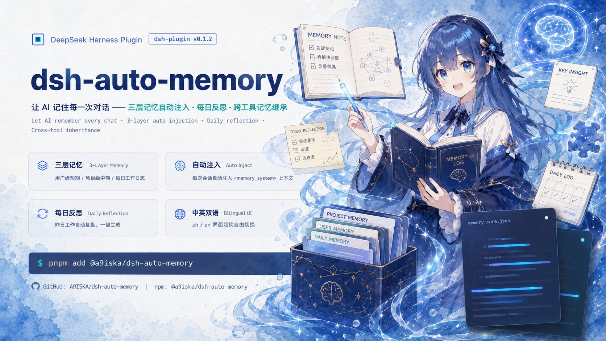
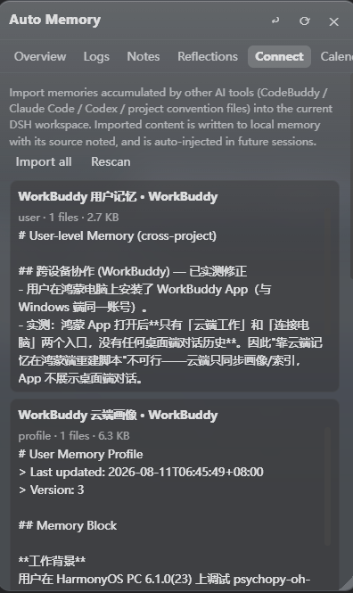
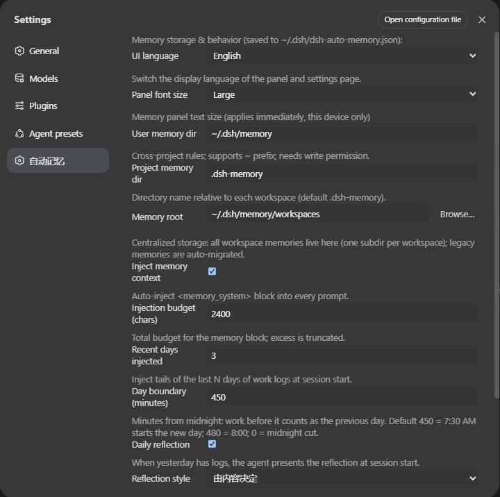

# dsh-auto-memory — Auto Memory & Proactive Companion for DeepSeek Harness

<p align="center">
  
</p>

<p align="center">
  <a href="README.md">中文</a> · <b>English</b> · License BSD-3-Clause · <code>pnpm add @a9i5k4/dsh-auto-memory</code>
</p>

> **v0.1.30 MAJOR UPDATE** — A brand-new Welcome Tour: every feature introduced step by step with per-feature switches; an Office/Fluent-style liquid-glass app icon family; a changelog intro animation; and an unattended mode built for long batch jobs.

An associative-memory & proactive-companion plugin for the DeepSeek Harness Web GUI: three-layer memory with automatic injection and on-demand recall, per-turn auto-consolidation, AI greetings and daily reflections, calendar reminders, cross-tool memory inheritance — plus production-grade unattended/batch support.

**The problem it solves**: AI assistants start from zero every session. With this plugin, your AI remembers your preferences, project conventions, yesterday's progress and next week's deadlines — and says "welcome back" when you return.

---

## Highlights in 30 seconds

| | |
|---|---|
| **Three-layer memory engine** | User rules → project notes → daily logs; auto-injected + on-demand recall, prefix-cache friendly |
| **Memory writes itself** | A subagent quietly evaluates every turn and files topic-grouped entries — you never "remember to log" |
| **Proactive reminders** | The AI spots deadlines and promises in conversation, files them into the calendar and reminds you later |
| **Everything is a switch** | Welcome tour + settings page, every feature individually toggleable (incl. unattended mode) |
| **External memory inheritance** | Memories from WorkBuddy / CodeBuddy / Claude Code / Codex are scanned, importable, per-source managed |
| **Production-grade hygiene** | Write gate (mojibake/stutter/JSON-injection blocking) + dirty-token scanner + credentials never enter prompts |

---

## Welcome Tour (new in v0.1.30)

After first install or an upgrade, the plugin auto-plays a **step-by-step welcome tour** — not an ad popup, but the home of every feature switch:

<p align="center"></p>

- **One Office/Fluent-style liquid-glass app icon per step**: cyan inject, amber greeting, green calendar, violet engine, sky radar, coral finish — each with its own looping motion (bell sway, page flip, radar sweep, rising spark…)
- **Flip every feature right in the tour**: switches write config instantly; no second trip to settings required
- **Semantic-engine detection/download inline**: the three retrieval tiers (lexical 0GB floor → built-in ~130MB → advanced Python BGE-M3) are auto-detected and one-click installable (SHA256 verify + inference self-test)
- **Live external-memory scan**: WorkBuddy / Claude Code / Codex sources found on your machine, tick-per-source
- **No "how do I close this"**: closing mid-tour lands on a finish page telling you exactly where each feature lives in Settings

<p align="center"></p>

One-time catch-up for upgraders: from v0.1.30 every user auto-plays the full tour once after upgrading, then the changelog follows (skippable). Reopen anytime via **Settings → Appearance → Welcome tour → ▶ Replay**.

---

## Three-layer memory system

| Layer | Location | Content |
|---|---|---|
| User-level memory | `~/.dsh/memory/MEMORY.md` | Cross-project rules & preferences |
| Project notes | `~/.dsh/memory/workspaces/{workspace}/MEMORY.md` | Conventions & decisions |
| Daily logs | `~/.dsh/memory/workspaces/{workspace}/YYYY-MM-DD.md` | Append-only work log |
| Daily reflections | `…/reflections/YYYY-MM-DD.md` | Structured review (results / lessons / next) |

**Injection strategy**: static discipline lives in the system prompt (byte-stable, keeps the prefix cache hot); dynamic memory rides a runtime snapshot — only the last day of logs plus a reflection digest are injected, everything else is fetched on demand via `memory_read` / `memory_recall`. Credential/secret sections are **always filtered out of prompts**.

---

## Feature tour

### Auto-consolidation — memory writes itself

After every turn a small subagent quietly evaluates what happened: long-term-valuable topics are grouped into today's log (`## Topic (HH:MM)` + bullets), durable decisions are promoted to project notes, cross-project rules to user-level memory, small talk is skipped, failures queue and retry every 5 minutes (a 15-second heartbeat file proves the loop is alive). Daily write budgets with AI auto-compaction — going over budget never rejects a write.

### Activation & crystallization — interrupt only when it matters

Associative recall detects memory needs directly in the conversation chain and injects at the next boundary (prefix-cache friendly); frequent workflows crystallize into skill checklists that attach automatically, promote after cross-session validation (approvals in the Memory Hub tab, 90-day auto-archive with pinning). **Every "should I interrupt" decision can be reviewed and graded** in the Recall review tab (A activate / P prefetch / S suppress / H harmful / E edit); the review queue digests into policy hints.

<p align="center"></p>

### Unattended mode — built for batch jobs

Running long pipelines or automated flows? Settings → Automation offers **Unattended mode** and **auto-unattended overnight** (22:00-08:00, tunable). While engaged: no greetings, no niceties or behavioural directives, calendar silent, context stable — tokens go to the work, not the small talk.

### AI greetings & daily reflections

A period-aware greeting (morning/afternoon/evening) that mentions your most important work; return after an hour away and the memory panel auto-opens with "welcome back" plus a recent-work digest; the first session of each day presents yesterday's structured reflection.

### Smart search

Ask in natural language — the AI expands your query into keywords, scans every memory layer, and answers conversationally with sources cited; cross-workspace search included.

### Calendar — maintained by the AI

The AI spots deadlines and promises in conversation and files them (`calendar_add`); pending items are injected into later sessions until completed; day view is a 07:00–22:00 timeline with location/reminder fields and urgency-tinted colors.

### External memory inheritance

Sessions and memories from WorkBuddy / CodeBuddy / Claude Code / Codex are scanned, importable per source (**path pointers only, never copied content**), removable per source; import-side and injection-side hygiene gates keep external dirt out.

### Memory hygiene (production-grade write gate)

- All three write tools run `sanitizeForWrite`: GBK mojibake (34-feature table), stutter degeneration, consecutive duplicate lines, external-AI-profile JSON signatures, base64 residue — rejected with a human-readable reason
- Settings → Debug Center "Scan dirty tokens": one-click scan of user memory / notes / logs / reflections, reported by line range (locations only, no content)
- Caps: 8,000 chars per append, 200,000 per rewrite; appends deduped against the last ~60 lines

---

## Engineering core (restraint by design)

- **Zero runtime dependencies** beyond Node built-ins
- **Prefix-cache friendly**: byte-stable prompts keep DeepSeek's prefix cache hitting — your history is never re-encoded
- **Rate-limited AI**: auto-consolidation ≤8×/day with cooldown; useful memory without burning budget
- **Centralized storage**: all workspace memory under one root (`~/.dsh/memory/workspaces/`), readable from any session
- **30-day distillation**: old logs are AI-distilled into project notes; originals archived, nothing lost

---

## UI gallery

### Memory panel · Overview (away greeting + AI period summaries)


### Memory Hub · three stores + skill promotion approvals


### Recall review · grade every activation decision


### Welcome tour · feature switches + engine detection


<details>
<summary><b>More screenshots</b> (click to expand)</summary>

### External memory scan (inside the tour)


### Connect other AI tools



### Calendar view


### Workspace mind map


### Settings




</details>

---

## Install (one command)

> Prerequisite: install [DeepSeek Harness](https://github.com/deepseek-ai/deepseek-harness) and start `dsh web` at least once.

Run in the **profile directory** (`~/.dsh/profiles/web`):

```bash
cd ~/.dsh/profiles/web
pnpm add @a9i5k4/dsh-auto-memory
```

Then edit `package.json` in that directory and append to the `dsh.profile.bundles` array:

```json
"@a9i5k4/dsh-auto-memory"
```

Restart **dsh web** (the 「Memory」entry appears in the sidebar).

> No pnpm? `npm install @a9i5k4/dsh-auto-memory` works the same.
> pnpm v11 blocks packages published <1 day ago: set `minimumReleaseAge: 0` in pnpm-workspace.yaml or pin an explicit version for same-day updates.

### AI-era installation

Copy this to the AI assistant you're already using:

```text
Install the npm package @a9i5k4/dsh-auto-memory in the DeepSeek Harness web profile
directory ~/.dsh/profiles/web (pnpm add or npm install),
append "@a9i5k4/dsh-auto-memory" to the dsh.profile.bundles array in package.json,
then restart dsh web to activate the plugin.
```

### Updating

```bash
cd ~/.dsh/profiles/web && pnpm up @a9i5k4/dsh-auto-memory
```

The Settings → Auto Memory page has a "Check for updates" button comparing your version with the npm registry; registry installs get a one-click update.

---

## Configuration

Config file `~/.dsh/dsh-auto-memory.json` (everything adjustable in the Settings GUI, zh/en UI and panel font size included):

```json
{
  "userMemoryDir": "~/.dsh/memory",
  "memoryRoot": "~/.dsh/memory/workspaces",
  "injectEnabled": true,
  "injectBudgetChars": 2400,
  "recentDaysInjected": 1,
  "reflectEnabled": true,
  "autoConsolidate": true,
  "autoConsolidateCooldownMinutes": 30,
  "autoConsolidateDailyMax": 8,
  "unattendedMode": false,
  "unattendedAuto": false,
  "unattendedAutoHours": ["22:00-08:00"],
  "memoryHubEnabled": true,
  "externalSources": { "workbuddy-user": true, "claude-global": true },
  "dayBoundaryMinutes": 450
}
```

> Full key reference lives in the Settings page — every switch has a description, and every welcome-tour switch maps 1:1 to settings.

---

## Structure

- `lib/index.js` — Host half: engine, injection, tools, routes (zero runtime deps, Node built-ins only)
- `lib/client.js` — Browser half: memory panel (calendar / mind map) + settings page + welcome tour (zh/en i18n)
- `python/` — optional Python semantic sidecar (BGE-M3 int8, advanced tier)
- `cordis.patch.yml` — plugin registration row

## Known limitations

- Memory files are plain-text Markdown; no secrets stored unless explicitly requested.
- `memory_recall` session search depends on the deployed session-query index; without it, only local search works.
- Plugin-set changes require a dsh restart.

---

## Community

- [@ProperSAMA](https://github.com/ProperSAMA) — panel readability fix for DSH Desktop enhanced mode (transparent/Mica materials) + entry-button anti-occlusion & outside-click/Esc close ([PR #12](https://github.com/Aik358/dsh-auto-memory/pull/12))
- [@nkh0472](https://github.com/nkh0472) — unattended/batch workflow hardening feedback that drove the welcome tour and per-feature switches ([Issue #10](https://github.com/Aik358/dsh-auto-memory/issues/10))

---

## Release

- GitHub: https://github.com/Aik358/dsh-auto-memory
- npm: `@a9i5k4/dsh-auto-memory`
- License: BSD-3-Clause
