# dsh-auto-memory — DSH 自动记忆与人性化交互插件

<p align="center">
  <a href="https://htmlpreview.github.io/?https://github.com/Aik358/dsh-auto-memory/blob/preview/docs/landing/index.html"><strong>🌐 宣传主页（功能全景 · 数据流 · 论文 · 截图）</strong></a>
</p>

<p align="center">
  <a href="docs/screenshots/promo/promo-1-hero.png">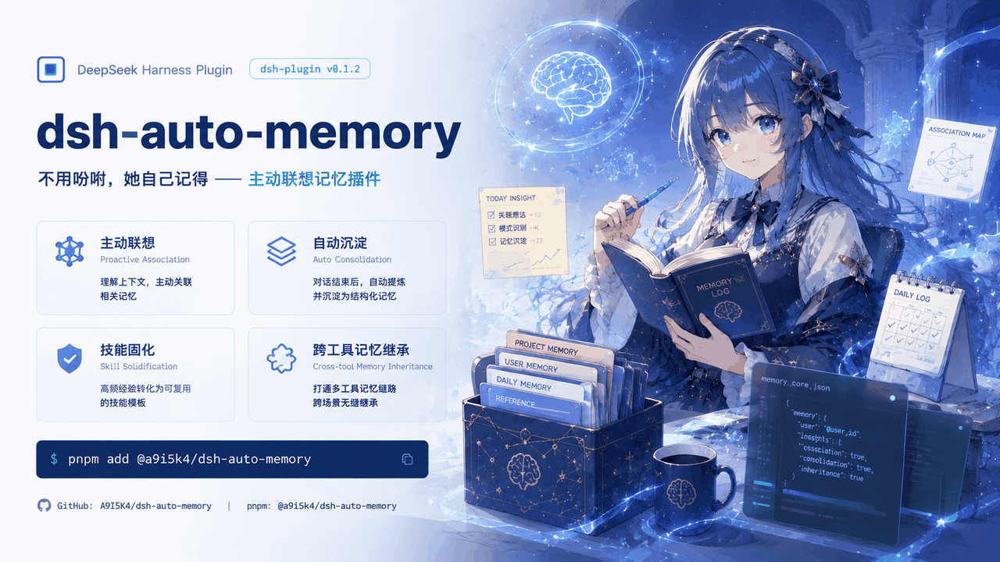</a>
</p>

<p align="center">
  <a href="docs/screenshots/promo/promo-1-hero.png"></a>
  <a href="docs/screenshots/promo/promo-2-tour.png"></a>
  <a href="docs/screenshots/promo/promo-3-recall.png"></a>
  <a href="docs/screenshots/promo/promo-4-unattended.png"></a>
  <a href="docs/screenshots/promo/promo-5-external.png"></a>
  <a href="docs/screenshots/promo/promo-6-greeting.png"></a>
</p>
<p align="center"><sub>宣传图六幕 · 点击任意一张查看大图</sub></p>

<details>
<summary><b>宣传图分幕浏览</b>（点击展开，逐幕翻看）</summary>

#### 第一幕 · 主视觉 —— 不用吩咐，她自己记得

<p align="center"></p>

#### 第二幕 · 欢迎向导 —— 每个功能，当场看懂、当场开关

<p align="center"></p>

#### 第三幕 · 唤起与固化 —— 对话凝成技能，每一步有迹可循

<p align="center"></p>

#### 第四幕 · 无人值守模式 —— 整夜安静跑，零寒暄，零打扰

<p align="center"></p>

#### 第五幕 · 外部记忆继承 —— 你的其他 AI，也在喂她记忆

<p align="center"></p>

#### 第六幕 · 定时暖心问候 —— 让每一天都被记得

<p align="center"></p>

</details>

<p align="center">
  <b>中文</b> · <a href="README.md">English</a> · License BSD-3-Clause · <code>pnpm add @a9i5k4/dsh-auto-memory</code>
</p>

> **v0.1.30 大更新** — 全新「欢迎向导」：分步介绍所有功能、当场开关；Office/Fluent 式液态玻璃应用图标族；更新日志开场动画；无人值守模式面向长批处理任务。

一个为 DeepSeek Harness Web GUI 打造的**主动联想记忆插件**：不依赖模型主动调用，记忆在对话进行时被情境自动唤回并注入下一环节——同时三层记忆自动沉淀、AI 问候与每日反思、日历提醒、外部 AI 记忆继承，以及面向生产环境的无人值守/批处理支持。

**它解决的问题是**：AI 助手每次会话都从零开始，而现有的记忆方案都要求模型"记得去查"——调一次工具、发一次请求，忘了就没了。装上它之后，记忆的唤回不需要任何指令：Host 中间件持续观察对话情境，该想起的记忆自动走向模型；你的偏好、项目约定、昨天的进度、下周的截止日期，还有你回来时那声"欢迎回来"，全部自然发生。

---

30 秒亮点

| | |
|---|---|
| **主动联想，零指令** | 记忆不靠模型调用——Host 观察情境自动唤回，经固定边界注入下一环节，前缀缓存友好 |
| **三层记忆引擎** | 用户级规则 → 项目笔记 → 每日日志，注入+按需检索 |
| **记忆自动沉淀** | 每轮对话结束由子代理静默判断去留，主题分组写入日志——你永远不需要记得"记一下" |
| **唤起有据可查** | 每次激活决策带完整证据链，唤起回顾页可复核打分；技能由跨会话证据渐进固化 |
| **主动式提醒** | AI 从对话中识别截止日期/约定，自动入日历并在后续会话中提醒 |
| **一切皆开关** | 欢迎向导+设置页双重入口，每个功能独立开关（含无人值守模式） |
| **外部记忆继承** | WorkBuddy / CodeBuddy / Claude Code / Codex 的历史记忆可扫描、导入、按源管理 |
| **生产级卫生** | 写入门禁（乱码/复读/JSON 注入拦截）+ 脏 token 扫描 + 凭证永不进提示词 |

---

## 欢迎向导（v0.1.30 新增）

升级或首次安装后，插件会自动播放一段**分步欢迎向导**——这不是弹窗广告，而是功能总开关的集合地：

<p align="center">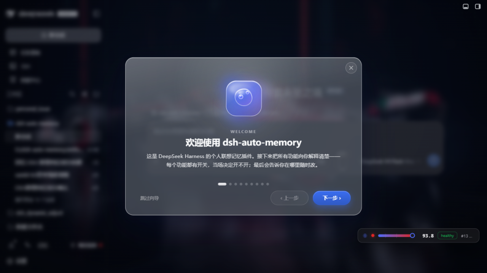</p>

- **每步一枚 Office/Fluent 式液态玻璃应用图标**：注入青蓝、问候暖金、日历青绿、引擎紫蓝、雷达天青、完成珊瑚金——各配专属循环动效（铃摆动、日历翻页、雷达扫描、火花上升…）
- **每项功能当场开关**：开关即写配置立即生效，不需要再进设置页确认
- **语义引擎检测/下载内联**：三级检索引擎（词法 0GB 保底 → 内置语义 ~130MB → Python BGE-M3 进阶）在向导内自动检测、一键安装（SHA256 校验+推理自检）
- **外部记忆实时扫描**：本机可读的 WorkBuddy / Claude Code / Codex 等来源直接列出，逐源勾选
- **关不掉的困惑不存在**：中途关闭会先落到"完成提醒"步，告诉你每个功能在设置的哪个分区重新打开

<p align="center">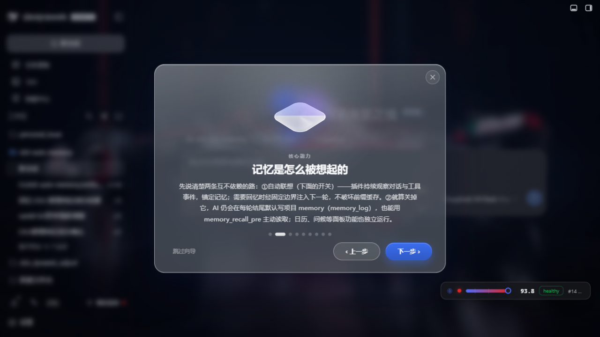</p>

升级用户的一次性触达：v0.1.30 起所有用户升级后都会自动播放一次完整向导，结束后自动接更新日志（可点击跳过）。之后可随时在 **设置 → 外观 → 欢迎向导 → ▶ 重看引导** 重新打开。

---

## 三层记忆体系

| 层 | 位置 | 内容 |
|---|---|---|
| 用户级记忆 | `~/.dsh/memory/MEMORY.md` | 跨项目规则与偏好 |
| 项目笔记 | `~/.dsh/memory/workspaces/{workspace}/MEMORY.md` | 项目约定与决策 |
| 每日日志 | `~/.dsh/memory/workspaces/{workspace}/YYYY-MM-DD.md` | 追加式工作日志 |
| 每日反思 | `…/reflections/YYYY-MM-DD.md` | 结构化复盘（成果/教训/下一步） |

**注入策略**：静态纪律进 system prompt（字节级稳定，保前缀缓存命中）；动态记忆走运行时快照——只注入最近 1 天日志+反思摘要，其余全部按需经 `memory_read` / `memory_recall` 取回。凭证/密钥段**永远被过滤在提示词之外**。

---

## 功能全景

### 主动联想 — 不用吩咐，她自己记得

这是插件与其他记忆方案的根本区别：**记忆唤回不依赖模型主动调用**。市面上的记忆工具要么要模型记得调一次检索工具，要么要用户手动粘贴上下文——忘了调，记忆就等于不存在。本插件是 Host 侧的主动联想中间件：持续观察对话情境与运行事件，相关记忆在模型开口之前就被检索、决策、并经固定边界注入下一环节（已发请求不可原地改写，前缀缓存永不失效）。同时权限分立：语义决策与身份/授权/时序治理由两层各自负责，每次投递都有证据链。

### 自动沉淀 — 记忆自己写自己

每轮对话结束后，一个小型子代理静默评估本轮内容：有长期价值的主题分组写入今日日志（`## 主题（HH:MM）`+要点），长期决策晋升项目笔记，跨项目规则晋升用户级记忆，闲聊跳过，失败进队列每 5 分钟重试（15 秒心跳文件证明循环存活）。每日写入有预算与自动压缩（超限不拒写，AI 合并去重后写入）。

### 唤起与固化 — 该出手时才出手

联想式记忆唤起在对话链中检测回忆需求，命中即注入下一环节（不破坏前缀缓存）；高频流程固化为技能 checklist，匹配对话自动附上，跨会话验证后晋升（记忆中枢页审批，90 天未用自动归档可置顶）。**每一次"要不要打断你"的决策都能在「唤起回顾」页复核打分**（A 该激活 / P 只预取 / S 应抑制 / H 有害 / E 改目标），判定队列会汇总成政策提示。

<p align="center">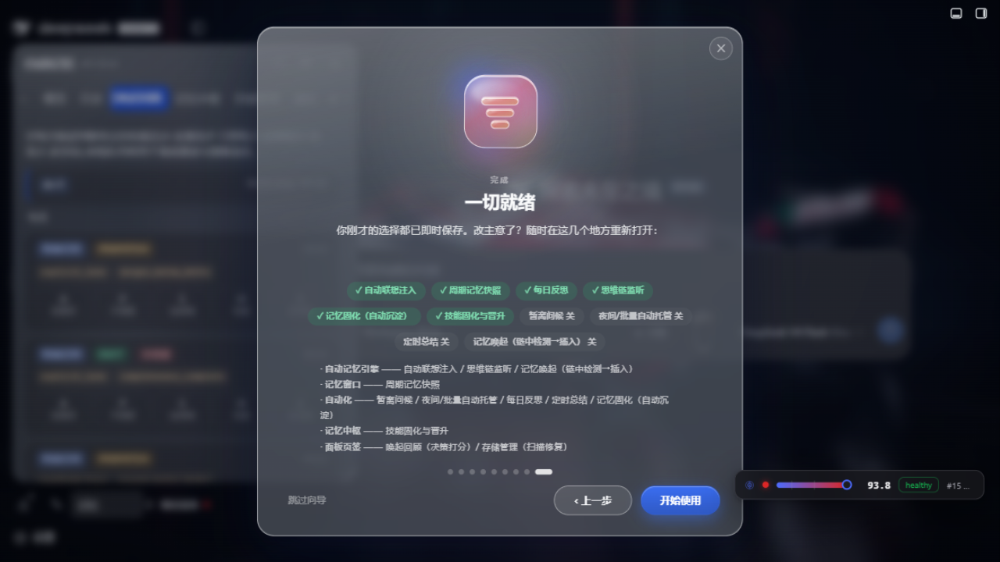</p>

### 无人值守模式 — 面向批处理任务

长跑批处理/自动化流水线？设置 → 自动化提供**无人值守模式**与**夜间自动托管**（22:00-08:00 可调）。托管期间：不注入欢迎语/寒暄/行为指令、日历提醒静默、上下文保持稳定——模型专注干活，token 花在正事上。

### AI 问候与每日反思

按时段（晨/午/晚）生成提及你当日最重要工作的问候；暂离超过 1 小时回来，记忆面板自动打开并送上"欢迎回来"+近期工作摘要；每天第一次会话主动呈现前一日结构化反思。

### 智能检索

自然语言提问，AI 自动扩展关键词扫描全部记忆层，会话式回答并标注来源；支持跨工作区检索。

### 日历 — AI 替你维护

AI 从对话中识别截止日期/约定自动入日历（`calendar_add`），未完成事项注入后续会话直到完成；日视图 07:00-22:00 时间轴、地点/提醒字段、紧急度语义色。

### 外部记忆继承

WorkBuddy / CodeBuddy / Claude Code / Codex 的历史会话与记忆可扫描发现、按源导入（**只存路径指针，不复制内容**）、按源删除；导入侧+注入侧双重卫生闸门防外部脏数据混入。

### 记忆卫生（生产级写入门禁）

- 三个写入工具全部过 `sanitizeForWrite`：GBK 乱码（34 特征全表）、复读退化、连续重复行、外部 AI 画像 JSON 特征、base64 残留——全部拒写并给出中文回执
- 设置 → 调试中心「扫描脏 token」：一键扫描用户级/项目/日志/反思，按行区间报告问题（只报位置不含正文）
- 追加 8000 字/条、全量改写 20 万字上限；追加前与文件尾部近 60 行做去重

### 记忆生命周期（30 天蒸馏与召回边界）

`memory_maintain_pre` 把 30 天前的每日日志交给 AI 蒸馏：只提炼有跨会话长期价值的要点（技术决策/架构约定/偏好/踩坑规则），写入项目笔记；原文保底归档到 `archive/`（AI 不可用时降级为原样归档，绝不丢信息）。

需要知道的召回边界：**procedure skills（技能固化）与用户级/项目笔记永远不在蒸馏范围**——技能固化存在独立的记忆中枢存储，不受影响；蒸馏只处理日期命名的每日日志。归档后的原文不在词法/语义检索的常规扫描范围内（检索范围=项目笔记+活跃日志+反思+用户级记忆），但蒸馏要点已进入项目笔记、随注入常驻。理解为：蒸馏=主动把"过程流水"换成"可复用结论"的取舍。

### 工作区全景与跨区检索

面板「工作区」页签自动生成工作区关系图（AI 归纳主题与跨区关联，可拖拽/缩放/点卡片看详情）；`memory_recall_pre` 天然跨工作区——检索结果标注来源工作区，其他项目的日志、笔记同样可达。

### AI 发散固化（memory_consolidate）

让 AI 通读今日/近期日志，发散提炼值得长期固化的要点并写入项目笔记——与自动沉淀互补：自动沉淀管"每轮结束记流水"，consolidate 管"阶段性回头看什么值得升格"。

---

## 工程内核（保持克制的设计）

- **零运行时依赖**：Node 内建模块之外无任何依赖
- **前缀缓存友好**：提示词字节级稳定，DeepSeek 前缀缓存持续命中，不反复重编码历史
- **限额 AI**：自动沉淀每日 ≤8 次带冷却，记忆有用但不烧预算
- **集中式存储**：全部工作区记忆收在 `~/.dsh/memory/workspaces/` 一个根下，任意会话可读
- **30 天蒸馏**：旧日志由 AI 蒸馏进项目笔记，原文归档不丢失

---

## 界面速览

### 记忆面板 · 概览（暂离问候 + AI 时段总结）

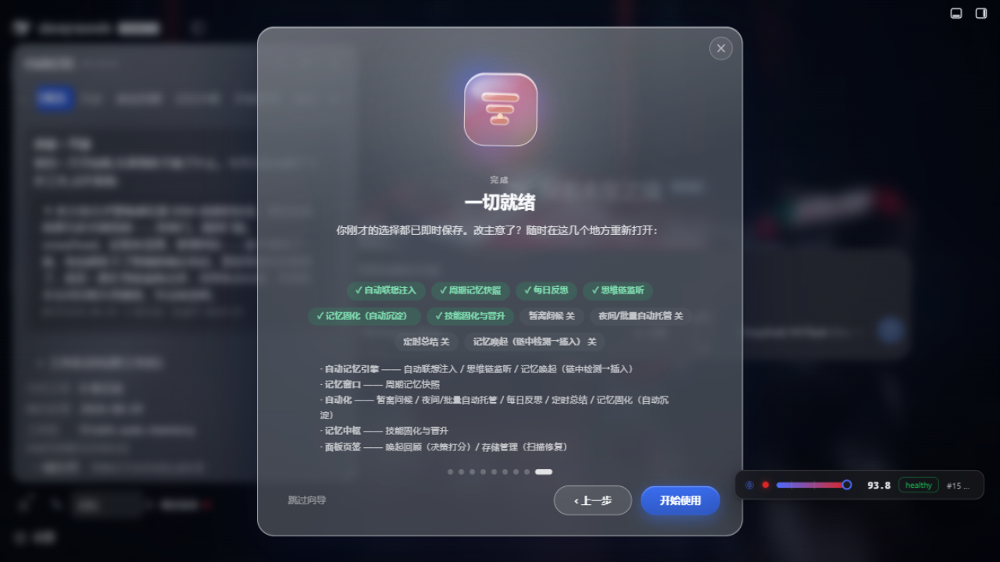

### 记忆中枢 · 三层记忆店与技能晋升审批

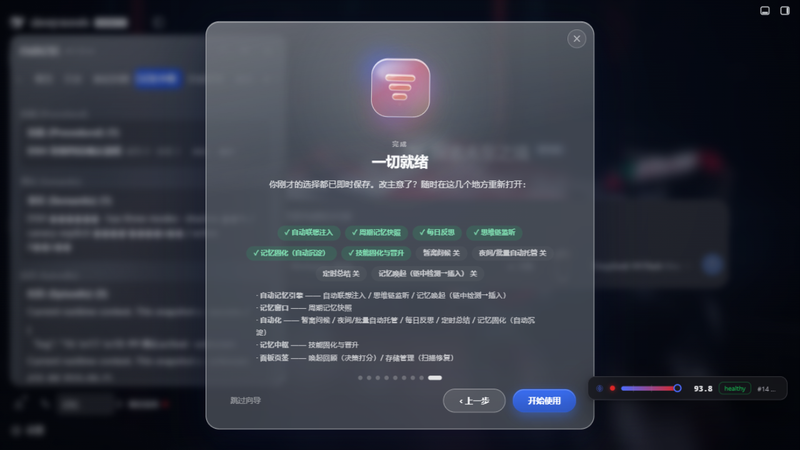

### 唤起回顾 · 每次激活决策可打分


### 欢迎向导 · 功能开关与引擎检测

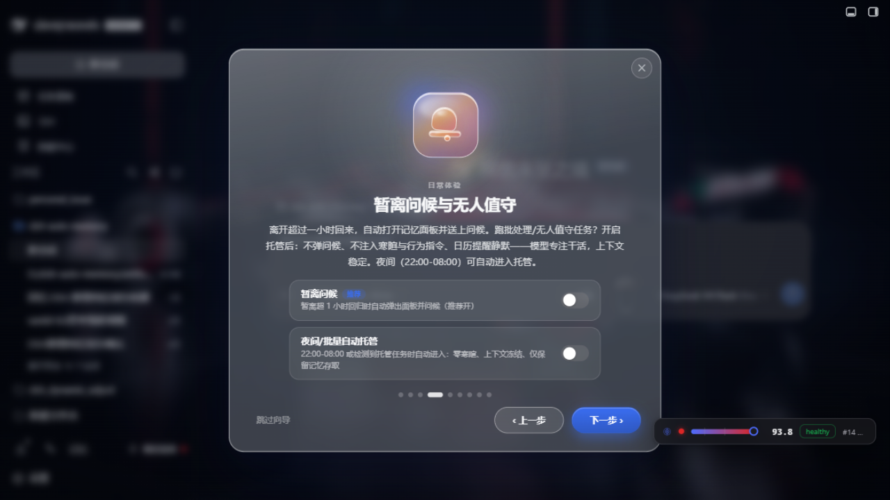

<details>
<summary><b>更多截图</b>（点击展开）</summary>

### 外部记忆扫描（欢迎向导内）

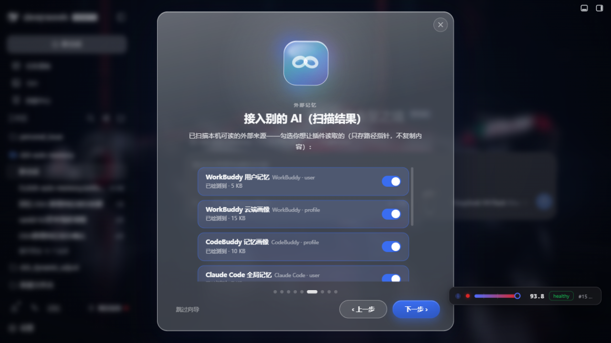

### 连接其他 AI 工具

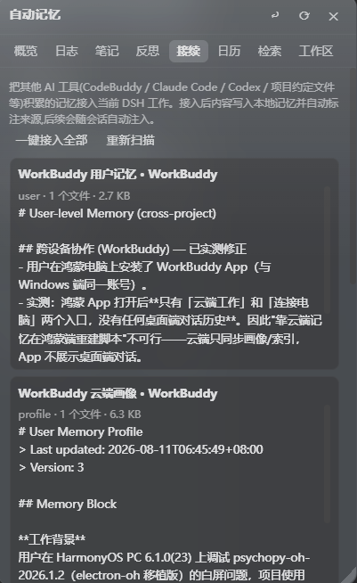

### 日历视图

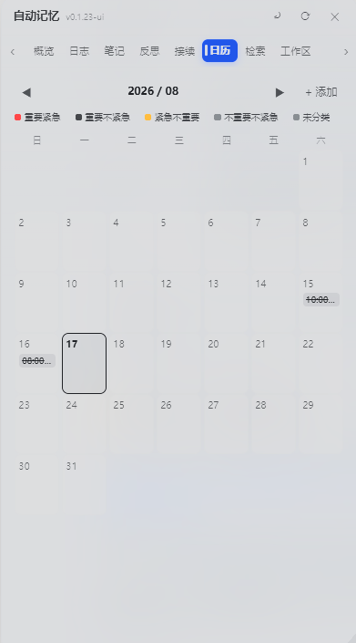

### 工作区关系图

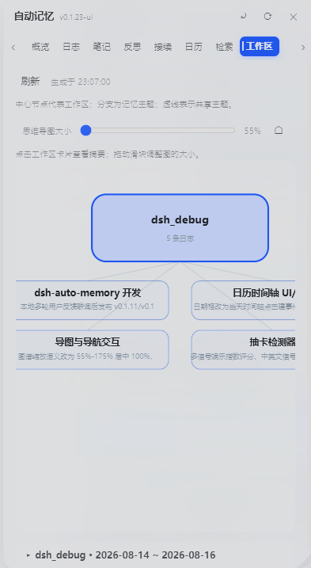

### 设置页

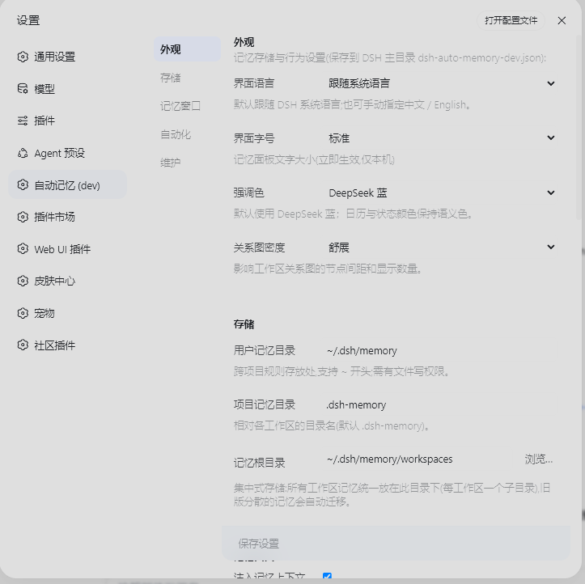
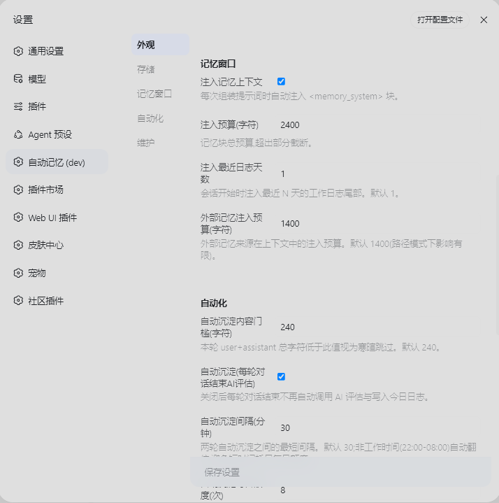

</details>

---

## 安装（一条命令）

> 前置：安装 [DeepSeek Harness](https://github.com/deepseek-ai/deepseek-harness) 并至少启动过一次 `dsh web`。

在 **profile 目录**（`~/.dsh/profiles/web`）执行：

```bash
cd ~/.dsh/profiles/web
pnpm add @a9i5k4/dsh-auto-memory
```

### 语义引擎（可选但推荐）

内置 JS 语义档（e5-small q8 ~130MB）需要推理库 `@huggingface/transformers`（随主包作为可选依赖自动安装）。若你的 pnpm 因安全策略拦截了它的原生脚本（提示 `ERR_PNPM_IGNORED_BUILDS` / `Ignored build scripts: onnxruntime-node, sharp`），执行一次批准后重装即可：

```bash
# 批准 onnxruntime-node / sharp 的原生安装脚本,再重装 transformers
pnpm approve-builds
pnpm add @huggingface/transformers
```

装完重启 `dsh web`，向导的语义引擎步会自动检测到就绪（SHA256 校验 + 推理自检）。词法检索 0GB 永远兜底，不装也能用（仅召回精度较低）。

然后编辑同目录 `package.json`，在 `dsh.profile.bundles` 数组追加：

```json
"@a9i5k4/dsh-auto-memory"
```

重启 **dsh web** 生效（侧边栏出现「记忆」入口）。

> 没有 pnpm？`npm install @a9i5k4/dsh-auto-memory` 同样可用。
> pnpm v11 限制安装发布不足 1 天的版本：当天发布想立即更新，在 profile 目录 `pnpm-workspace.yaml` 加 `minimumReleaseAge: 0`，或装显式版本。

### AI 时代安装法

复制下面这段发给你正在用的 AI 助手即可：

```text
在 DeepSeek Harness web profile 目录 ~/.dsh/profiles/web 安装 npm 包
@a9i5k4/dsh-auto-memory（pnpm add 或 npm install），
把 "@a9i5k4/dsh-auto-memory" 追加到 package.json 的 dsh.profile.bundles 数组，
然后重启 dsh web 激活插件。
```

### 更新

```bash
cd ~/.dsh/profiles/web && pnpm up @a9i5k4/dsh-auto-memory
```

设置 → 自动记忆页的「检查更新」按钮可比对 npm registry 最新版；registry 安装支持一键更新。

---

## 配置

配置文件 `~/.dsh/dsh-auto-memory.json`（GUI 设置页可视化调整，含中英文界面与面板字号）：

```json
{
  "userMemoryDir": "~/.dsh/memory",
  "memoryRoot": "~/.dsh/memory/workspaces",
  "injectEnabled": true,
  "injectBudgetChars": 2400,
  "recentDaysInjected": 1,
  "reflectEnabled": true,
  "autoConsolidate": true,
  "autoConsolidateCooldownMinutes": 30,
  "autoConsolidateDailyMax": 8,
  "unattendedMode": false,
  "unattendedAuto": false,
  "unattendedAutoHours": ["22:00-08:00"],
  "memoryHubEnabled": true,
  "externalSources": { "workbuddy-user": true, "claude-global": true },
  "dayBoundaryMinutes": 450
}
```

> 完整键位见设置页——每个开关都有中文说明；欢迎向导里的每个开关与设置页一一对应。

---

## 结构

- `lib/index.js` — Host 半：引擎、注入、工具、路由（零运行时依赖）
- `lib/client.js` — Browser 半：记忆面板（含日历/关系图）+ 设置页 + 欢迎向导（内置中英 i18n）
- `python/` — 可选 Python 语义 sidecar（BGE-M3 int8，进阶档）
- `cordis.patch.yml` — 插件注册行

## 系统架构

全部里程碑已实现并 live verified。完整交互式架构图见 [docs/proactive-associative-memory-system-map.html](docs/proactive-associative-memory-system-map.html)，核心分层如下：

```
DeepSeek Harness (Node, 127.0.0.1:3080)
├─ JS 记忆核心（lib/*_pre.js，零运行时依赖）
│   M1 会话隔离 · M2 ContextObserver 投影
│   M3 记忆锚定（anchored records + sidecar 身份）
│   M4 语料适配 + 影子检索宿主（evidence store）
│   M5 上下文/证据桥（envelope · coverage · cite/correction）
│   M6 激活收件箱（校验→offer→claim→参考尾注渲染→delivered/seen）
│   lexical_pre_v2 词法回退检索（BM25 + CJK 2gram，0GB 永远可用）
│   C2 内置语义层（e5-small q8 ~130MB，默认档）
└─ Python sidecar M7（可选，lazy spawn 子进程）
    worker_semantic_pre_v1.py
    ├─ index_sync：JS 授权分页建库（digest 校验，scope 分组）
    ├─ dense：BGE-M3 int8 + para-512 分块 + 余弦检索（R@5 0.925）
    ├─ hybrid：稠密 0.7 + 词法 0.3 融合
    └─ fv2 激活决策：两车道 + 硬门禁（echo/correction/stale/scope）
```

**权限分立**：Python（语义层）决定"想起什么、何时建议"；JS（权威层）决定身份、授权、时序、投递——Python 不创建证据，也不直接注入。数据流：`context_push → M5 envelope → 决策 → M6 固定边界注入 → delivered/seen 证据回流`。

### 技术论文与设计文献

本项目的设计不是拍脑袋——每项算法结论都来自可复现实验，并冻结为工程决策台账：

| 文献 | 内容 |
|---|---|
| [多语言嵌入式检索选型研究](docs/M7-RESEARCH-PAPER.md) | 3 模型 × 5 分块策略 × 6 检索通道 ≈ 90 评测单元；BGE-M3 全面领先，冻结为 D1–D11 工程决策 |
| [激活策略 v2：回声陷阱的发现、度量与修正](docs/M7-ACTIVATION-V2-PAPER.md) | 语义相关 ≠ 唤起必要的激活策略技术报告 + 双轨部署架构（§7） |
| [嵌入基准报告](docs/M7-EMBEDDING-BENCHMARK.md) | 模型/分块/融合的冻结依据：bge-m3 + para-512-noov + 加权融合 |
| [算法冻结决策 D1–D11](docs/M7-ALGORITHM-DECISION.md) | 全部研究结论到生产实现的决策台账 |
| [Held-out 人工金标验收](docs/M7-ACTIVATION-V2-HOLDEDOUT-EVAL.md) | 67 条人工标注打分：actPrecision 0.917 / 有害注入 0 / echo 层 7/7 |
| [Python Sidecar 完整契约](docs/PYTHON-SIDECAR-CONTRACT.md) | 协议/生命周期/权威边界/各里程碑回归证据 |

论文由自主工程 Agent（ZCode / GLM）撰写，全部结论在人类审核下冻结进生产实现。

## 已知限制

- 记忆文件为纯文本 Markdown；除非明确要求，不存储密钥
- `memory_recall` 会话搜索依赖已部署的 session-query 索引，缺失时仅本地检索可用
- 插件增减需要重启 dsh 生效

---

## 社区致谢

- [@ProperSAMA](https://github.com/ProperSAMA) — DSH Desktop 增强模式（透明/Mica 材质）面板可读性修复 + 入口按钮防遮挡与外点/Esc 关闭（[PR #12](https://github.com/Aik358/dsh-auto-memory/pull/12)）
- [@nkh0472](https://github.com/nkh0472) — 无人值守/批处理场景加固反馈，推动了欢迎向导与功能开关化（[Issue #10](https://github.com/Aik358/dsh-auto-memory/issues/10)）

---

## 制作署名

本项目由人与 AI 协作完成。除上述工程与社区贡献外：

- **Aik358** — 项目所有者：产品方向、架构与工程决策。
- **ZCode（GLM，智谱 Z.ai）** — 自主工程 Agent：M 系列语义引擎实现、两篇基准研究论文（[M7 检索选型研究](docs/M7-RESEARCH-PAPER.md) / [激活策略 v2 技术报告](docs/M7-ACTIVATION-V2-PAPER.md)）、全套回归测试、宣传网页设计与构建。
- **Kimi K3（月之暗面）** — 前端 Agent：参与 v0.1.30 欢迎向导界面资产与视觉验收。

AI Agent 作为研究论文作者与部分实现作者署名，全程在人类审核与指导下工作。

---

## 发布信息

- GitHub: https://github.com/Aik358/dsh-auto-memory
- npm: `@a9i5k4/dsh-auto-memory`
- License: BSD-3-Clause
