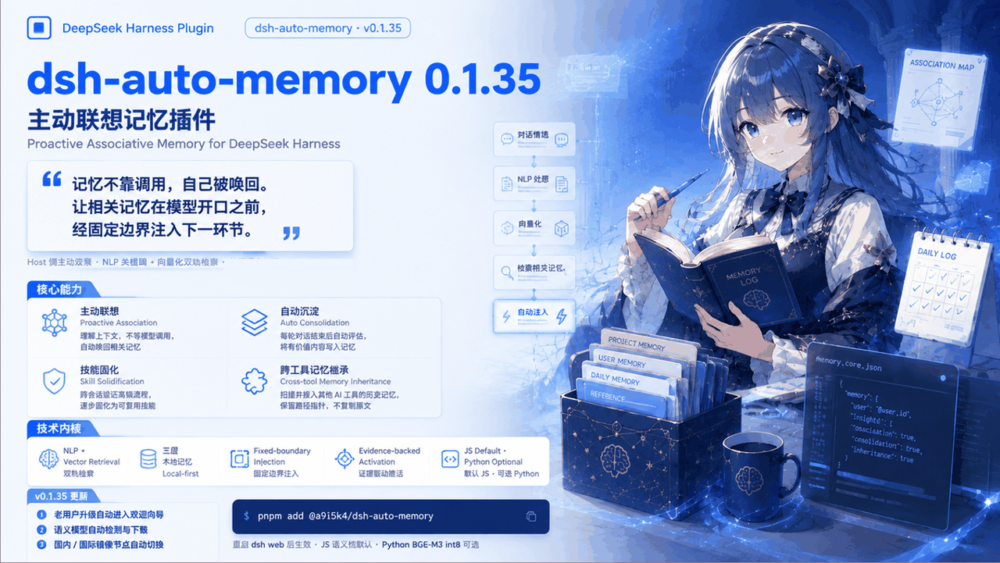

# dsh-auto-memory — 她记得，不必吩咐

> **现在，换窗口也不必。**
> 跨窗口 · 跨会话 · 跨工具，记忆不断线

<p align="center">
  <a href="https://htmlpreview.github.io/?https://github.com/Aik358/dsh-auto-memory/blob/preview/docs/landing/index.html"><strong>🌐 宣传主页（功能全景 · 数据流 · 论文 · 截图）</strong></a>
</p>

<p align="center">
  <a href="docs/screenshots/promo/promo-0-banner-v2.png"></a>
</p>

<p align="center">
  <a href="docs/screenshots/promo/promo-0-banner-v2.png"></a>
  <a href="docs/screenshots/promo/promo-2-tour.png"></a>
  <a href="docs/screenshots/promo/promo-3-recall.png"></a>
  <a href="docs/screenshots/promo/promo-4-unattended.png"></a>
  <a href="docs/screenshots/promo/promo-5-external.png"></a>
  <a href="docs/screenshots/promo/promo-6-greeting.png"></a>
</p>
<p align="center"><sub>宣传图六幕 · 点击任意一张查看大图</sub></p>

<details>
<summary><b>宣传图分幕浏览</b>（点击展开，逐幕翻看）</summary>

#### 第一幕 · 主视觉 —— 不用吩咐，她自己记得

<p align="center"></p>

#### 第二幕 · 欢迎向导 —— 每个功能，当场看懂、当场开关

<p align="center"></p>

#### 第三幕 · 唤起与固化 —— 对话凝成技能，每一步有迹可循

<p align="center"></p>

#### 第四幕 · 无人值守模式 —— 整夜安静跑，零寒暄，零打扰

<p align="center"></p>

#### 第五幕 · 外部记忆继承 —— 你的其他 AI，也在喂她记忆

<p align="center"></p>

#### 第六幕 · 定时暖心问候 —— 让每一天都被记得

<p align="center"></p>

</details>

<p align="center">
  <b>中文</b> · <a href="README.md">English</a> · License BSD-3-Clause · <code>pnpm add @a9i5k4/dsh-auto-memory</code> · <a href="https://qm.qq.com/q/v7Asxn6vPa">QQ 交流群</a>
</p>

---

## 烧掉的书，留不住读后感

每一个用 AI 干正事的人，都经历过同一时刻：聊到一半，窗口满了，她"忘了"。不是不聪明，是她的思考被压缩成了一段摘要——像把一整本书烧掉，只留一句读后感。为什么这个方案修错了、那条路走不通，全在火里。

dsh-auto-memory 从第一天就不信这件事只能如此。她把记忆放在窗口外面：该想起的自动想起，不必吩咐；想起的每一条都有出处，可查、可改、可删。

现在，我们把这条路线推到最后一块拼图——上下文将满时，她不再压缩自己，而是**合上一本写满批注的笔记，翻开新的一页**。笔记还在手边，随时翻回去。

**压缩即失真，关窗即清零，换工具即归零——这三件事，从这里开始不成立。**

---

## 30 秒亮点

| | |
|---|---|
| **主动联想，零指令** | 记忆不靠模型调用——Host 观察情境自动唤回，经固定边界注入下一环节，前缀缓存友好 |
| **三层记忆引擎** | 用户级规则 → 项目笔记 → 每日日志，注入+按需检索 |
| **记忆自动沉淀** | 每轮对话结束由子代理静默判断去留，主题分组写入日志——你永远不需要记得"记一下" |
| **唤起有据可查** | 每次激活决策带完整证据链，唤起回顾页可复核打分；技能由跨会话证据渐进固化 |
| **主动式提醒** | AI 从对话中识别截止日期/约定，自动入日历并在后续会话中提醒 |
| **一切皆开关** | 欢迎向导+设置页双重入口，每个功能独立开关（含无人值守模式） |
| **外部记忆继承** | WorkBuddy / CodeBuddy / Claude Code / Codex 的历史记忆可扫描、导入、按源管理 |
| **生产级卫生** | 写入门禁（乱码/复读/JSON 注入拦截）+ 脏 token 扫描 + 凭证永不进提示词 |
| **Astra 式上下文管理（下一大版本）** | 上下文将满不再压成一段摘要——四段式交接笔记跨窗口续命，全量历史归档可搜，Agent 按需检索 |
| **模型无关** | 不锁厂商、不锁档位：DSH 上任何模型即装即得，词法 0GB 保底、内置语义 ~130MB、进阶 563MB |
| **记忆可携带** | 全部存在你自己的盘上；跨 AI 工具扫描导入，每条有证据链、可审计、可删除——记忆属于你，不属于任何厂商 |

---

## 四件花了心血的事

这个插件有四个功能，是我们一件一件亲手养大的；日历、检索、关系图、无人值守、记忆卫生……其余的一切特色，都围绕这四件生长。

### 第一件 · 会记事，也会问候

她最早学会的是两件小事：每次对话结束，把值得留的事写进记忆，不用你吩咐；在你暂离归来、清晨开工、深夜收尾的时刻，用合时宜的口吻说一声"欢迎回来"。听起来简单，但这两个动作定了她的性格——记忆不是数据库，问候不是提示音，是一个记得你的同事回来时的那句话。后来的一切能力，都长在这份性格上。我们从头到尾用"她"称呼这个插件，不是营销的包装——从第一个功能起，她就在做人才会做的事。

### 第二件 · 不只是想起来了去查，是做事时自然想起

人用记忆有两种方式：一种是刻意回想，翻找之前做过什么；更多的时候，是记忆在做事的当下自己涌上来。上一大版本，我们给了她后一种。给记忆库装上 Transformers 语义模型，让她在对话进行时判断两件事：此刻值不值得唤起，以及唤起哪一条——判断的材料就是你正在进行的思考与对话：你在想什么、说了什么、她答了什么。于是相关的记忆在模型开口之前，已经顺着上下文走到它该在的位置，经固定边界注入下一个环节。不依赖模型"记得去查"——忘了查，记忆就等于不存在；**她替你记得去想。**

### 第三件 · 像骑自行车，不用想怎么骑

人学会骑自行车之后，就不再回忆教学步骤——肌肉记忆接管一切，知识自然迁移到下一段路。她也在长这样的记性：多次观察到你的纠正、或反复做着同样相似的事，流程就固化成技能；下次再遇到相似的事，不用谁提醒，清单自动附上。刻意学的，变成顺手的——这是她的 procedural memory，也是「记忆中枢」页签里你能审批、能置顶、能看着她成长的那部分。

### 第四件 · 交接，而不是压缩（正在进行）

窗口将满时，她不再把整本书烧成一句读后感，而是写下四段式交接笔记——状态、目标、走过的弯路、下一步——合上这一页，翻开下一页；完整历史归档可搜，细节随时翻回去。这是四件心血里最新的一件，也是她完整记性的最后一块拼图——全文见[「她怎么交接」](#她怎么交接下一大版本--即将上线)。

---

## 为什么是插件

2026 年 9 月，GPT-6 Astra 把「上下文管理」作为旗舰实验特性发布：笔记跨窗口保留，历史归档可搜索，上下文快满时倾向交接而不是压缩。

看到这条公告，我们挺高兴——像独自走夜路的人，看见远处也亮起了灯。把记忆放到窗口外面：结构化的笔记、可搜索的归档、交接代替压缩——这条路上，原来不止我们一个行人。旗舰愿意为它按下 experimental 的按钮，说明这件事值得被更多人认真对待。

所以我们把它做成开放插件：没有 experimental 的门槛，也不绑定任何档位——装进 DSH，你机器上的任何模型，今天就有一份。

| | GPT-6 Astra / Codex 实验特性 | dsh-auto-memory |
|---|---|---|
| 可用性 | 单厂商旗舰、experimental | 开源插件，DSH 任何模型即装即得 |
| 笔记 | 跨窗口 keep notes | 四段式交接 ledger，用户可直接读改 |
| 归档 | 早期窗口可搜索 | 本地全量归档 + 词法/语义双臂检索 |
| 检索 | history/_context 工具 | memory_search / memory_note 门控代理工具 |
| 触发 | token budget + handoff | 水位感知 + 压缩前拦截 |
| 所有权 | 厂商侧 | 全在用户盘上，治理式写回可审计 |
| 分级 | 绑定订阅档位 | 0GB 词法 → 130MB 内置语义 → 563MB Python 进阶 |

**同一条路线，两种抵达：它随旗舰发布，我们随插件走进你的机器。**

*本节所述的上下文管理能力随下一大版本上线（见[「她怎么交接」](#她怎么交接下一大版本--即将上线)）。*

---

## 一个星期

周一，你交给她一个调研，中途关机。

周三，你换了台电脑，顺手把默认模型也换了。她接上的不是"抱歉，我不记得了"，而是上周的进度、三条已经试过的死路，和下一步。因为交接笔记在，原始记录可搜，记忆跟着你走。

周五，你随口问："你为什么记得这个？"她给你看：哪条消息、哪次工具输出、哪一次深夜反思写下的。你可以让她把这条记得更牢，也可以让她忘了那个。

**她记得，不必吩咐。你若要她忘，也只是一句话。**

> 交接相关情节随下一大版本上线。

---

## 她怎么记

记忆分四层，各管一摊：

| 层 | 位置 | 内容 |
|---|---|---|
| 用户级记忆 | `~/.dsh/memory/MEMORY.md` | 跨项目规则与偏好 |
| 项目笔记 | `~/.dsh/memory/workspaces/{workspace}/MEMORY.md` | 项目约定与决策 |
| 每日日志 | `~/.dsh/memory/workspaces/{workspace}/YYYY-MM-DD.md` | 追加式工作日志 |
| 每日反思 | `…/reflections/YYYY-MM-DD.md` | 结构化复盘（成果/教训/下一步） |

静态纪律进 system prompt——字节级稳定，前缀缓存持续命中，从不反复重编码历史；动态记忆走运行时快照，只带最近一天的日志与反思摘要，其余按需经 `memory_read` / `memory_recall` 取回。**凭证/密钥段永远被过滤在提示词之外。**

**记，不需要你动手。** 每轮对话结束，一个小型子代理静默做一次"要不要记"的判断：值得记的主题分组写进日志（`## 主题（HH:MM）`+要点），长期决策晋升项目笔记，跨项目规则晋升用户级记忆，闲聊跳过。失败不慌——进队列，每 5 分钟重试，一个 15 秒心跳文件证明循环活着。每日写入有预算，超限时 AI 先合并去重再落笔——她记得节制，也记得不丢。

阶段性再回头一次：`memory_consolidate` 让她通读近期日志，发散提炼值得长期固化的要点升格进项目笔记——自动沉淀管"每轮结束记流水"，这一步管"过一阵子，什么值得留下来"。

---

## 她怎么想起

**不靠模型"记得去查"。** 市面上的记忆方案，要么要模型主动调一次检索工具，要么要你手动粘贴上下文——忘了调，记忆就等于不存在。这里是 Host 侧的联想中间件：对话进行时，她持续观察情境与运行事件，相关记忆在模型开口之前就被检索、决策、注入下一个环节。已发出去的请求不可改写，所以注入走固定边界——**前缀缓存永不失效，token 不为回忆买单两次。**她的判断材料就是对话本身：你在想什么、说了什么、她答了什么；值不值得唤起、唤起哪一条，由语义模型在对白进行中实时判断——不是想起来了才去查，是做事的时候自然想起。

权限也分了家：想起什么归语义决策管，该不该、什么时候归身份与时序治理管——每一次投递都有证据链。她递来的每一页还都过了安检：注入内容在全部出口中和模板变量——日志里一个普通的 `{{baseUrl}}`，再也不会卡住一整轮对话。

想主动问，随时开口：自然语言提问，她自动扩展关键词扫描全部记忆层，会话式回答、逐条标注来源。`memory_recall` 天然跨工作区——别的项目的日志、笔记、结论，同样一句可达。

面板「工作区」页签把这一切画成一张关系图：中心是工作区，分支是记忆主题，虚线是跨区共享；可拖拽、可缩放、点卡片看详情。**你的记忆第一次有了形状。**

---

## 她怎么提醒

**日历是她替你维护的。** 对话里出现截止日期和约定，她自动记下（`calendar_add`）；**没完成的事会持续注入后续会话，直到完成**——约定不会被忘在某个聊天记录的深处。日视图铺开 07:00–22:00 时间轴，地点、提醒、紧急度语义色，一眼看清今天；`calendar_list` / `calendar_done` / `calendar_remove` 让她汇报、销账、撤销。

按时段的问候：清晨、午后、深夜，问候语会提起你当天最重要的工作——不是模板寒暄，是读过你日志的问候。

离开超过一小时再回来，记忆面板自动打开，一句"欢迎回来"，附上你不在时该知道的近期摘要。不喜欢被打扰？「自动弹出记忆窗口」一个开关，说关就关。

---

## 她怎么长大

**蒸馏：把过程流水换成可复用的结论。** 30 天前的每日日志交给她通读，只提炼有跨会话长期价值的要点——技术决策、架构约定、偏好、踩过的坑——写进项目笔记；原文归档保底，AI 不可用时降级为原样归档，**绝不丢一个字**。召回边界同样清楚：技能、用户级、项目笔记永不参与蒸馏——蒸馏只处理日期命名的流水，动不了的从来不动。

**技能：像骑自行车，不用想怎么骑。** 人学会骑车之后就不再回忆教学步骤——肌肉记忆接管一切。她也一样：多次观察到你的纠正、或反复做着同类的事，流程就固化成技能；下次遇到相似的活儿，不用谁提醒，checklist 自动附上。注入形态分三级——完整步骤 / 摘要 / 仅提示，高风险场景自动降级为提示，不添乱。技能由跨会话证据渐进晋升，在「记忆中枢」页签审批；90 天没用自动归档，重要的可置顶，常用的会被轻轻保活。

**反思：每天合上账本前，她给自己写复盘。** 成果、教训、下一步，落在独立的反思层；第二天第一次会话，主动呈现昨天的反思——你的项目从周一开始就有了一个记得昨天所有事的人。

---

## 她怎么交接（下一大版本 · 即将上线）

> **正在路上**：四段式交接笔记、`memory_search` / `memory_note` 主动检索工具、全量历史归档可搜索、token 水位感知——随下一大版本上线，对标 GPT-6 Astra 的上下文管理。

上下文将满时，她不再把整本书烧成一句读后感，而是写下**四段式交接笔记**——任务状态、目标、已试过的方案与失败原因、进度与下一步——合上这个窗口，翻开下一个。写不进笔记的也不怕：完整的历史消息与工具输出落进本地归档，随时可搜，细节不再死在火里。

她还能主动翻回去：`memory_search` 按需检索全量归档，`memory_note` 随手记下要紧事——从"被动吃注入"到"自己查资料"，这是她记性的第二次升级。

配 token 水位感知：快满时，她提示你开新窗口交接，而不是默默压缩。窗口是宿主的领地——她只助产交接，从不越权替宿主做决定。

---

## 她怎么搬家

你的记忆不止在一家 AI 里。WorkBuddy、CodeBuddy、Claude Code、Codex——她在本机扫描这些工具留下的历史会话与记忆，逐源列出、逐源勾选导入。「接续」页签是这场迁徙的口岸：**只存路径指针，不复制内容**——尊重来源，零冗余；不想要了，按源删除，干净利落。

导入侧和注入侧各设一道卫生闸门：外部工具的脏数据、别家的画像残留，进不来，也出不去。**搬家归搬家，家具先消毒。**

---

## 她怎么让你放心

**每一次想起都可查账。** 每个"要不要激活"的决策都带完整证据链；「唤起回顾」页签把每次投递摊开：投给了谁、何时、结果如何——按 A 该激活 / P 只预取 / S 应抑制 / H 有害 / E 改目标五档复核打分，判定队列自动汇总成政策提示。她的记性经得起审计。

**每一句话进来都过门禁。** 三个写入工具全部执行写前体检：GBK 乱码（34 项特征全表）、复读退化、连续重复行、外部 AI 画像 JSON 特征、base64 残留——一律拒写，并给一句中文回执告诉你为什么。追加单条 8000 字、全量改写 20 万字上限；写入前与文件尾部近 60 行比对去重。

**体检不止防外来物。** 设置 → 调试中心，「扫描脏 token」一键扫过用户级、项目笔记、日志、反思，按行区间报告问题——只报位置，不看内容。

最后是边界，写成性格：

1. 不替宿主决定压缩——窗口是宿主的领地，她只负责交接；
2. 不上传任何记忆——全部存储在你本机，外部扫描只读；
3. 不用记忆操纵你的语体——注入永远声明"背景事实，非表达示范"；
4. 不做黑箱——每条记忆证据直达，每次投递可回放；
5. 不做全家桶——只做记忆，边界清晰才可信。

---

## 她怎么听话

**一切皆开关。** 首次启动自动播放**欢迎向导**：每步一枚 Office/Fluent 式液态玻璃应用图标——注入青蓝、问候暖金、日历青绿、引擎紫蓝、雷达天青、完成珊瑚金——各配专属循环动效（铃摆、翻页、双环、棱镜、雷达、火花）。每个功能当场开关、立即生效，不用再进设置页确认；语义引擎的检测、下载、自检内联在向导里一次完成；外部记忆来源实时扫描、逐源勾选。中途关掉也不慌——最后一步"完成提醒"告诉你每个开关住在设置的哪个分区。

<p align="center"></p>

<p align="center"></p>

升级用户的一次性触达：v0.1.30 起所有用户升级后都会自动播放一次完整向导，结束后自动接更新日志（可点击跳过）。之后可随时在 **设置 → 外观 → 欢迎向导 → ▶ 重看引导** 重新打开。

设置页与向导双入口、一一对应：自动联想、周期快照、暂离问候、夜间托管、每日反思、定时总结、外部记忆、技能固化、自动弹出……每个开关一行中文说明，中英文界面随心切换，面板字号可调。

十个页签，各司其职：**工作区**（关系图）、**日历**、**接续**（外部记忆）、**记忆中枢**（技能审批）、**日志**、**笔记**、**反思**、**唤起回顾**（查账）、**检索**、**存储**。面板也体贴：DSH Desktop 增强模式（透明/Mica 材质）下自动保住可读性；默认位置不挡侧边栏「记忆」入口；点外部或按 Esc 就走——在场，但不碍事。

**长跑批处理？开无人值守。** 设置 → 自动化提供「无人值守模式」与「夜间自动托管」（22:00–08:00 可调）：托管期间不注入欢迎语、不寒暄、不下行为指令，日历提醒同步静默——模型专注干活，token 花在正事上。

**升级也体面。** 设置页「检查更新」比对 npm registry，registry 安装一键更新；大版本更新日志配玻璃 Logo 开场动画——三层组装、展开、消散，点击任意处可跳过。

---

## 安装（一条命令）

> 前置：安装 [DeepSeek Harness](https://github.com/deepseek-ai/deepseek-harness) 并至少启动过一次 `dsh web`。

在 **profile 目录**（`~/.dsh/profiles/web`）执行：

```bash
cd ~/.dsh/profiles/web
pnpm add @a9i5k4/dsh-auto-memory
```

然后编辑同目录 `package.json`，在 `dsh.profile.bundles` 数组追加：

```json
"@a9i5k4/dsh-auto-memory"
```

重启 **dsh web** 生效（侧边栏出现「记忆」入口）。

> 没有 pnpm？`npm install @a9i5k4/dsh-auto-memory` 同样可用。
> pnpm v11 限制安装发布不足 1 天的版本：当天发布想立即更新，在 profile 目录 `pnpm-workspace.yaml` 加 `minimumReleaseAge: 0`，或装显式版本。

### 语义引擎（可选但推荐）

内置 JS 语义档（e5-small q8 ~130MB）需要推理库 `@huggingface/transformers`（随主包作为可选依赖自动安装）。若 pnpm 因安全策略拦截原生脚本（提示 `ERR_PNPM_IGNORED_BUILDS` / `Ignored build scripts: onnxruntime-node, sharp`），执行一次批准后重装即可：

```bash
# 批准 onnxruntime-node / sharp 的原生安装脚本,再重装 transformers
pnpm approve-builds
pnpm add @huggingface/transformers
```

装完重启 `dsh web`，向导的语义引擎步会自动检测到就绪（SHA256 校验 + 推理自检）。词法检索 0GB 永远兜底，不装也能用（仅召回精度较低）。

### AI 时代安装法

复制下面这段发给你正在用的 AI 助手即可：

```text
在 DeepSeek Harness web profile 目录 ~/.dsh/profiles/web 安装 npm 包
@a9i5k4/dsh-auto-memory（pnpm add 或 npm install），
把 "@a9i5k4/dsh-auto-memory" 追加到 package.json 的 dsh.profile.bundles 数组，
然后重启 dsh web 激活插件。
```

### 更新

```bash
cd ~/.dsh/profiles/web && pnpm up @a9i5k4/dsh-auto-memory
```

设置页「检查更新」可比对 npm registry 最新版，registry 安装支持一键更新。

---

## 配置

配置文件 `~/.dsh/dsh-auto-memory.json`（GUI 设置页可视化调整，含中英文界面与面板字号）：

```json
{
  "userMemoryDir": "~/.dsh/memory",
  "memoryRoot": "~/.dsh/memory/workspaces",
  "injectEnabled": true,
  "injectBudgetChars": 2400,
  "recentDaysInjected": 1,
  "reflectEnabled": true,
  "autoConsolidate": true,
  "autoConsolidateCooldownMinutes": 30,
  "autoConsolidateDailyMax": 8,
  "unattendedMode": false,
  "unattendedAuto": false,
  "unattendedAutoHours": ["22:00-08:00"],
  "memoryHubEnabled": true,
  "externalSources": { "workbuddy-user": true, "claude-global": true },
  "dayBoundaryMinutes": 450
}
```

> 完整键位见设置页——每个开关都有中文说明；欢迎向导里的每个开关与设置页一一对应。

---

## 工程内核（保持克制的设计）

- **零运行时依赖**：Node 内建模块之外无任何依赖
- **前缀缓存友好**：注入内容字节级稳定，DeepSeek 前缀缓存持续命中，不反复重编码历史
- **限额 AI**：自动沉淀每日 ≤8 次、30 分钟冷却，动态注入默认预算 2400 字符——记忆有用，但不烧预算
- **集中式存储**：全部工作区记忆收在 `~/.dsh/memory/workspaces/` 一个根下，任意会话可读
- **30 天蒸馏**：旧日志由 AI 蒸馏进项目笔记，原文归档不丢失

---

## 界面速览

### 记忆面板 · 概览（暂离问候 + AI 时段总结）


### 记忆中枢 · 三层记忆店与技能晋升审批


### 唤起回顾 · 每次激活决策可打分


### 欢迎向导 · 功能开关与引擎检测


<details>
<summary><b>更多截图</b>（点击展开）</summary>

### 外部记忆扫描（欢迎向导内）


### 连接其他 AI 工具


### 日历视图


### 工作区关系图


### 设置页


</details>

---

## 结构

- `lib/index.js` — Host 半：引擎、注入、工具、路由（零运行时依赖）
- `lib/client.js` — Browser 半：记忆面板（含日历/关系图）+ 设置页 + 欢迎向导（内置中英 i18n）
- `python/` — 可选 Python 语义 sidecar（BGE-M3 int8，进阶档）
- `cordis.patch.yml` — 插件注册行

## 系统架构

全部里程碑已实现并 live verified。完整交互式架构图见 [docs/proactive-associative-memory-system-map.html](docs/proactive-associative-memory-system-map.html)，核心分层如下：

```
DeepSeek Harness (Node, 127.0.0.1:3080)
├─ JS 记忆核心（lib/*_pre.js，零运行时依赖）
│   M1 会话隔离 · M2 ContextObserver 投影
│   M3 记忆锚定（anchored records + sidecar 身份）
│   M4 语料适配 + 影子检索宿主（evidence store）
│   M5 上下文/证据桥（envelope · coverage · cite/correction）
│   M6 激活收件箱（校验→offer→claim→参考尾注渲染→delivered/seen）
│   lexical_pre_v2 词法回退检索（BM25 + CJK 2gram，0GB 永远可用）
│   C2 内置语义层（e5-small q8 ~130MB，默认档）
└─ Python sidecar M7（可选，lazy spawn 子进程）
    worker_semantic_pre_v1.py
    ├─ index_sync：JS 授权分页建库（digest 校验，scope 分组）
    ├─ dense：BGE-M3 int8 + para-512 分块 + 余弦检索（R@5 0.925）
    ├─ hybrid：稠密 0.7 + 词法 0.3 融合
    └─ fv2 激活决策：两车道 + 硬门禁（echo/correction/stale/scope）
```

**权限分立**：Python（语义层）决定"想起什么、何时建议"；JS（权威层）决定身份、授权、时序、投递——Python 不创建证据，也不直接注入。数据流：`context_push → M5 envelope → 决策 → M6 固定边界注入 → delivered/seen 证据回流`。

### 技术论文与设计文献

本项目的设计不是拍脑袋——每项算法结论都来自可复现实验，并冻结为工程决策台账：

| 文献 | 内容 |
|---|---|
| [多语言嵌入式检索选型研究](docs/M7-RESEARCH-PAPER.md) | 3 模型 × 5 分块策略 × 6 检索通道 ≈ 90 评测单元；BGE-M3 全面领先，冻结为 D1–D11 工程决策 |
| [激活策略 v2：回声陷阱的发现、度量与修正](docs/M7-ACTIVATION-V2-PAPER.md) | 语义相关 ≠ 唤起必要的激活策略技术报告 + 双轨部署架构（§7） |
| [嵌入基准报告](docs/M7-EMBEDDING-BENCHMARK.md) | 模型/分块/融合的冻结依据：bge-m3 + para-512-noov + 加权融合 |
| [算法冻结决策 D1–D11](docs/M7-ALGORITHM-DECISION.md) | 全部研究结论到生产实现的决策台账 |
| [Held-out 人工金标验收](docs/M7-ACTIVATION-V2-HOLDEDOUT-EVAL.md) | 67 条人工标注打分：actPrecision 0.917 / 有害注入 0 / echo 层 7/7 |
| [Python Sidecar 完整契约](docs/PYTHON-SIDECAR-CONTRACT.md) | 协议/生命周期/权威边界/各里程碑回归证据 |

论文由自主工程 Agent（ZCode / GLM）撰写，全部结论在人类审核下冻结进生产实现。

## 已知限制

- 记忆文件为纯文本 Markdown；除非明确要求，不存储密钥
- `memory_recall` 会话搜索依赖已部署的 session-query 索引，缺失时仅本地检索可用
- 插件增减需要重启 dsh 生效

---

## 社区致谢

**反馈与交流：**欢迎加入 QQ 交流群——[点击加入 dsh-auto-memory 交流群](https://qm.qq.com/q/v7Asxn6vPa)——问题反馈、使用技巧交流，响应比 issue 更快。

社区贡献者：

- [@ProperSAMA](https://github.com/ProperSAMA) — DSH Desktop 增强模式（透明/Mica 材质）面板可读性修复 + 入口按钮防遮挡与外点/Esc 关闭（[PR #12](https://github.com/Aik358/dsh-auto-memory/pull/12)）
- [@nkh0472](https://github.com/nkh0472) — 无人值守/批处理场景加固反馈，推动了欢迎向导与功能开关化（[Issue #10](https://github.com/Aik358/dsh-auto-memory/issues/10)）

---

## 制作署名

本项目由人与 AI 协作完成。除上述工程与社区贡献外：

- **Aik358** — 项目所有者：产品方向、架构与工程决策。
- **ZCode（GLM，智谱 Z.ai）** — 自主工程 Agent：M 系列语义引擎实现、两篇基准研究论文（[M7 检索选型研究](docs/M7-RESEARCH-PAPER.md) / [激活策略 v2 技术报告](docs/M7-ACTIVATION-V2-PAPER.md)）、全套回归测试、宣传网页设计与构建。
- **Kimi K3（月之暗面）** — 前端 Agent：参与 v0.1.30 欢迎向导界面资产与视觉验收。

AI Agent 作为研究论文作者与部分实现作者署名，全程在人类审核与指导下工作。

---

## 发布信息

- GitHub: https://github.com/Aik358/dsh-auto-memory
- npm: `@a9i5k4/dsh-auto-memory`
- License: BSD-3-Clause
