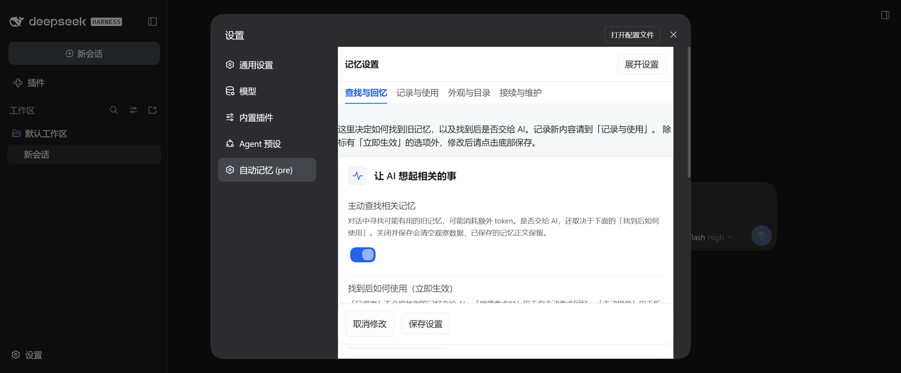

# DeepCode 兼容修复与同类问题复核

2026-10-05；基于 upstream/main `e260677`（3.2.9）。此分支修复代码与生成源，不发布安装包。

## 工作区和目录

上游 3.2.9 已修复工作台运行校验的 Android 路径别名误判，以及连续建立失败时的熔断。本次进一步修复遗漏入口：

| 问题 | 修复后行为 |
| --- | --- |
| 多层新目录尚不存在时，只解析直接父目录，仍保留别名 | 找到最近存在的祖先，解析物理路径，再拼回缺失后缀 |
| `/config` 对合法别名目录静默丢弃 | `workbenchRoot`、`memoryRoot`、`userMemoryDir` 均按物理路径判断是否位于 DSH_HOME 下 |
| 根目录中的符号链接可绕过上述字面包含校验 | 解析后确实落到根外的路径继续拒绝，不改变原配置 |
| 清理旧工作台时，将当前目录的另一种写法误删为旧登记 | 同一物理目录的登记保留；含会话的登记仍保留；缺失路径的登记不清理 |
| 新一期会话建立时仍按字面路径登记，可能产生重复工作区 | 先查找同一物理目录已有的工作区并复用 id；缺失时仅登记一次 |
| 接续会话按 cwd 查工作区时，别名匹配不到，落入未分组 | 保留 sessionIds 的优先级，再按物理路径寻找所属工作区 |
| Linux/Android 登记比较无条件转小写，可能混淆两个目录 | Windows 忽略大小写；Android/Linux/macOS 保留路径大小写 |
| `..phone` 等合法子目录名被当成父目录遍历 | 仅拒绝 `..` 路径段；合法子目录照常使用 |

截图中 C 盘与 D 盘若确实为不同物理目录，仍正确报告不匹配。已有“同意并建立”入口可建立目标目录下的工作台；不会将两处不同目录假装成同一处，也不会因此删除旧会话。

## 外观和手机布局

- 共享兼容样式由 `skins/compat/mobile.css` 提供，随生成器嵌入客户端，适用于基线、仪器、编辑和活水四款皮肤。
- 设置页使用实色背景、清楚的文字和边框，避免宿主侧栏和设置透字。
- 展开页使用视口高度及 Android 安全区变量。内容单独滚动，保存按钮保留在底部，页签可横向滚动。
- 未展开的桌面设置页继续随宿主滚动，页签和保存区保持 sticky；独立滚动布局只约束展开状态。
- 控件容器可以收缩，检索按钮可以换行；“端到端加密档位”等长选项不再撑宽页面。
- 小屏下浮窗、引导和工作台确认弹窗使用实色背景，关闭模糊效果。
- 检测 `window.androidBridge` 和 DeepCode 的移动布局标记，兼顾手机端的宽屏模式；普通窄浏览器也有回落。
- 自动展开只触发一次。点击“返回宿主设置”或 Escape 后，尺寸监听不会立即重新展开。

DeepCode 接口依据其[公开源码](https://github.com/kelai141/dsh-mobile-apk)，包括 theme bridge 和移动样式。插件不修改宿主的主题桥接。冻结基线源固定为 LF，避免 Windows 检出改变换行后违反生成和主题同步约束。

## 已完成验证

- 修复前实际复现了路径配置丢失、当前登记误删、接续别名匹配失败、长下拉框将 320px 页面撑到约 502px，以及返回设置后反复展开。
- 46 个相关 smoke 套件：46 PASS、0 FAIL、0 TIMEOUT。范围为工作台、设置、皮肤、生成器、路由、接续、跨工作区、配置读写等；不是全仓全部测试。
- 新增路径测试执行完整 MemoryEngine 和真实注册的 `/config` HTTP handler，使用隔离临时目录与真实 junction/symlink；三种平台的大小写分支另外直接执行生产方法验证。
- 使用 Windows DSH 0.2.0-rc.2 的实际页面检查。320×720 下四款皮肤 × 深浅主题 × 四个设置页签，共 32 组，通过背景不透明、视口边界、横向宽度、底部保存可点击和内容滚动检查。
- 四个页签逐个打开可见折叠项（分别 4、12、5、17 项），宽度检查通过。另检查 390×844、320×420、1280×900 的实际页面尺寸。
- 在实际 UI 修改设置并保存，看到“已保存”，配置文件对应字段更新；点击返回后保持宿主设置页。工作台确认和记忆浮窗在 320px 下背景不透明且位于视口内。
- 入口语法、生成源同步检查通过。

重点复核命令：

```sh
node --check lib/index.js
node --check lib/client.js
node tools/build-iter5-skin.mjs --check
node tests/smoke/smoke-test-deepcode-paths.mjs
node tests/smoke/smoke-test-deepcode-ui.mjs
node tests/smoke/smoke-test-workbench-canon.mjs
node tests/smoke/smoke-test-workbench-create-breaker.mjs
node tests/smoke/smoke-test-workbench-gaps.mjs
```

浏览器只读探针保存在 `tests/browser/deepcode-ui-probe.js`，可在打开真实记忆设置页后通过 BrowserSkill 的 evaluate 运行。测试与页面检查结果、截图位于本地忽略目录 `.qa-deepcode/`。

首次验证时，上游标准 smoke runner 依赖的 `tools/smoke-impact.mjs` 在基线中缺失，因此上述专项结果使用隔离 DSH_HOME/HOME/USERPROFILE 的逐文件执行器取得。后续 CI 修复已恢复标准运行器依赖，见下文。

## 最终复核（PR #237）

按 Open Code Review delegation 流程对照 `e260677` 审查全部差异。OCR 可审查项 12 个，逐项 reviewed，skipped 0，覆盖率 100%。另人工核对 OCR 因扩展名或二进制排除的文档、冻结源及三张截图（共 5 项）；全部差异共 17 个文件。

覆盖 `.gitattributes`、`lib/client.js`、`lib/index.js`、`skins/compat/mobile.css`、`skins/iter5/surfaces.js`、`tests/browser/deepcode-ui-probe.js`、两个 DeepCode smoke、Iter5 skin smoke、workbench canon/gaps smoke、生成器。冻结源与生成客户端同步检查通过。

复核发现并修复两个中等问题：

1. 工作台新会话登记未按物理路径复用已有工作区，别名可造成重复分组。先加真实 MemoryEngine 回归复现失败，再合并登记入口，按物理目录复用 id。另覆盖缺失登记仅调用一次、登记失败返回诊断状态。
2. 兼容 CSS 把未展开的桌面设置页也改成了隐藏溢出和静态保存区。Windows 实际页面中保存区滚到视口外（顶部约 1229px，视口高 624px）；现将隐藏溢出限定到展开状态，未展开恢复 sticky 页签和保存区。修复后保存区位于 507–576px，可点击。

最终验证：

- Windows / Node 24.15.0：46 个相关 smoke，46 PASS / 0 FAIL / 0 TIMEOUT。
- 本机 Ubuntu WSL / Node 23.11.1：12 个针对路径、工作台、接续、主题同步和生成器的 smoke，12 PASS / 0 FAIL / 0 TIMEOUT。使用真实 Linux symlink，不仅是模拟平台变量。
- Windows DSH 实际浏览器页面：桌面未展开、桌面展开（均 1502×624）、窄屏展开（320×720）三种状态，各四款皮肤 × 深浅主题 × 四个页签，共 96 组探针全部通过。未展开的宿主滚动、保存区可点击也纳入探针。
- 语法、生成器同步及 diff whitespace 检查通过。未发现剩余需要修复的高/中等问题。

首次 smoke CI 在执行测试前因缺失 `tools/smoke-impact.mjs` 失败；对照基线确认其同样导入该文件且未包含该文件。随后按用户要求修复 CI，不再将入口失败作为交付状态。

## CI 修复

- 恢复运行器所需的 `tools/smoke-impact.mjs`，加入发布同步清单，避免下次发布再次丢失。
- 新增隔离仓库中的 CLI 回归：发布复制后的入口启动、帮助、中文重命名影响面、局部运行、筛选/排除、真实失败退出与超时。
- CI 显式准备 Python 3.12。标准回归不安装模型或第三方运行时依赖，原有排除项保持不变。
- WASM 路径测试使用含中文与空格的临时资产目录；可通过 `DSH_TEST_TRANSFORMERS_DIST` 指定真实已安装资产。该项验证路径选择，不执行 WASM。
- Python 解释器链测试改用真实 Python 进程和临时 venv，覆盖缺失/缺依赖/就绪、选择顺序、超时重试与失败诊断。空导入模块仅作为依赖探测夹具。原有真实 C2/C3 模型断言保留在 `smoke-test-py-runtime-live.mjs`，通过 `DSH_TEST_PLUGIN_DIR` 指定安装目录；本次未运行模型验收。
- 沉淀隔离测试预置自身工作台，验证 A/B 源消息隔离、工作台归属和同轮去重；断言异常现在强制非零退出，负向探针验证不会被宿主异常监听器吞成成功。
- 修正截取固定 300 字符的旧源码守卫，并按已审查的 DeepCode 改动同步宿主哈希基线；行为断言和路由计数继续保留。

全量命令（隔离 DSH_HOME/HOME/USERPROFILE）：

```sh
node tools/run-smoke.mjs --jobs=1 --timeout=90000 --exclude=-live --exclude=m79-feature-v2 --exclude=m710-fv2-emit --exclude=c4-fresh-install
```

Ubuntu WSL / Node 23.11.1 / Python 3.12.3：264 PASS / 0 FAIL / 0 TIMEOUT。本机 WSL 为匹配 CI 的 Python 命令名，在临时 PATH 中为 python3 提供 python 别名，没有改动系统安装。

Windows / Node 24.15.0 / Python 3.12.10：同一命令 264 PASS / 0 FAIL / 0 TIMEOUT。CI 修复的 10 个可审查文件逐项复核，0 跳过；本文档另人工核对。本机结果与 GitHub 的 Node 22 门禁结果分别记录。

桌面未展开修复后的实际截图：



**验收边界：未连接 Android 手机，未运行 DeepCode APK；浏览器尺寸检查不等于 DeepCode 真机验收。** 手机系统栏、安全区、软键盘和具体 WebView 版本仍需设备复测。未发布、未合并。
