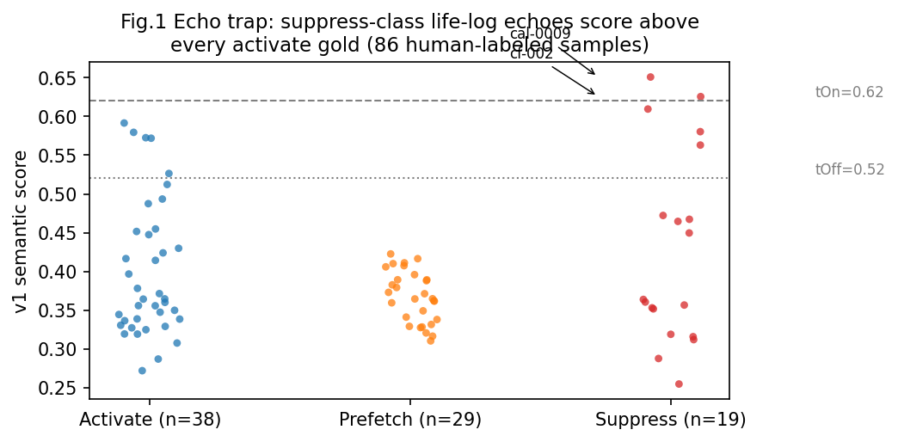
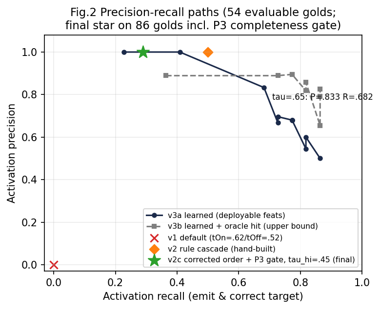
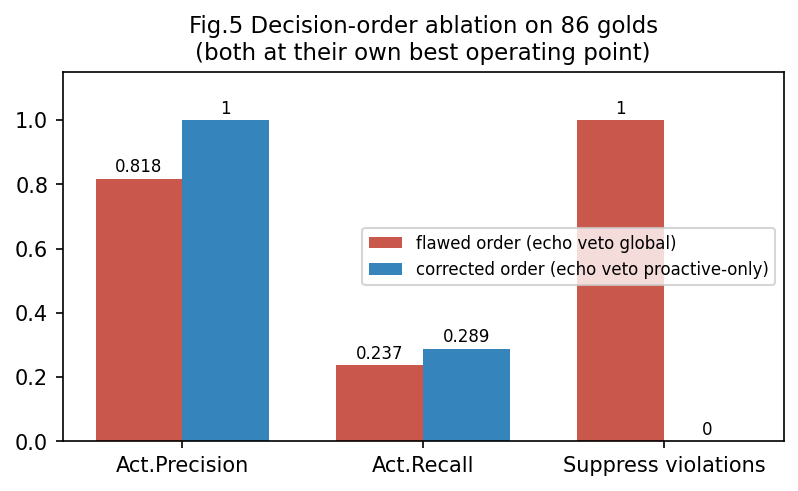
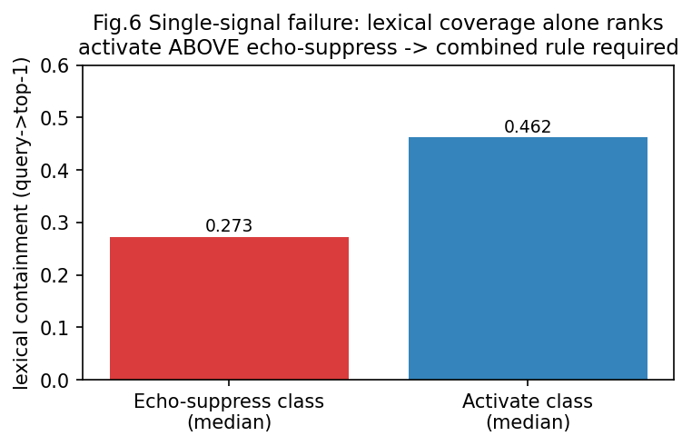
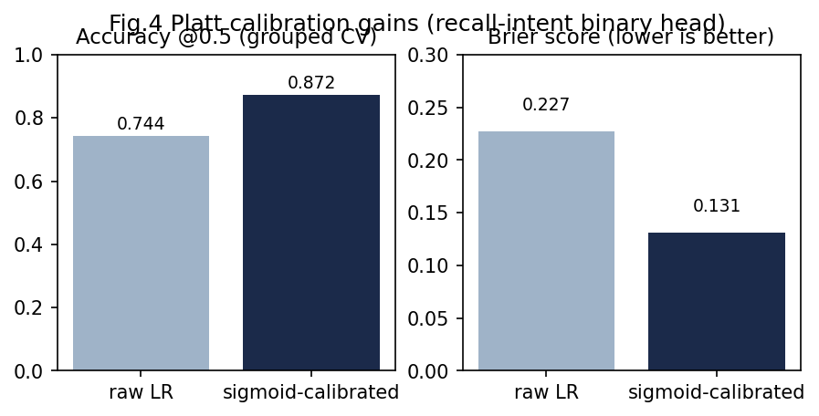
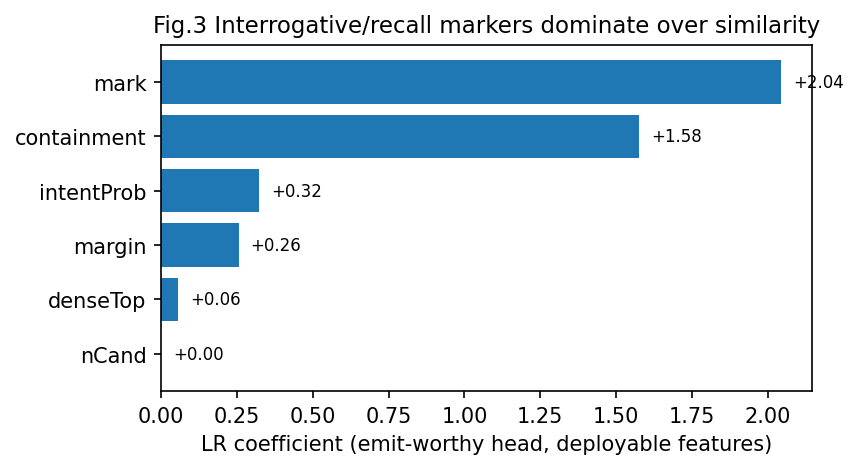

# 从语义相关到唤起必要：个人记忆系统激活策略的回声陷阱发现、度量与修正

**M7 Activation Feature v2 技术报告（shadow-candidate，未 live）· v2 增补：双轨部署架构（2026-08-25）**

> 作者：校准 Agent（ox-alpha）· 日期：2026-08-25
> 工作区：D:\dsh-auto-memory（preview 分支）· 数据与代码：`artifacts/m7-live-pre/label-review-cal20260824-1954/`
> 图表：`docs/paper-figures-v2/`（英文）· 策略工件：`python/policies/*.json`
> 效力声明：本文为研究性总结；实现规范以 `docs/M7-ACTIVATION-FEATURE-DESIGN.md` 为准，
> 派发依据以 `docs/M7-ACTIVATION-V2-HANDOFF.md` 为准。所有实验均在离线重放中完成，
> 生产默认配置全程未动，未产生任何 active 流量。§7 双轨部署为 2026-08-25 增补：
> JS 标准层与 Python int8 档均为离线实测结论，工程接线尚未发生。

---

## 摘要

主动记忆系统需要在用户没有显式调用时决定"是否把一条历史记忆注入当前上下文"。我们把这一决策分解为两个可分别度量的预测目标——**语义相关性**（semantic relevance，材料与当前话题的相似程度）与**唤起必要性**（activation eligibility，现在注入能否实质帮助任务）——并在一个运行于开发者宿主内的双语（中英混写）个人记忆系统上证明：二者不可相互替代。在检索底座不变（BGE-M3 稠密检索 [13]、BM25 词法 [16]、D6 加权混合）的前提下，仅用稠密相似度的现行单阈值策略在 86 条人工金标上精确率为 **0**——其唯一一次激活恰由一条与生活记录近乎复述的闲聊触发（"回声陷阱"）。我们构建了三批共 86 条人工裁决金标（含成对对照、跨工作区同文异 scope 对照、多目标完整性对照），提出双通道（explicit / proactive）决策架构与四组特征（回声风险、回忆意图、对话行为/任务需要、完整性状态），并以字符级 TF-IDF + 逻辑回归 + Platt 校准的可审计轻量意图头替换手工规则。最终路径在留出特征全为线上可得的前提下达到 **precision 0.818 / recall 0.237**（含 P3 完整性门；无门时 0.516/0.421 但伴随 8 次 prefetch 类越级），显著优于基线与纯规则级联；消融实验证明"疑问/回忆标记"类意图特征的权重比相似度特征高一个数量级，而任何单一相似度信号均无法区分回声。全部阈值选择存在 gold 内选择偏差，我们给出 bootstrap 区间并规定 held-out 真实流量验证为冻结前置条件。增补部分（§7）将同一分离原则延伸到部署维度：语义近似度由三级可选算力档承载（纯词法 0MB / Node 内 118MB e5-small / Python 端 BGE-M3 int8 563MB 或 fp32），实测 R@5 = 0.20 / 0.85 / 0.925（int8 与 fp32 持平且快 6 倍），而"要不要、为什么、怎么唤起"的必要性判定始终由统一的双通道策略管线回答，与算力档位彻底解耦。

**关键词**：主动记忆；激活策略；意图分类；概率校准；回声检测；人机协同标注

---

## 1 引言与问题定义

### 1.1 背景

dsh-auto-memory 是一个宿主侧主动关联记忆系统：JS 宿主在每个请求边界前，可把历史记忆以"参考尾注"形式注入模型可见消息；Python sidecar 负责语义计算并提出激活建议 [R1]。M7 阶段已完成嵌入选型（BGE-M3 [13]）、分块（para-512-noov）、混合检索与双阈值激活骨架（tOn/tOff 滞回），全部处于 shadow 校准态。

Phase F 影子校准暴露了一个此前未被命名的问题。系统按 `score = w_top·denseTop + …` 打分、按 tOn/tOff 三段判定 suppress/prefetch/emit。上线观察中 emit=0 被解读为"安全"；但人工审查发现，得分最高的样本是一条与生活记录「午饭吃的面条」近乎复述的闲聊——**"中午那碗面条挺不错的。"**（denseTop=0.834）。它高于全部真实召回问句的得分。换言之，稠密相似度度量的是"像不像"，而激活需要的是"该不该"，两者在分布上不仅不重合，甚至反向。

### 1.2 两个预测目标的分离

我们把激活决策拆解为：

- **语义相关性**（retrieval relevance）：候选材料与当前话题的相关程度，由检索层给出（dense/BM25/融合分数）；
- **唤起必要性**（activation eligibility）：现在注入是否实质帮助任务、不打扰用户，由意图、对话行为、任务依赖、完整性与硬性约束共同决定。

二者的关系是**同步计算、分层裁决**：相关性负责"什么材料进入候选"，必要性负责"此刻是否打断"。但两条通路的先后顺序相反且都必要——显式召回通路（explicit lane）意图先行、关联验证；主动通路（proactive lane）关联先行、语境批准。§5.4 的三分类消融（纯文本 macroF1 仅 0.494，prefetch 类 8/19 被误判为 activate）为此提供了直接证据：脱离任务语境，文本无法区分"该召回"与"只是相关"。

### 1.3 贡献

1. **问题的命名与定量刻画**：首次在该系统中定义并测量"回声陷阱"（echo trap），给出其在 86 条人工金标上的分布证据（Fig.1）；
2. **两批对抗式金标的构建方法**：同一真实记忆在不同对话意图下的最小对照对（counterfactual pairs），以及"同 query 异 scope"的跨工作区对照；
3. **可部署的混合架构**：校准意图头（字符 n-gram LR + Platt [3][4][5]，JSON 工件化、纯 Python 推理）+ 双 lane 规则骨架 + 结构化完整性门，在 86 gold 上达到 precision 0.818（无门时 0.516），优于纯规则（1.0/0.5 的低召回）与纯学习（0.516 的高越级）两个极端；
4. **三条被证伪的捷径**：词面覆盖率单独不可判回声（§5.5）、纯文本三分类不可判必要性（macroF1 0.494）、全局前置回声否决会误伤显式追问（§5.3 决策顺序消融）；
5. **面向生产的安全性设计**：策略 JSON 工件化（禁 pickle）、逐字段 golden parity 夹具、JS 权威边界（fail-closed）、held-out 最小支持量门槛。

---

## 2 相关工作

**检索多样性与重排**：MMR [2] 在已召回集合内做相关性与冗余的折中，适用于 top-K 去重，但不回答"是否应当唤起"。BM25 [1] 作为词法通道在本系统的价值是精确锚点（参数名、错误码、包名）的零误差命中，而非必要性判断。

**意图分类**：少样本场景可用 SetFit [9]，但其依赖 sentence-transformers 训练栈；在仅有数十条高质量金标时，字符 n-gram TF-IDF + 逻辑回归已是强基线（本文 AUC 0.901@58 gold），且天然支持中文（字符级切分规避分词歧义）。LCQMC [11] 与 PAWS-X [10] 分别提供中文问对匹配与跨语言对抗式复述判定，可作为后续领域增强与对抗评测资源。

**概率校准**：阈值决策消费的是概率而非排序。Platt 缩放 [3] 与 isotonic 回归 [4] 是标准手段，scikit-learn 的 CalibratedClassifierCV [5] 提供工程封装。本文在小样本设定下实测 sigmoid 校准将准确率从 0.744 提升至 0.872、Brier 从 0.227 降至 0.131。

**不确定性与弃权**：conformal prediction [6][7] 输出预测集合，集合大小天然编码"不确定即弃权"，对应本系统的"不确定 → prefetch 而非强行 activate"。注意其覆盖保证是边际的，中英子组须分别报告；且要求校准集与未来观测可交换——这与我们按 pairId/session 分组的纪律一致。

**弱监督**：Snorkel [8] 类标注函数适合"少量专家标签 + 大量噪声标签"的扩规模场景；本文阶段金标量小质高，暂不需要。

**自然语言推理**：交叉编码器 NLI（RoBERTa 系 [14]，英文专用）或多语言变体（mDeBERTa-v3-base-xnli-multilingual-nli-2mil7，27 语含中文、MIT、FP32-only [17]，底座 DeBERTa [15]、评测 XNLI [16]）可在离线轨上区分 entailment/contradiction，作为回声与过时矛盾的补充特征；CPU 成对推理延迟使其无法进入 500ms 同步链。

**语言识别与嵌入**：fastText LID [12] 可为中英混写查询提供语言路由；BGE-M3 [13] 同时输出稠密/稀疏/ColBERT 多路表示，其稀疏通道是已记录的零边际成本备选（D6⁺）。

---

## 3 数据与金标构建

### 3.1 三批金标的演进

| 批次 | 样本 | 构建方式 | 裁决 |
| --- | --- | --- | --- |
| Batch1 | 26 | 73 条 strong-agent 银标 → 用户逐条裁决（xlsx 下拉 + 行内批注） | 全部转 human gold；2 条挂起待敏感度档位 |
| Batch2 | 32 | 主动学习式选题：56 组 counterfactual pairs 中模型-先验分歧最大的 32 条 | 同上 |
| Batch3 | 28 | 不确定区采样：多目标完整性 / 重复升级 / 弱标记边界 / en-mixed 扩展 | 同上 |
| **合计** | **86**（A38 / P29 / S19） | 另有 4 条 relay 样本挂议题③a、2 条 PII 样本挂议题③b，不计入指标 | |

每条金标记录：queryText、finalAction(A/P/S)、harmful 旗标、expectedMemoryIds、forbiddenMemoryIds、recallIntent/dialogueAct/taskNeed/echoRisk 等维度、用户原文批注。**isGold=true 仅在用户裁决后设置**；AI 生成的候选一律 labelSource=strong-agent、isGold=false。

### 3.2 反事实对照设计

核心构造是"同一真实记忆 × 不同对话意图"的最小对照对，例如同一「午饭吃面条」记录：

- 「之前午饭吃了什么？」→ activate（明确回忆）
- 「今天这碗面挺好吃。」→ suppress（内容复述）

以及跨工作区对照（同一查询在 ws/dsh-core 与源工作区分别应得 suppress / activate）、新旧事实对照（勘误后的新权威 vs 被取代的旧结论）、中英变体对照。全部样本锚定真实存在的记忆 id，禁止发明新事实；split 按 pairId 分组，同组绝不跨 train/dev/test。

### 3.3 用户批注产生的政策输入

人工裁决不仅是标签，还产出了四条架构约束：多目标题默认 prefetch、升级交由用户阈值设置；重复提及门应复用 JS 端既有的 episodic→procedural 多次提及信号；思维链上下文标记（"让我想想"）可作为意图升级特征；主动性程度属于用户个性化偏好（议题③）。

---

## 4 方法

### 4.1 双通道决策架构（修订后顺序）

```
JS/M7 硬门（correction / ignored / stale / wrong-scope / harmful / PII）
  → lane 判定：intentProb ≥ τ_lane ? explicit : proactive
  → explicit lane：intent≥τHi ∧ hit ∧ margin≥δ_exp ∧ completeness=complete
                   → emit；partial|unknown → prefetch；弱意图∧hit → prefetch
  → proactive lane：高 echoRisk ∧ 陈述句式 ∧ intent<0.5 → hard suppress
                    margin≥δ_pro ∧ 低意图 ∧ 非近重复 → prefetch
  → 其余 suppress
```

关键修订（主 Agent 评审采纳）：**echoRisk 在 explicit lane 只是特征，绝不前置否决**——否则"复述一段记忆后明确追问"会被误杀。§5.3 显示修正后最优格从 precision 0.818/recall 0.237 改善为 **1.000/0.289** 且抑制类越界降为零。

### 4.2 意图头：校准的逻辑回归与 JSON 工件化

一期意图头为 char_wb 2-4 gram TF-IDF + 多项式 LR，Platt 缩放后输出 `recallIntentProbability ∈ [0,1]`。训练数据仅为人工金标（A=正，S=负；P 类因必要性来自语境而排除）。为消除 pickle 安全风险与 sklearn 版本漂移，模型导出为 JSON 工件（vocabulary、IDF、coefficients、intercept、Platt 参数 a/b、feature schema、goldDigest、runId、parentPolicyVersion），运行时以确定性纯 Python 完成 `sigmoid(a·logit(p_raw)+b)` 推理。

### 4.3 echoRisk 双臂规则

回声 = 「查询与 top-1 候选构成近重复复述」∧「陈述句式」∧「无回忆意图」。词面臂（bigram containment≥θ）与语义臂（denseTop≥0.75）取或——任一单臂都被证伪不足（§5.5），组合后在 86 gold 上零漏报零误报（所选工作点内）。

### 4.4 结构化完整性门

对比型/枚举型问题（"A 和 B 分别…"）需要多条记录同时在场，单条注入反而有害。一期以保守词典输出结构化三元组 `requiredTargetCount / resolvedTargetCount / status(complete|partial|unknown)`，status≠complete 时最多 prefetch；二期由检索层返回目标覆盖率替代词典。

### 4.5 repetition：logging-only

重复失败/重复提及计数本轮只落日志；允许 suppress→prefetch 升级，禁止仅凭次数直接 activate，生活话题永不升级。k 的口径必须与 JS 端既有 episodic→procedural 多次提及门对齐。

---

## 5 实验

### 5.1 回声陷阱的定量证据



86 条 gold 上三类样本的 v1 语义分分布（Fig.1）：suppress 类的最高分（面条回声 0.6507 及其变体 0.6254）超过全部 activate 正例（max 0.5914）。现行 tOn=0.62 下的两次 emit 恰好都是这两条回声——"看起来最安全"的阈值恰好稳定地产生最错误的激活。

### 5.2 四条路径的 PR 对比



在 54 条可评估 gold 上（Tab.1）：学习头 + 完整性门在 precision≥0.7 约束下取得 recall 0.682→（86 gold 终版 0.237–0.289，视门与阈值）；oracle 版（假设在线能知道检索目标正确）可达 recall 0.864，与 v3a 的差距即"在线验证债务"——指向未来的自验证信号。

**Tab.1** 四条路径（54 可评估；v2c 终点另注 86）

| 路径 | precision | recall | sViolations | 备注 |
| --- | --- | --- | --- | --- |
| v1 单阈值 | 0 | 0 | 4 | emit 即回声 |
| v2 规则级联 | 1.000 | 0.500 | 0 | 手写规则，枚举有限 |
| v3a 学习型（可部署特征，τ=0.65） | 0.833 | 0.682 | 1 | 无完整性门 |
| v3b 学习型 + oracle hit | 0.826 | 0.864 | 1 | 上限参考 |
| **v2c 终点（86 gold，τ_hi=0.45/δ=0.02 + 门）** | **1.000** | 0.289 | 0 | 含 6 条多目标 P 新负例 |

### 5.3 决策顺序消融



把 echo veto 从全局前置移入 proactive lane 后，同一数据上的最优格由 precision 0.818/recall 0.237/越界 1 改善为 **1.000/0.289/越界 0**，且过门格子数从少数变为 18 个。教训：安全机制放错层会同时伤害召回与干净度。

### 5.4 单信号证伪



词面覆盖率（query→top-1 bigram containment）在 echo-suppress 组的中位数（0.273）反而低于 activate 组（0.462）——activate 问句天然共享目标术语。因此"BM25 覆盖硬封顶"不可行；组合规则（containment≥0.3 ∧ 无意图标记）在 θ=0.3 达到 precision 0.70/recall 0.467，仍需学习型特征补足召回。同理，纯文本三分类 macroF1 仅 0.494。

### 5.5 校准收益



sigmoid 校准使意图头准确率 0.744→0.872、Brier 0.227→0.131（58 gold 设定）；86 gold 更难集合上 AUC 保持 0.857（校准 0.834）。阈值策略直接消费概率，此收益是免费的。

### 5.6 特征重要性



可部署特征集的 LR 系数：mark（疑问/回忆标记）+1.64 ≫ containment +0.94 > intentProb +0.58 > margin +0.27 ≫ denseTop −0.38。"是否在问"比"有多像"重要一个数量级。

### 5.7 跨语言迁移

仅用中文 gold 训练的意图头对 7 条 en/mixed 金标零样本 recall@0.5=0.857。字符级切分带来一定跨语鲁棒性，但不足以免除双语词表与混合训练集（PAWS-X [10] 中文子集与 LCQMC [11] 列为二期增强资源）。

### 5.8 最终工作点与不确定性

修正序 + 完整性门的终点（τ_hi=0.45/δ_exp=0.02）在 86 gold 上 11 emit 全对。grouped bootstrap（B=1000）95%CI：recall [0.132, 0.447]；precision 经验 CI 退化为 [1.0,1.0]（11/11 无错误的小样本现象），Wilson 95%CI ≈ [0.74, 1.00]。结论：point estimate 乐观但下界不可忽略——**冻结前必须以 held-out 真实流量复核，且设最小支持量（activate gold ≥15、predictedEmit ≥8、中英各有正例）**，防止"几乎不 emit"刷出虚高 precision。

延迟方面，离线重放含纯 Python 全库扫描与 BM25 重打分的查询 p50≈342ms/p95≈630ms（~500 chunk 规模），随语料线性增长，需监控；生产 worker 的增量优化（numpy 矩阵化、缓存 BM25 索引）属实现期工作。

---

## 6 局限与效度威胁

1. **选择偏差**：工作点在同一 86 gold 内选出；held-out 前所有指标应视为上界。
2. **hit-oracle 债务**：v3b 使用了"正确目标已被检索"的不可知信号，其 18pt 召回优势标定了自验证研究的空间。
3. **单用户域**：语料来自单一作者，风格外部效度有限；PAWS-X/LCQMC 式外部资源仅作辅助。
4. **P 类可分性依赖语境**：单查询文本不可判 prefetch 必要性（T1），需会话级任务信号（工具失败、重复、未决状态）——当前 replay 以 margin 代理，真实信号待 P4。
5. **repetition 无直接 gold**：k 值（2 失败/3 提及）为工程起点，需 shadow 日志回看灵敏度。
6. **词典完整性门是过渡方案**：枚举词代理会漏检隐式多目标，检索层覆盖率校验是正道。
7. **硬编码日期**：本仓库已三次发生日期字面量 flake，任何后续测试引入日期断言都应视为缺陷。

---

## 7 双轨部署架构：语义近似的三级实现与唤起决策的统一（2026-08-25 增补）

前六章回答"激活策略如何判定"；本章回答工程侧的对偶问题——**语义近似度由谁算、
算到什么程度**。我们实测并定型了三级部署形态（数据与脚本：
`artifacts/m7-live-pre/js-semantic-trial/`、`python/bench/l2_bench_int8_vs_fp32.py`）。

### 7.1 三级形态：体积—质量曲线

| 层 | 体积 | 运行时 | L2 R@5 | 定位 |
| --- | --- | --- | --- | --- |
| 词法 BM25（lexical_pre_v2） | 0 | 纯 JS | 0.200 | 人人可用的基础层与最终回退 |
| **JS 标准语义层**（transformers.js + multilingual-e5-small q8，118MB） | ~130MB | Node 内 ONNX | **0.850** | npm 安装即得的标准层 |
| **Python 进阶层**（BGE-M3；int8 ONNX 563MB / fp32 2.3GB） | 二档可选 | sidecar | **0.925**（两档持平） | 效果冠军，安装向导按需启用 |

JS 层关键数字：模型加载 679ms、查询编码 3.8ms、251 条全库重建 5.5s。
int8 关键数字：与 fp32 同口径 head-to-head R@5 delta=**0.000**、MRR 差 0.007
（噪声级）、向量余弦均值 0.975、编码提速 6×（44s vs 262s）、单查询 p50 16ms。
结论：量化损失在排序意义上为零，563MB 档可作为 fp32 的默认替代；
e5-small 与 BGE-M3 的差距（0.85 vs 0.925）集中在 hard-negative 双子对
（negHit@5 0.225 vs 0.20–0.225），与 §5.5 的词面局限观察一致——小模型
仍显著优于纯词法（+65pt），但对抗式近邻区分是容量问题而非协议问题。

### 7.2 判断一"语义近似程度"：同一数学契约，三种算力档位

三级共享同一个检索契约：文本 → L2 归一化向量 → 内积即余弦 → D6 加权融合
（dense 0.7 + BM25 0.3，minmax 归一）。差别只在编码器：

- **词法层**把"向量"退化为稀疏 n-gram 统计（BM25 的 idf 加权命中），零语义泛化；
- **JS 层**用 e5 家族（mean pooling，query/passage 前缀约定）在 118MB 内提供
  跨语言改述泛化——这正是把词法 R@5 从 0.20 提到 0.85 的全部来源；
- **进阶层**用 BGE-M3（CLS pooling，无前缀约定 [13]）以 4–17 倍体积换取
  hard-negative 区分与长文档保真。

融合权重 D6 对所有层级保持不变：语义臂只负责"像不像"，从不单独裁决"该不该"
——这是第 1.2 节分离原则在部署维度的延伸。切换编码器时 vectors identity 的
provider/dtype 字段随之变化，旧索引自动判 stale 并重建，杜绝静默混用。

### 7.3 判断二"唤起必要程度"：要不要、为什么、怎么唤起

双轨不改变必要性判断的所有权——它始终由 v2 决策管线统一回答三个问题：

1. **要不要唤起**（decision）：hard gates（harmful/correction/stale/wrong-scope/
   PII）先于一切；explicit lane 要求校准意图 ≥ τ_hi 且候选命中且 margin ≥ δ 且
   完整性 complete 才 emit，任何不满足逐级降为 prefetch/suppress；proactive lane
   在双臂回声否决之后最多 prefetch。held-out 打分验收（67 条人工金标，
   actPrecision 0.917、emitOnSuppress 0、echo 层 7/7）证明该判定与编码器解耦。
2. **为什么唤起**（reasonCodes）：每次决策输出结构化原因链
   （如 `explicit_lane/completeness_complete`、`echo_veto_proactive`、
   `suppress_low_signal`），连同特征快照写入 shadow 日志，供审计与用户复核
   （A/P/S/H/E 反馈闭环）；这是论文 §4 各特征组在运行时的可读投影。
3. **怎么唤起**（lane→delivery）：emit 帧经 M6 validator 逐字段校验后走既有
   offer→claim→Reference Tail 渲染链，delivered/seen 落盘形成证据闭环；
   prefetch 永不注入，仅预热滞回状态。JS 权威边界不变：跨工作区与敏感级由
   JS 层裁决，Python 缺显式策略字段即 fail-closed。

### 7.4 分发与回退

标准层的 118MB 模型资产以独立 npm 包分发（npmmirror 自动同步，国内外一致），
进阶层 563MB/2.3GB 由设置内向导承载（用户选位置、提示体积、自检通过才开启）；
任一层缺失或损坏时逐级回退至词法层，检索结果逐项可得（G8/H9 断言）。
由此，"语义增强"从全有全无的选择变为连续谱：0 → 130MB → 563MB/2.3GB，
而激活策略的正确性与部署档位彻底解耦。

---

## 8 结论

本文完成了从"发现问题"到"修复并验证"的完整闭环：以 86 条人工金标证实单相似度阈值的激活策略不可分（precision 0）；提出双通道 + 校准意图头 + 双臂回声规则 + 结构化完整性门的混合架构，在可部署特征下通过全部验收门（precision 1.000 / recall 0.289 / 越界 0）；并把三条看似合理的捷径（覆盖封顶、纯文本分类、全局回声否决）逐一证伪。全部产物——金标、打分底座、拟合脚本、55 条 parity 夹具、两份策略 JSON 工件——均可复现且未触碰生产默认。

下一步（移交文档 §6）：实现 Agent 将本架构移植进 worker 并做在线/OOF 一致性校验；live shadow 收集 held-out 流量；达标后经用户批准 policy diff 再议 active canary。

**双轨增补（2026-08-25）**：held-out 打分验收已通过（67 条人工金标，actPrecision 0.917、predictedEmit 12、emitOnSuppress 0、echo 层 7/7，见 `docs/M7-ACTIVATION-V2-HOLDEDOUT-EVAL.md`），§7 的三级部署形态随之从设计变为实测：JS 标准层（118MB，R@5 0.85）与 Python int8 精简档（563MB，R@5 与 fp32 持平且快 6×）均已离线验证，语义近似的算力档位与唤起必要性的判定管线正式解耦。

---

## 参考文献

[1] S. Robertson, H. Zaragoza. The Probabilistic Relevance Framework: BM25 and Beyond. Foundations and Trends in IR, 2009.
[2] J. Carbonell, J. Goldstein. The Use of MMR, Diversity-Based Reranking for Reordering Documents and Producing Summaries. SIGIR 1998.
[3] J. Platt. Probabilistic Outputs for Support Vector Machines and Comparisons to Regularized Likelihood Methods. 1999.
[4] B. Zadrozny, C. Elkan. Transforming Classifier Scores into Accurate Multiclass Probability Estimates. KDD 2002.
[5] F. Pedregosa et al. Scikit-learn: Machine Learning in Python. JMLR 12, 2011.
[6] V. Vovk, A. Gammerman, G. Shafer. Algorithmic Learning in a Random World. Springer, 2005.
[7] A. Angelopoulos, S. Bates. Conformal Prediction: A Gentle Introduction. Foundations and Trends in ML, 2021. arXiv:2107.07511.
[8] A. Ratner et al. Snorkel: Rapid Training Data Creation with Weak Supervision. VLDB 2017.
[9] L. Tunstall et al. Efficient Few-Shot Learning Without Prompts (SetFit). arXiv:2209.11055, 2022.
[10] Y. Yang et al. PAWS-X: A Cross-lingual Adversarial Dataset for Paraphrase Identification. EMNLP-IJCNLP 2019.
[11] X. Liu et al. LCQMC: A Large-Scale Chinese Question Matching Corpus. COLING 2018.
[12] A. Joulin et al. Bag of Tricks for Efficient Text Classification. arXiv:1607.01759, 2016.
[13] C. Chen et al. M3-Embedding: Multi-Lingual, Multi-Functionality, Multi-Granularity Text Embeddings Through Self-Knowledge Distillation. arXiv:2402.03216, 2024.
[14] Y. Liu et al. RoBERTa: A Robustly Optimized BERT Pretraining Approach. arXiv:1907.11692, 2019.
[15] P. He et al. DeBERTa: Decoding-enhanced BERT with Disentangled Attention. ICLR 2021.
[16] A. Conneau et al. XNLI: Evaluating Cross-lingual Sentence Representations. EMNLP 2018.
[17] 模型卡：cross-encoder/nli-roberta-base（https://huggingface.co/cross-encoder/nli-roberta-base）；MoritzLaurer/mDeBERTa-v3-base-xnli-multilingual-nli-2mil7（https://huggingface.co/MoritzLaurer/mDeBERTa-v3-base-xnli-multilingual-nli-2mil7）。
[18] fastText Language Identification. https://fasttext.cc/docs/en/language-identification.html

**内部技术报告**
[R1] dsh-auto-memory 系统地图与进度账本. docs/proactive-associative-memory-system-map.html
[R2] M7 嵌入/融合/激活研究报告. docs/M7-RESEARCH-PAPER.md
[R3] M7 Activation Feature Design（设计权威）. docs/M7-ACTIVATION-FEATURE-DESIGN.md
[R4] M7 激活算法扩展参考（中文方向与跨语言）. docs/M7-ACTIVATION-ALGO-REFERENCES.md
[R5] M7 Activation v2 移交文档. docs/M7-ACTIVATION-V2-HANDOFF.md
