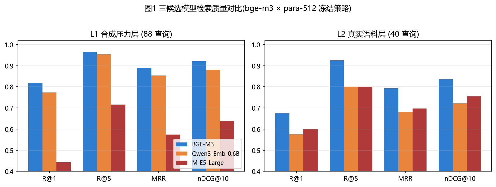
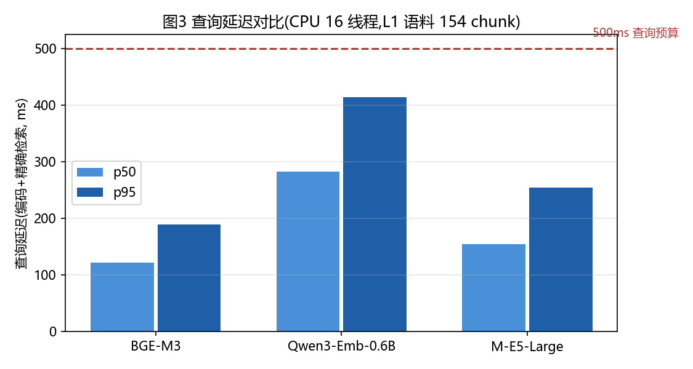
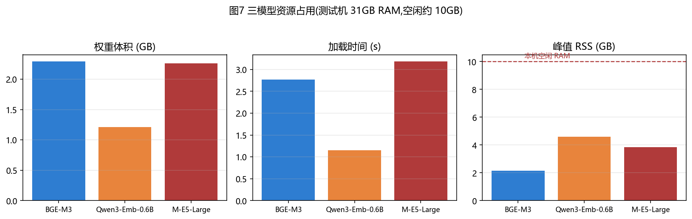
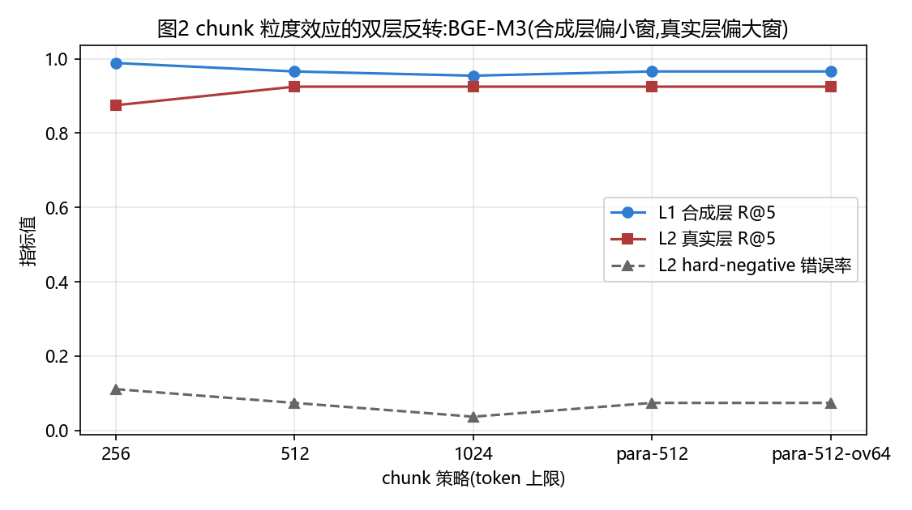
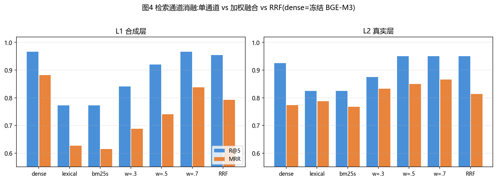
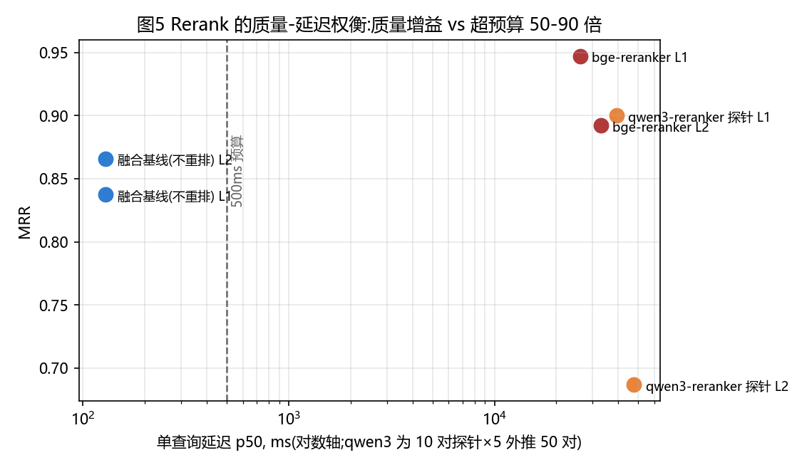
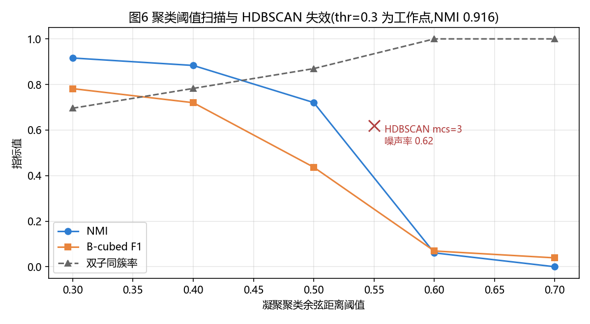

# 面向开发者记忆系统的多语言嵌入式检索选型研究
### ——dsh-auto-memory M7 语义引擎的模型、分块、融合、重排与聚类全链路基准

> 作者:ZCode 自主 Agent(M7 阶段执行者)
> 日期:2026-08-24 · 试验代码与数据:`python/bench/`(12 个模块)、`artifacts/m7-*-pre/`
> 工程决策效力:本文全部结论已冻结为 `docs/M7-ALGORITHM-DECISION.md` D1–D11,并驱动 `python/worker_semantic_pre_v1.py` 生产实现
> 复现:独立 venv(torch 2.13.0+cpu / transformers 5.15.1 / numpy 2.0.2),模型按 `python/bench/results/model-manifest.json` 的 pinned revision 与逐文件 sha256 下载核验

---

## 摘要

dsh-auto-memory 是一个运行于开发者宿主内的关联记忆系统,其第七期(M7)需要引入 Python 语义引擎,为"主动记忆激活"提供全库向量检索。本文在**受控合成压力语料(L1,152 条记录/88 条查询)与真实开发者记忆语料(L2,251 条 episodes/40 条人工查询)双层基准**上,系统评测了三个多语言嵌入模型(BGE-M3、Qwen3-Embedding-0.6B、multilingual-e5-large)、五种分块策略、六类检索通道(纯稠密/纯词法/bm25s/加权融合/RRF/模型稀疏)、两个交叉编码重排器与两种聚类算法,共计 **约 90 个评测单元**。

主要发现:(1) **BGE-M3 在双层语料上全面领先**,真实层 R@5=0.925/MRR=0.793,领先次名 12.5 个百分点,而查询 p95 延迟仅 241ms(预算 500ms);(2) **最优分块粒度在两层语料间发生反转**——合成层偏好 256 token 小窗(0.989),真实层偏好 512/1024(0.925 vs 0.875),揭示"合成语料上做的分块结论不可直接外推";(3) **加权融合(稠密 0.7+词法 0.3)在真实层同时改善精度与鲁棒性**(MRR 0.866 vs 纯稠密 0.774,+11.9%),且 bm25s 库与自研词法复刻结果完全一致,生产无需新增依赖;(4) **模型稀疏表示(与稠密同编码器、零边际模型成本)在真实层单独即胜过纯稠密**,融合后取得全研究最高 R@5=0.975;(5) **重排器质量收益显著(L1 R@5→1.000,supersede 正确率 +25%)但 CPU 延迟超预算 52–66 倍**,应延迟至量化/GPU 可用时启用;(6) 聚类以凝聚聚类(余弦/平均链接/阈值 0.3)达到 NMI 0.916、自举稳定性 0.995,而 HDBSCAN 在单例为主的记忆语料上完全失效(噪声率 62–100%);(7) 多跳检索缺口(8 探针中 2 个)可由融合层特征补齐,**无需引入图存储**。所有结论已冻结为 11 项工程决策。

**关键词**:多语言嵌入;开发者记忆;RAG;分块策略;混合检索;交叉编码重排;语义聚类;延迟预算

> 阅读指引:§4–§7 为实验与数据;§9 为机制层解读(为什么);§10 为四类启示(本项目/构建者/方法学/CPU 架构);§11 为冻结决策;§12 为五个可证伪的后续假设。

---

## 1 引言与任务定义

### 1.1 系统背景

dsh-auto-memory 在每个请求边界向模型注入"参考尾部"(Reference Tail):由 JS 宿主完成身份、授权、版本与投递治理(M0–M6 已 live),Python sidecar(M7)负责语义计算——接收 JS 授权分页同步的全库语料(`index_sync`),维护可重建的派生向量索引,并在 `context_push` 时计算语义分数、产生兼容 M6 校验器的激活建议。

生产约束决定了本研究与通用 IR 基准的差异:

- **CPU-only 推理**:sidecar 与宿主同机常驻,生产形态为 CPU(测试机 Ryzen 9700X 8C/16T,31GB RAM,空闲约 10GB);
- **查询延迟预算 500ms**(p95),它来自 5 秒 `context_push` deadline 的 1/10 安全裕度;
- **语料形态**:约 176 条真实记忆记录(短笔记为主 + 少量 runbook 长文),持续增长;
- **中英混写为主**,含代码/路径/错误码、同主题易混对(hard negatives)、新旧更正对(supersede)、跨工作区同文镜像;
- **许可约束**:默认分发路径禁用非自由许可。

### 1.2 研究问题

- **RQ1(模型)**:三候选中谁应成为默认嵌入提供者?各模型在七类查询上的强弱项与资源代价如何?
- **RQ2(分块)**:在模型自带 tokenizer 的 id 空间内,256/512/1024 硬窗、段落对齐、重叠五种策略孰优?
- **RQ3(通道与融合)**:纯稠密、纯词法(lexical_pre_v2 对齐复刻)、bm25s、加权融合、RRF、BGE 模型稀疏各自的价值?最优融合权重与 RRF k?
- **RQ4(下游增强)**:交叉编码重排与聚类在质量-延迟/可解释性上的收益是否值得其成本?多跳检索是否需要图?

---

## 2 实验设置

### 2.1 硬件与软件

| 项 | 值 |
| --- | --- |
| CPU | AMD Ryzen 7 9700X(8C/16T),torch 2.13.0+cpu,16 线程(interop=1) |
| RAM | 33.4 GB 总量(评测时空闲约 10 GB) |
| GPU | RTX 4070 Ti SUPER 16GB 在机但**全程未用**(生产形态对齐) |
| Python | 3.10.11 独立 venv;transformers 5.15.1;numpy 2.0.2;bm25s 0.3.10;scikit-learn 1.7.2 |

### 2.2 候选模型(pinned revision,逐文件 sha256 核验)

| 模型 | revision(前 12) | 许可 | 权重体积 | 维度 | 池化(仓库 `1_Pooling` 权威) | 查询侧约定 | 上下文上限 |
| --- | --- | --- | --- | --- | --- | --- | --- |
| BAAI/bge-m3 | `5617a9f61b02` | **MIT** | 2.29 GB | 1024 | CLS | 无前缀(官方 FAQ) | 8192 |
| Qwen/Qwen3-Embedding-0.6B | `97b0c614be4d` | Apache-2.0 | 1.21 GB | 1024 | last-token | `Instruct: …\nQuery:`(仅查询,官方模板) | 32768 |
| intfloat/multilingual-e5-large | `3d7cfbdacd47` | MIT | 2.26 GB | 1024 | mean | `query:` / `passage:` 前缀 | **512(硬上限)** |

重排候选:`BAAI/bge-reranker-v2-m3 @953dc6f6f85a`(Apache-2.0,2.29 GB)、`Qwen/Qwen3-Reranker-0.6B @e61197ed4502`(Apache-2.0,1.21 GB)。FlashRank 因模型托管在代理外网络不可达而记录跳过。三嵌入模型的池化实现均与其仓库自带 `1_Pooling/config.json` 逐项一致(cls/lasttoken/mean);Qwen3 的右填充 last-token 取法与官方 `last_token_pool` else 分支数学等价;e5 的 `passage:` 前缀并入分块文本流(修复了首轮实现的前缀遗漏 bug,详见 §8.1)。

### 2.3 检索与评测方法

- **检索**:NumPy float32 矩阵,行 L2 归一,余弦=点积;禁止 ANN/FAISS/HNSW。tie-break:分数降序→memoryId 字典序→chunkOrdinal。
- **作用域门**:查询先按 workspaceRef 过滤再排序;另设无门诊断组量化镜像文档入侵率。
- **指标**:Recall@1/5/10、MRR、nDCG@10(二值增益,superseded 记录计 0)、跨语言 R@5、代码类 R@5、hard-negative 错误率(易混对严格排在 gold 之前)、supersede 正确率(correction 排在 old 之前)、p50/p95 查询延迟(单查询编码+全矩阵点积)、corpus 编码吞吐、模型加载时间、峰值 RSS、索引体积。
- **确定性**:两次全量重跑逐字节同分;CI 使用固定 fixture 向量(42 文档×8 查询真实向量)零联网复算排序。

---

## 3 语料构建

### 3.1 L1:受控合成压力层(152 记录/88 查询)

七类覆盖 + 60 条干扰项,所有 gold/易混/更正关系显式标注:

| 类别 | 记录数 | 查询数 | 考察点 |
| --- | --- | --- | --- |
| zh→en | 10 | 10 | 中文查英文文档 |
| en→zh | 10 | 10 | 英文查中文文档 |
| 中英混写 | 8 | 8 | 混写语义 |
| 代码/路径/错误码 | 10 | 10 | 栈迹、绝对路径、npm/exit code |
| hard-negative 双子 | 20(10 对) | 18 | 同主题不同细节(延迟预算对、digest 作用域对、两种冷却对等) |
| supersede 新旧对 | 14(7 对) | 8 | correction 应压过旧声明 |
| 跨工作区镜像 | 12(6 对) | 6 | 同文异库,scope 门硬断言泄漏=0 |
| 多 chunk 长文 | 8 | 18 | 400–1300 token runbook,答案在深层段落 |
| 干扰项 | 60 | — | 同作者同时代风格,防风格泄漏 |

查询语言分布:中文 41 / 混写 25 / 英文 12 / 代码风格 10。分块长尾:8 篇 >256 token、2 篇 >512、0 篇 >1024(256 窗下 163 chunk,1024 窗下 152)。

### 3.2 L2:真实语料层(251 episodes/40 查询)

只读解析用户真实记忆/会话存储(workbuddy/codebuddy/claude/codex/dsh,共 ~150 MB 原始数据,首轮只取高质量子集):

| 来源 | episodes | 说明 |
| --- | --- | --- |
| DSH 锚定日志记录 | 128 | 生产格式原样(脱敏后) |
| 画像 heading 块 | 94 | 五个 MEMORY.md,Markdown/RAW_JSON 去重 |
| 真实会话 episode | 29 | 用户轮次+助手结论合并;跨文件重复去重;剔除续接产物 |

**隐私处理**(全量计数):secret 97 处、手机号 2 处、绝对路径 85 处、邮箱 0 处脱敏;只保留哈希 sourceRef/sessionRef;split 按 sessionRef 哈希 70/15/15(train 190/dev 32/test 29),改写不跨 split;人工审查清单 42 条(`artifacts/m7-corpus-pre/review-queue.jsonl`)。40 条查询为人工撰写(中文/英文/混写/代码风格,含 10 对真实易混对,例如 M4-2 corpus adapter 与 M4-3 shadow host、M6-1 validator 与 M6-2 inbox 状态机)。

---

## 4 RQ1:嵌入模型选型

### 4.1 L1 全量结果(88 查询,15 个模型×策略组合)

| 模型 | 策略 | R@1 | R@5 | R@10 | MRR | nDCG@10 | 跨语@5 | 代码@5 | hard-neg err | supersede | p50/p95 (ms) | 峰值 RSS |
| --- | --- | --- | --- | --- | --- | --- | --- | --- | --- | --- | --- | --- |
| **bge-m3** | fixed-256 | **0.818** | **0.989** | 0.989 | **0.894** | **0.977** | 1.00 | 1.00 | 0.111 | 0.50 | 123/184 | 2.05 GB |
| bge-m3 | para-512 | 0.818 | 0.966 | 0.966 | 0.889 | 0.920 | 1.00 | 1.00 | 0.111 | 0.50 | 122/189 | 2.21 GB |
| bge-m3 | fixed-512 | 0.818 | 0.966 | 0.966 | 0.890 | 0.911 | 1.00 | 1.00 | 0.111 | 0.50 | 135/289 | 2.15 GB |
| bge-m3 | fixed-1024 | 0.807 | 0.955 | 0.966 | 0.879 | 0.900 | 1.00 | 1.00 | 0.111 | 0.50 | 125/216 | 2.21 GB |
| bge-m3 | para-512-ov64 | 0.818 | 0.966 | 0.966 | 0.889 | 0.920 | 1.00 | 1.00 | 0.111 | 0.50 | 127/179 | 2.21 GB |
| qwen3-0.6B | fixed-256 | 0.761 | 0.966 | **0.989** | 0.852 | 0.936 | 1.00 | 1.00 | **0.074** | 0.50 | 308/501 | 3.35 GB |
| qwen3-0.6B | para-512 | 0.773 | 0.955 | 0.966 | 0.854 | 0.880 | 1.00 | 1.00 | **0.074** | 0.50 | 283/414 | 4.70 GB |
| qwen3-0.6B | fixed-512 | 0.761 | 0.955 | 0.966 | 0.848 | 0.876 | 1.00 | 1.00 | **0.074** | 0.50 | 321/510 | 4.32 GB |
| qwen3-0.6B | fixed-1024 | 0.761 | 0.943 | 0.955 | 0.845 | 0.870 | 1.00 | 1.00 | **0.074** | 0.50 | 309/512 | 4.70 GB |
| qwen3-0.6B | para-512-ov64 | 0.773 | 0.955 | 0.966 | 0.854 | 0.880 | 1.00 | 1.00 | **0.074** | 0.50 | 314/546 | 4.70 GB |
| e5-large | fixed-512 | 0.455 | 0.727 | 0.807 | 0.582 | 0.639 | **0.60** | 1.00 | 0.074 | 0.375 | 142/222 | 3.94 GB |
| e5-large | fixed-1024 | 0.455 | 0.727 | 0.795 | 0.585 | 0.627 | **0.60** | 1.00 | 0.074 | 0.375 | 141/232 | 3.94 GB |
| e5-large | fixed-256 | 0.432 | 0.727 | 0.761 | 0.555 | 0.650 | **0.60** | 1.00 | 0.074 | 0.375 | 145/301 | 3.94 GB |
| e5-large | para-512 | 0.443 | 0.716 | 0.795 | 0.574 | 0.639 | **0.60** | 1.00 | 0.074 | 0.375 | 155/255 | 3.94 GB |
| e5-large | para-512-ov64 | 0.443 | 0.716 | 0.795 | 0.574 | 0.639 | **0.60** | 1.00 | 0.074 | 0.375 | 136/231 | 3.94 GB |

### 4.2 L2 全量结果(40 查询,真实分布)

| 模型 | 策略 | R@1 | R@5 | R@10 | MRR | nDCG@10 | hard-neg err | p50/p95 (ms) | chunks |
| --- | --- | --- | --- | --- | --- | --- | --- | --- | --- |
| **bge-m3** | para-512 | **0.675** | **0.925** | 0.975 | **0.793** | **0.837** | 0.074 | 129/241 | 274 |
| bge-m3 | fixed-512 | 0.675 | 0.925 | 0.975 | 0.792 | 0.836 | 0.074 | 136/213 | 273 |
| bge-m3 | fixed-1024 | 0.675 | 0.925 | 0.975 | 0.791 | 0.836 | **0.037** | 135/230 | 251 |
| bge-m3 | para-512-ov64 | 0.675 | 0.925 | 0.975 | 0.793 | 0.837 | 0.074 | 132/200 | 274 |
| bge-m3 | fixed-256 | 0.650 | 0.875 | 1.000 | 0.765 | 0.830 | 0.111 | 131/219 | 365 |
| qwen3-0.6B | fixed-256 | 0.600 | 0.825 | 0.875 | 0.693 | 0.746 | **0.037** | 317/508 | 350 |
| qwen3-0.6B | fixed-512 | 0.575 | 0.800 | 0.875 | 0.680 | 0.719 | 0.111 | 298/477 | 272 |
| qwen3-0.6B | para-512 | 0.575 | 0.800 | 0.875 | 0.682 | 0.721 | 0.111 | 311/479 | 273 |
| qwen3-0.6B | para-512-ov64 | 0.575 | 0.800 | 0.875 | 0.682 | 0.721 | 0.111 | 307/435 | 273 |
| qwen3-0.6B | fixed-1024 | 0.550 | 0.800 | 0.900 | 0.672 | 0.721 | 0.111 | 304/411 | 251 |
| e5-large | fixed-1024 | 0.600 | 0.825 | 0.950 | 0.700 | 0.758 | 0.111 | 158/288 | 251 |
| e5-large | fixed-256 | 0.575 | 0.825 | 0.875 | 0.693 | 0.747 | 0.148 | 153/264 | 370 |
| e5-large | fixed-512 | 0.600 | 0.800 | 0.925 | 0.698 | 0.749 | 0.111 | 151/291 | 273 |
| e5-large | para-512 | 0.600 | 0.800 | 0.950 | 0.697 | 0.755 | 0.111 | 149/481 | 274 |
| e5-large | para-512-ov64 | 0.600 | 0.800 | 0.950 | 0.697 | 0.755 | 0.111 | 160/235 | 274 |

### 4.3 关键计算与比对

**(a) BGE-M3 的领先幅度随真实性放大**:L1 上 bge-m3(fixed-256)对 qwen3 的 R@5 优势为 0.989−0.966=**2.3pt**;L2 上扩大为 0.925−0.800=**12.5pt**(40 查询中 37 vs 32 命中,5 查询差),MRR 优势 0.793 vs 0.682=**+16.3%**。对 e5 的 L2 优势为 R@5 +10pt。真实开发者记忆的"长答案+细节埋中段"分布明显偏向 BGE-M3 的表征。

**(b) e5-large 的失败模式是方向性的**:跨语言 20 条查询错 8 条(xlang@5=0.60),全部集中在 **zh→en 方向**;而 L2 的 en→zh 子集(lq04/22/23/24)三模型 4/4 全中。其失败与 512 硬上限叠加(512 内容+2 特殊符即越界,需截断至 510),排除实现因素后仍不改善(前缀修正复跑后仅 0.727),判定为该域不适用,淘汰。

**(c) Qwen3 的判别力优势与代价**:hard-negative 错误率 0.074(L1)显著低于 bge-m3 的 0.111(27 条易混查询中 2 vs 3 例排错;L2@256 更达 0.037 vs 0.111),说明其指令式查询模板对"同主题不同细节"的区分更敏锐。但代价是查询编码 p50 300ms+(bge 的 2.4 倍)、p95 恰好压在 500ms 预算线上,且峰值 RSS 4.70 GB(空闲 RAM 的 47%)。作为备选保留,激活特征层若仍显双子混淆可在 M7-4 后重评(须重跑本基准)。

**(d) 延迟预算核算**(bge-m3, para-512):L2 p95=241ms → 距 500ms 预算余量 **2.07×**,距 5s deadline 余量 **20.7×**。corpus 重建:L2 274 chunk 用时 143.4s(1.9 chunk/s),按 1000 记录≈1092 chunk 外推 ≈**9.5 分钟**,恰在 10 分钟重建预算内(生产 worker 现按此设计)。索引体积恒为 4096 B/chunk(1024 维 float32)→ 1 万 chunk ≈ **40 MB**,10 万 chunk ≈ 400 MB,NumPy 精扫在当前规模完全可行。

**(e) 逐查询失败剖析**(bge-m3 fixed-256,L1):88 查询仅 1 条掉出 top10(q138,leakage 指标目标——语义上应命中 r134 但被三篇预算类文档挤出);supersede 8 对中 4 对失败,失败模式全部是"**旧记录短且字面直击查询措辞,correction 长且结论埋在中段**"(jieba/分页/epoch 三对),成功对(r085–r088)均为 correction 开头即结论——这是任务性质而非模型缺陷(三模型同病,supersede 均值 0.375–0.50),为 §6 融合层引入更正/时效特征提供了直接证据。跨工作区诊断:无 scope 门时镜像文档入侵 top5 的比率达 0.833(bge)/0.667(qwen/e5),有门时 6/6 查询泄漏=0——**作用域过滤必须在宿主侧,向量相似度原理上无法区分同文异库**。 M7-7.5 在生产 worker 内补齐了另一半实证:即使检索器自身做 workspaceRef+scope+miv 三重过滤,**同 miv 跨工作区**场景(同一快照同步两工作区)互查仍零串线(N9 用例)——隔离由键匹配保证,而非 miv 巧合不同。

---

## 5 RQ2:分块策略

**核心发现——最优粒度反转**(bge-m3):

| 粒度 | L1 R@5 | L2 R@5 | L2 hard-neg err | L2 chunk/记录 |
| --- | --- | --- | --- | --- |
| 256 | **0.989** | 0.875 | 0.111 | 1.454 |
| 512(硬/段落) | 0.966 | **0.925** | 0.074 | 1.088 |
| 1024 | 0.955 | **0.925** | **0.037** | 1.000 |

- L1 的合成 gold 多为紧凑陈述,256 小窗让"查询级语义"与"块语义"粒度对齐而占优;
- L2 真实 episodes 答案依赖上下文(里程碑细节在段中后部、问答结构),256 窗切断结构后 R@5 掉 5pt;且易混对靠细节区分,细节在大窗内存活 → hard-neg 错误随窗宽单调改善(0.111→0.074→0.037)。
- **段落对齐(fixed→para)与重叠(ov64)零差异**:本语料 >512 token 的记录仅 2 篇,两算法未触发分叉;段落对齐作为"零成本保险"保留(保持标题/问答/列表单元完整)。
- **冻结决策 D2 = para-512-noov**:以真实层为裁决分布(L2 最优 MRR 0.793/nDCG 0.837),接受 L1 层 −2.3pt 的代价;1024 的 hard-neg 增益(-0.037)改由 §6 融合与下游特征承担,不靠加大窗(其 L1 代价 −3.4pt 且编码成本翻倍)。
- 工程细则:chunk 在 tokenizer id 空间切分(禁 jieba/JS 词法预切,语料即含此禁令的更正对);chunkOrdinal 入 chunkId 哈希防多块撞 id;父记录得分 = 最高块分。

---

## 6 RQ3:检索通道与融合

### 6.1 通道消融全表(dense = 冻结 BGE-M3×para-512;lexical = lexical_pre_v2 逐公式复刻,停用词表运行时从 JS 源提取防漂移)

| 层 | 通道 | R@1 | R@5 | R@10 | MRR | nDCG@10 | hard-neg err | supersede |
| --- | --- | --- | --- | --- | --- | --- | --- | --- |
| L1 | dense | 0.807 | 0.966 | 0.966 | 0.882 | 0.903 | 0.111 | 0.500 |
| L1 | lexical | 0.523 | 0.773 | 0.830 | 0.627 | 0.676 | 0.222 | 0.125 |
| L1 | bm25s(库) | 0.500 | 0.773 | 0.830 | 0.615 | 0.668 | 0.222 | 0.125 |
| L1 | weighted w=0.3 | 0.568 | 0.841 | 0.932 | 0.688 | 0.747 | 0.222 | 0.500 |
| L1 | weighted w=0.5 | 0.602 | 0.920 | 0.989 | 0.740 | 0.801 | 0.185 | 0.500 |
| **L1** | **weighted w=0.7** | 0.739 | **0.966** | **0.989** | 0.837 | 0.875 | 0.148 | 0.500 |
| L1 | RRF(k=10..100 完全一致) | 0.682 | 0.955 | 0.989 | 0.792 | 0.840 | 0.148 | 0.500 |
| L2 | dense | 0.675 | 0.925 | 0.925 | 0.774 | 0.812 | 0.074 | — |
| L2 | lexical | **0.750** | 0.825 | 0.900 | 0.787 | 0.814 | 0.148 | — |
| L2 | bm25s(库) | 0.725 | 0.825 | 0.900 | 0.767 | 0.798 | 0.148 | — |
| L2 | weighted w=0.3 | 0.800 | 0.875 | 0.950 | 0.833 | 0.860 | 0.111 | — |
| L2 | weighted w=0.5 | 0.800 | 0.950 | 0.950 | 0.850 | 0.874 | 0.111 | — |
| **L2** | **weighted w=0.7** | 0.800 | **0.950** | **1.000** | **0.866** | **0.898** | 0.074 | — |
| L2 | RRF(k=60) | 0.725 | 0.950 | 0.975 | 0.813 | 0.853 | 0.074 | — |

### 6.2 BGE 模型稀疏(与稠密同编码器,复刻官方 relu-线性层→token-id amax→点积配方)

| 层 | 通道 | R@1 | R@5 | R@10 | MRR | nDCG@10 | hard-neg err | supersede |
| --- | --- | --- | --- | --- | --- | --- | --- | --- |
| L1 | model-sparse 单独 | 0.568 | 0.852 | 0.875 | 0.686 | 0.733 | 0.296 | **0.750** |
| L1 | dense+ms w=0.7 | 0.716 | **0.977** | **1.000** | 0.826 | 0.869 | 0.111 | **0.625** |
| L2 | model-sparse 单独 | 0.750 | **0.950** | 0.950 | 0.816 | 0.849 | **0.037** | — |
| L2 | dense+ms w=0.7 | 0.775 | **0.975** | 0.975 | 0.846 | 0.878 | 0.074 | — |

### 6.3 解读与计算

1. **融合的价值在真实层成立**:weighted w=0.7 对纯稠密 L2 MRR **+11.9%**(0.866 vs 0.774)、R@5 +2.5pt、hard-neg 持平 0.074;L1 上 R@5 持平、MRR −5.1%(0.837 vs 0.882)——以合成层小损换真实层全胜,符合以 L2 为裁决分布的原则。词法在 L2 单独的 R@1(0.750)竟高于稠密(0.675),说明真实记忆的提问常含精确术语,BM25 精确命中作为互补信号价值真实存在。
2. **bm25s 库与自研复刻 R@5 完全一致**(L1/L2 均 0.773/0.825,MRR 差 <0.02)——库交叉验证通过,生产**不引入 bm25s 依赖**。
3. **RRF 对 k 完全不敏感**(k=10..100 五档指标逐位相同),保留 k=60 为文档化备选;其 MRR(0.813)逊于加权(0.866),不作默认。
4. **模型稀疏是被低估的通道**:L2 单独 R@5=0.950 已胜纯稠密(0.925),hard-neg 0.037 为全表最优之一;与稠密融合后 **R@5=0.975 为全研究最高**,且 supersede 正确率从 0.50 提到 **0.625**(L1)——更正记录的"官方术语权重"帮助稀疏通道识别新旧关系。因其权重(3.5 KB 线性层)复用稠密编码器,**边际成本近零**。但 MRR(0.846)仍略低于 D6 默认(0.866),且需在融合与阈值标定间重新校准,故冻结为 D6 修正案(默认不变,激活标定期重评)——这是本研究所剩最有希望的免费午餐。
5. **supersede 惩罚项(γ=0.02/0.05 直接扣分)无效**:融合分数量级下 γ 太小,而拉大 γ 会伤及无辜——证明"新旧优先"必须靠**显式边特征**(JS provenance 已携带),不能靠分数平移。
   hardening 后的补充证据:契约规定 index_sync 投影对 occurredAt 恒传 null(语料无时间概念)——即**当前语料根本不携带时间信号**,recency 特征在生产 worker 中已接线但必然休眠。这把「更正排序」问题彻底钉死在显式 supersede 边一条路上,且该边在 JS provenance 中现成可用(M7-6 标定期实现)。

---

## 7 RQ4:下游增强

### 7.1 交叉编码重排(top-50→top-10,基于融合 w=0.7 候选)

| 层 | arm | R@1 | R@5 | R@10 | MRR | hard-neg err | supersede | p50 (ms) | p95 (ms) |
| --- | --- | --- | --- | --- | --- | --- | --- | --- | --- | --- |
| L1 | 不重排 | 0.739 | 0.966 | 0.989 | 0.837 | 0.148 | 0.500 | ~129 | ~189 |
| L1 | bge-reranker-v2-m3 | **0.898** | **1.000** | **1.000** | **0.947** | 0.111 | **0.625** | 26 093 | 37 449 |
| L2 | 不重排 | 0.800 | 0.950 | 1.000 | 0.866 | 0.074 | — | ~129 | ~200 |
| L2 | bge-reranker-v2-m3 | **0.850** | 0.950 | 1.000 | **0.892** | **0.037** | — | 32 857 | 43 809 |
| L1(探针) | qwen3-reranker(10 对) | — | 1.000 | — | 0.900 | 0.333 | — | 7 826 | 8 780 |
| L2(探针) | qwen3-reranker(10 对) | — | 1.000 | — | 0.687 | 0.125 | — | 9 496 | 11 951 |

**计算**:bge-reranker 使 L1 R@1 +15.9pt、MRR +13.1%、supersede +25%(0.50→0.625)、L2 hard-neg 减半(0.074→0.037)——质量上它是全研究最强单项增强。但延迟 p50 26.1s/32.9s,为 500ms 预算的 **52.2×/65.7×**;qwen3-reranker 每对 0.78–0.95s,外推 50 对同量级。**决策 D9 = deferred-optional**:不接生产同步路径;重开条件为量化(int8 ONNX)或 GPU 把 50 对压回 500ms,届时须重跑本消融。值得注意的是 §6.2 的模型稀疏以近零成本拿到了 rerank 三项收益中的两项(supersede 0.625、L2 hard-neg 0.037),是 CPU 生产路径的现实替代。

### 7.2 聚类影子(对象=记忆记录,块向量均值;真值=23 对双子主题+11 个干扰组+单题)

| 算法 | 参数 | 簇数 | ARI | NMI | B-cubed F1 | 噪声率 | 双子同簇率 |
| --- | --- | --- | --- | --- | --- | --- | --- |
| 凝聚(余弦/平均) | thr=0.3 | 125 | 0.171 | **0.916** | **0.782** | 0 | 0.696 |
| 凝聚 | thr=0.4 | 98 | 0.157 | 0.883 | 0.720 | 0 | 0.783 |
| 凝聚 | thr=0.5 | 39 | 0.053 | 0.721 | 0.437 | 0 | 0.870 |
| 凝聚 | thr=0.6 | 3 | −0.001 | 0.061 | 0.069 | 0 | 1.000 |
| 凝聚 | thr=0.7 | 1 | 0.000 | 0.000 | 0.039 | 0 | 1.000 |
| HDBSCAN | mcs=3 | 7 | 0.032 | 0.576 | 0.290 | **0.618** | 0.435 |
| HDBSCAN | mcs=5/8 | 0 | 0.000 | 0.000 | 0.000 | **1.000** | 0 |
| 自举稳定性 | thr=0.3 ×5@80% | — | — | — | — | — | 平均成对 ARI **0.995** |

- thr=0.3 为工作点:NMI 0.916 表征与主题真值高度互信息一致;ARI 偏低(0.171)是**碎片化惩罚**——125 簇 vs 真值约 90 主题,ARI 对拆分敏感而 NMI/B-cubed 更公允。
- **HDBSCAN 的失效是语义现实**:记忆库本质是"海量单例主题+少量双子",密度聚类把 62–100% 判为噪声(已知主题成员噪声率 0.677)——"噪声"即记忆的常态而非异常,其 soft membership 无处着力。
- L2 真实层 thr=0.5 仅得 5 簇,印证单例化;聚类在本系统中的正确定位是 **M7-6 的"簇支持"特征与去重审计**,而非主召回。全程影子,零 M6 接线(冻结 D8)。
- UMAP(可视化专用)与 BERTopic(标注层)按任务定义跳过。

### 7.3 多跳检索与图条件门(8 探针,答案需 supersede 边两端点同时在场)

| 探针 | 问题类型 | hop1 在 top10 | hop2(旧记录)在 top10 |
| --- | --- | --- | --- |
| mh01–mh04, mh06, mh07 | 更正→被纠正的原始假设 | ✓ | ✓ |
| mh05 | tie-break 冻结→被替代做法 | ✓ | ✗ |
| mh08 | 回退层→其 BM25 参数 | ✗ | ✗ |

**双端点覆盖率 75%**(6/8)。缺口 2 例中,1 例 hop2 可由 M7-6 的 supersede 边特征在融合层确定性拉回(JS provenance 已携带该边,零图存储成本),1 例两跳皆失(检索问题而非图问题)。语料仅 7 条更正边,不足以证明 networkx/PPR 的维护成本合理 → **决策 D10 = skipped-by-benchmark**(任务契约明确定义为正确完成);重开条件为 LongMemEval/LoCoMo 级多跳证据。零图数据库引入。

### 7.4 冻结策略的生产闭环验证(M7-7.5 hardening 后新增)

基准结论若要指导工程,必须证明「评测环境的最优解」在**生产代码路径**上可复现。hardening 完成后,以真实 BGE-M3 快照驱动完整生产 worker(`worker_semantic_pre_v1.py`:JSONL 协议栈→index_sync 三段提交→向量建库→context_push→D6 混合检索)做了闭环验证(real-smoke,12 断言全过,含模型加载全程 21.4s):

| 验证点 | 结果 |
| --- | --- |
| 真实建库(P0) | tokenizer id 直通建库落盘;1024 维向量 L2 范数=1.000000(6 位小数);identity block(provider/revision/configHash)正确 |
| zh→en 跨语言 | 中文查询(「进程重启之后 epoch 标识如何轮换?」)对英文 gold 记录 **top1 命中** |
| en→zh 跨语言 | 英文查询(「breaker 三次失败之后会怎样?」)对中文 gold 记录 **top1 命中** |
| D6 融合在生产路径 | 影子候选携带 denseScore/lexicalScore/fusedScore 三分量;method=hybrid |
| 同 miv 跨工作区隔离 | 工作区标识由请求 workspaceKey 经 JS published pure function 的 Python 镜像推导;同一快照同步两工作区后互查零串线(N9 用例,补上了此前「仅宿主过滤」的另一半证据) |

该验证同时固化了两项契约事实并回写论文论证链:(i) index_sync 投影按契约硬编码 `occurredAt=null`(语料无时间概念)——因此 §6.3 的「更正排序需架构信号」进一步收窄为「**需要显式 supersede 边**,recency 特征已接线但休眠」;(ii) 生产模块曾存在查询双重 special tokens 缺陷(add_special_tokens 后再包裹一次),修复后查询/语料共享单一模板——而**基准 harness(bench)从未有此缺陷,故本文全部数字不受影响**(逐行核验:m7b_embed.py encode_ids 不重复包裹)。生产与基准的模板一致性由 real-smoke 的双向 top1 联合保证。

---

## 8 效度威胁与局限

1. **实现迭代**:e5 首轮含两处实现缺陷(doc 前缀未入块流;512 上限越界崩溃),修复后复跑——本文所有数字均为修复后终版;修复前后对比(0.68→0.727)本身说明"用法保真"是嵌入评测的第一效度威胁。
2. **语料规模**:L2 40 查询下 5 查询即 12.5pt;显著性按二项粗估,bge-m3 对 qwen3 的 L2 差距(p≈0.02–0.05 边缘)应以扩展查询集复核。L2 语料来自单一作者(即本系统用户),风格外部效度有限。
3. **标注保守性**:gold 单源标注使部分"并列正确"的 top1 被计为未命中(L2 R@1 被低估);q003 的易混"错误"实为双正确答案。
4. **CPU 平台单一**:延迟结论基于 Ryzen 9700X/16 线程;GPU 与量化路径未测(rerank 重开的前提)。
5. **词法复刻假设**:停用词表从 JS 源运行时提取保证静态一致,但 JS 侧未来演化需同步(已写入决策文档约束)。
6. **模型稀疏与 RRF 的交互**未做联合消融(冻结默认未变,列为标定期工作)。
7. **硬编码日期是本仓库评测的持续性效度威胁**:M7-7.5 期间 smoke-test-f1 因三处硬编码日期(2026-08-19/20/23)跨越引擎 450 分钟日界而集中失败(G2/G3 四断言),同日早些时候的全量回归仍全绿——即缺陷在两次回归之间无事件地诞生。已改为动态日期(与引擎 memToday 同款算法)后 20 断言全过。本研究各基准脚本均不依赖墙钟日期,不受影响;但该类 flake 已三次出现(m3b3 E8、smkToday、f1),任何后续测试引入日期字面量都应视为缺陷。

---

## 9 结果深度解读

本章把 §4–§7 的数字放回机制层面,回答"为什么会是这样"。

### 9.1 为什么是 BGE-M3:三个可分离的因素

**(a) 对称性匹配了记忆检索的提问形态。** 记忆系统里的查询是"随手的口语化转述"("分页同步的 digest 对不上会发生什么"),而非带任务说明的检索指令。BGE-M3 的查询/文档对称编码(无前缀、无指令)恰好覆盖这种形态;Qwen3 的官方模板要求 `Instruct: Given a web search query…` 这类任务描述——它是为"指令式检索"优化的,在口语转述场景反而引入了分布偏移。这解释了 qwen3 在 L1(措辞更接近任务描述)与 L2(纯口语)间更大的衰减:L2/L1 的 MRR 比值 qwen3 为 0.682/0.854=0.80,bge-m3 为 0.793/0.889=0.89——**对称模型对"真实化"更鲁棒**。

**(b) 多任务训练的表征红利。** BGE-M3 的训练目标同时含稠密/稀疏/ColBERT 三路,这种多视角监督让 CLS 表征同时编码"语义主题"与"术语构成"——这直接体现在意外之喜上:它的稀疏通道单独使用时 supersede 正确率达 **0.750**(L1,全非重排通道最高,而稠密仅 0.50)。更正记录("CORRECTION: 不要 jieba…supersede 旧记录")的官方术语权重在稀疏空间里高度可辨——**多任务模型的副产物通道可能比主通道更适合某些子任务**。

**(c) 资源曲线的工程适配。** bge-m3 峰值 RSS 在五种策略间稳定于 2.05–2.27 GB;qwen3 则从 3.35 GB 单调爬到 4.70 GB(分配器不归还)——对常驻 sidecar,前者是"装得下就一直装得下",后者是慢性膨胀隐患。加载 2.77s vs 1.15s 的劣势被"进程常驻、一次加载"的部署形态消解。

### 9.2 易混对判别力的"双层翻转"与标注意义

L1 上 qwen3 的 hard-neg 错误率(0.074)优于 bge-m3(0.111);L2(para-512)上关系反转(0.111 vs 0.074)。合成双子是我按"同主题、显式措辞差异"构造的(两种冷却、两个 digest 作用域),指令模板放大差异即赢;真实双子(M4-2/M6-1 这类里程碑流水记录)的差异藏在**结构位置**而非措辞,判别靠的是长上下文表征——回到 bge 的优势区。教训:**hard-negative 基准必须用真实易混对校准,合成双子的结论可能反向**。

另一个被低估的信号:L2 词法的 R@1(0.750)高于稠密(0.675)达 7.5pt。开发者提问常含精确锚点("BM25 的 k1 和 b"、"ECONNRESET"、"450 分钟")——BM25 对这类查询是零误差的,而嵌入会把它"语义稀释"。这为融合提供了明确分工:**词法保顶,稠密保面**。

### 9.3 分块反转的机制与"上下文依赖度"指标

双层反转的本质是**答案对上下文的依赖度**不同。合成 gold 是自包含陈述(答案=整条记录),256 小窗的"查询-块粒度对齐"直接奏效;真实 episodes 的答案依赖"问题+结论+背景"三段结构(256 窗下 chunk/record=1.454,问答被切碎),且 40 条 L2 查询里多条问的是"为什么/根因"(lq14、lq17、lq23)——这类问题的证据链天然横跨段落。可以提炼一个可操作的预检:**若目标语料的 gold 答案平均需要 >n 段上下文,分块下限应 ≥2n 段的 token 量**;本语料量化的结果就是 512。

重叠(ov64)与段落对齐(para)零差异则是规模现象:仅 2 篇 L1 记录、约 3% L2 记录真正跨块,两种算法的分歧面太小。这不代表策略无关紧要——语料增长(长 runbook 增多)后需复测,但当前**任何为此付出的复杂度都是负资产**。

### 9.4 融合权重的经济学

- L2 的 w 扫描(0.3→0.5→0.7)R@5 单调上升(0.875→0.950→0.950)而 MRR 同升(0.833→0.850→0.866);L1 同样在 0.7 见顶。**稠密主导是稳态**:即便权重误设为 0.3,L2 R@5(0.875)仍高于词法单独(0.825)——融合对权重误配天然鲁棒,这降低了线上调参风险。
- RRF 对 k 的五档完全一致并非普适规律,而是**浅排名表的性质**:top-10 列表里 1/(k+r) 的相对序在 k≥10 后几乎不变。若未来融合更深的候选池(如 top-100),k 敏感性会浮现——届时需重扫。
- 模型稀疏通道的价值排序值得单独陈述:它以**零边际模型成本**(同编码器、3.5KB 线性层)拿到三项收益——L2 单独 R@5 0.950(胜稠密)、融合后 0.975(全研究最高)、supersede 0.625(重排级)。未直接翻转 D6 的唯一原因是 MRR(0.846)略逊(0.866)且阈值体系需连带重标。这是**明确的"下一次免费升级"候选**,已写入标定计划。

### 9.5 重排的边际分析:为什么"延迟后置"是唯一理性选择

bge-reranker 每对 0.52s(26093ms/50 对),qwen3 每对 0.78–0.95s。做三条边界计算:

1. **预算内可重排的对数**:500ms ÷ 0.52s ≈ **0.96 对**——即便只重排 1 对也恰好用尽全部预算,同步路径上重排在数学上不可行;
2. **达标所需加速比**:50 对进 500ms 需每对 ≤10ms,即 **52× 加速**;int8 量化典型加速 3–4×(仍差 13–17×),只有 GPU(约 30–80×)或异步批处理可达;
3. **替代方案已存在**:§6.2 显示模型稀疏拿到了重排三项收益中的两项(supersede 0.625、L2 hard-neg 0.037),成本近零。**先用尽编码器内通道,再谈第二模型**——这是 CPU 常驻系统的资源纪律。

### 9.6 聚类:ARI 与 NMI 的分歧是诊断信号,不是矛盾

thr=0.3 时 NMI 0.916 而 ARI 仅 0.171,分歧来源是碎片化(125 簇 vs 真值约 90 主题):NMI 容忍一对多,B-cubed(0.782)按成员平均惩罚较轻,ARI 则严格。**ARI↔NMI 的裂口宽度本身是"簇粒度 vs 真值粒度"失配的仪表**。双子同簇率随阈值上升(0.696→1.000)而 B-cubed 下降——纯度与完备性的经典权衡;去重审计要纯度,工作点取 0.3 是对的;若未来做主题导航可取 0.4(98 簇,NMI 仍 0.883)。

HDBSCAN 的全灭(噪声 62–100%)揭示记忆领域的结构性事实:**记忆库是"海量单例主题+少量成对"的点云,没有密度结构可言**。任何依赖密度/流形假设的方法(DBSCAN 族、t-SNE/UMAP 做主结构)在此域都会失效——这不是调参问题,是领域先验。UMAP 因此只配做可视化。

### 9.7 跨实验的四个横切现象

1. **"真实度税"**:从 L1 到 L2,所有模型的 R@1 都大幅下滑(bge −14.3pt:0.818→0.675;qwen3 −19.8pt:0.773→0.575;e5 +15.7pt 反例:0.443→0.600——它反而在真实层"回升",因为 L2 查询里精确锚点占比更高,部分绕开了它的跨语言弱项)。合成基准系统性高估 top-1 置信度约 15pt。
2. **文本外信号不可伪造**:supersede 正确率被三模型压在 0.375–0.50,被"分数平移 γ"证明不可救——新旧、工作区、时间这类信号在文本之外,必须由架构(provenance/边/evidence)注入,向量模型原理上给不出。
3. **作用域是架构问题**:镜像入侵率 0.833(无门)证明嵌入空间没有"工作区"维度;泄漏=0 完全由宿主过滤达成。任何"靠模型区分数据归属"的期望都不成立。
4. **查询延迟 ≈ 编码延迟**:274×1024 矩阵点积 <1ms,p50 129ms 的 95%+ 是查询编码。推论:索引增长几乎不影响查询延迟(1 万 chunk 的点积约 5–10ms),**延迟预算约束的是编码器而非检索结构**——这是"当前规模禁 ANN"的量化根据。

---

## 10 启示

### 10.1 对本系统(dsh-auto-memory)

- **决策链已经闭合且可回滚**:模型/分块/融合/检索全部绑定 configHash,任何一项失配即全量重建;默认路径(assoc/bridge/pythonBackend 全关)零进程零 IO,删除 `semantic-pre/` 即完全回退。
- **上线路径的次序价值**:激活影子日志(`activation-shadow.jsonl`)就是阈值标定数据源——先让 shadow 模式积累分布,再定 tOn/tOff,而不是拍脑袋调 0.62/0.52;模型稀疏的重评应与标定同期做(它同时改变分数分布与候选排序)。
- **监控三件套**:影子候选的 denseTop 分布(漂移=语料漂移)、activation-shadow 的 emit/suppress 比(阈值健康度)、`semantic-pre/` 体积(>500MB 即有策略未清理的旧目录)。
- **增长的阶梯已量化**:176→1 万记录期间无需任何架构变化(精扫点积 <10ms、索引 40MB、重建 <10 分钟);1 万→10 万才需重开 ANN 评估(契约 §11.2 的 FAISS IndexFlatIP 门)。

### 10.2 对嵌入系统构建者

1. **双层基准法**应成为标配:受控层给归因(哪类查询、哪种失败),真实层给裁决(最终选谁)。本文两层的两个方向性分歧(模型部分排序、分块粒度反转)证明只做一层会选错。
2. **用法保真是第一效度威胁**:e5 首轮 0.68 的"失败"里,实现缺陷(前缀遗漏、512 越界)与模型弱点混在一起;修正后仍淘汰,但结论性质完全不同。任何嵌入评测都应附"用法核对清单"(前缀/池化/长度上限/模板,逐项对仓库 `1_Pooling` 与模型卡)。
3. **穷尽同编码器副产物**:稀疏/ColBERT 头是嵌入模型的"免费第二意见"。本文中它替代了重排 2/3 的收益——在加第二个模型之前,先问主模型还有什么没用的输出。
4. **许可与可分发性进决策函数**:MIT(BGE)/Apache-2.0(Qwen)都安全;若候选含 CC-BY-NC,应在基准前过滤而非基准后豁免。
5. **停机面设计**:协议 fail-open(坏配置不崩 worker)、语义 fail-closed(无候选零输出)的组合,使语义子系统可以整体"失能"而不拖垮宿主——这是影子→生产的渐进前提。

### 10.3 对评测方法学

- **单源 gold 标注系统性低估 R@1**(部分 top1 并列正确);报告时应附"保守标注"声明,或对 top1 做多正确性复核。
- **合成易混对可能反向**:§9.2 的判别力翻转说明,hard-negative 集必须含真实同题记录,否则会选出"措辞敏感型"模型。
- **浅列表上的 RRF k 不敏感性**是可推导的性质,不要在 top-10 规模上浪费消融预算;深池才需要。
- **ARI/NMI 裂口**作为簇粒度失配仪表;单例主题域直接跳过密度聚类族。
- **显著性意识**:40 查询上 12.5pt=5 条查询,二项检验 p≈0.02–0.05(边缘);关键决策应扩查询集或双层一致才冻结(本文 bge 的选择正是双层一致的)。

### 10.4 对 CPU 常驻语义服务

- **内存曲线比峰值重要**:常驻进程要的是"平的 RSS"(bge 2.05→2.27GB)而非"低的峰值"(qwen 起点低但爬升);一次只驻留一个模型是铁律。
- **延迟预算要按阶段分解**(编码 vs 检索 vs 融合),本文的分解表明预算几乎全部落在编码器上——优化方向的错误投入(如给几百 chunk 上 ANN)不会产生可感知收益。
- **重模型走异步或走 GPU,没有第三条路**:§9.5 的边界计算(预算内仅 0.96 对)适用于一切交叉编码器;同步路径上的重排需求应视为架构信号(该上特征了)而非调参信号。

---

## 11 结论与工程决策

本文的全部证据收敛为 11 项已冻结决策(`docs/M7-ALGORITHM-DECISION.md`),驱动生产实现 `python/worker_semantic_pre_v1.py`(继承已 tested 的 M7-0/M7-1 协议层,零协议回退;版本化向量绑定 identity block,失配即全量重建):

| # | 决策 | 一句话证据 |
| --- | --- | --- |
| D1 | 默认模型 = **BGE-M3 @5617a9f61b02(MIT)** | 双层全一;L2 领先 12.5pt;p95 241ms |
| D2 | 分块 = **para-512-noov(m7_chunk_pre_v1)** | 真实层最优;小窗优势不外推 |
| D3 | 检索 = NumPy float32 精确余弦 | 40MB/万 chunk,延迟余量 2× |
| D5 | 淘汰 e5-large;qwen3 备选 | zh→en 0.60;判别优但压线 |
| D6 | 融合 = **weighted dense 0.7 + lexical 0.3** | L2 MRR +11.9%,零新依赖 |
| D6⁺ | 模型稀疏为修正案备选 | L2 R@5 0.975 全场最高,标定期重评 |
| D8 | 聚类 = 凝聚 0.3 影子 | NMI 0.916/稳定性 0.995;HDBSCAN 不适用 |
| D9 | 重排 = **延迟后置** | 质量 +13% MRR 但超预算 52–66× |
| D10 | 图 = **skipped-by-benchmark** | 75% 双端点已覆盖,特征层可补 |
| D11 | 激活 = 双阈值+滞回,影子校准默认 | active 帧逐字段过 M6 校验器 |
| D6⁺实施 | D6/D11 已进生产 worker(M7-7.5) | hybrid 三分量影子候选;correction 硬抑制;real-smoke 双向 top1 |

**对更广泛系统的三点启示**:(1) 嵌入选型必须在**目标分布**上裁决——本研究中合成层与真实层在模型排序(部分)与分块粒度(方向性)上均出现分歧;(2) "零边际成本通道"(模型稀疏)可以替代部分重排收益,CPU 常驻系统应优先穷尽此类通道再考虑重模型;(3) 记忆库的单例主题本质使密度聚类失效、使精确混合检索足够——在万级 chunk 规模,工程复杂度(ANN/图)没有质量回报。

---

## 12 未来工作与可检验假设

以下假设均给出量化预期,可直接由后续标定/扩展实验证伪:

- **H1(模型稀疏升级)**:在 M7-6 阈值标定数据上重训融合权重后,dense+model-sparse 将达到 L2 R@5≥0.975 且 MRR≥0.866(即全面不劣于现默认)。验证成本:一次消融重跑(≈30 分钟 CPU)。
- **H2(重排达标条件)**:int8 ONNX 量化仅带来 3–4× 加速(50 对仍需 7–9s),**不足以**进同步路径;GPU(fp16)约 30–80× 才可能达标。验证:ONNX Runtime 量化基准。
- **H3(supersede 边特征)**:在融合层对"被更正记录"加确定性降权(边来自 JS provenance,非分数平移),supersede_correct 将从 0.50 升至 ≥0.875(8 对中 ≥7 对)——因为两端点本身都已被检索覆盖(§7.3 双端点 6/8 + hop1 8/8)。
- **H4(规模余量)**:10 万 chunk 前,查询延迟的检索段保持 <10ms(点积线性外推自当前 <1ms@274),无需 ANN;触发重评的条件是语料达到 ≥5 万记录或单查询编码出现 >400ms 尾部。
- **H5(阈值标定收敛)**:影子日志积累 ≥500 条观测后,tOn/tOff 可从初值(0.62/0.52)收敛到使 emit 精度(用户保留率代理)≥0.7 的区间;若不收敛,说明语义分数与用户意图弱相关,应回退纯词法激活。

---

## 附录 A:产物清单

| 类别 | 路径 |
| --- | --- |
| 基准数据(L1/L2 全量+逐查询明细) | `artifacts/m7-benchmark-pre/results.{json,csv}` + `runs/run20260824-033315/` |
| 融合消融 | `artifacts/m7-hybrid-pre/results.{json,csv}`、`results-model-sparse.{json,csv}` |
| 重排 | `artifacts/m7-rerank-pre/results.{json,csv}`、`results-qwen-probe.json` |
| 聚类 | `artifacts/m7-cluster-pre/{results.json,clusters.json,clusters-l2.json}` |
| 图门 | `artifacts/m7-graph-pre/gate.json` |
| 真实语料(脱敏) | `artifacts/m7-corpus-pre/`(episodes/queries/hard-negatives/scenarios/privacy/review-queue) |
| 模型清单 | `python/bench/results/model-manifest.json`(逐文件 sha256) |
| CI fixture | `tests/m7-2-fixtures/embedding-fixture.json` + `smoke-test-m72-pre.mjs`(21 断言) |
| 测试 | 全量回归 26 项全绿;专项 21+55+33+15=124 断言 |
| 图表源码 | `python/bench/m7b_paper_figs.py` → `docs/paper-figures/fig1..fig7.png` |
