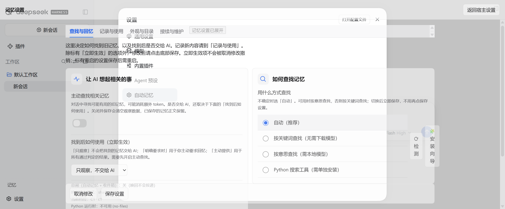
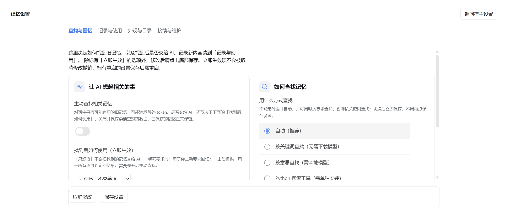
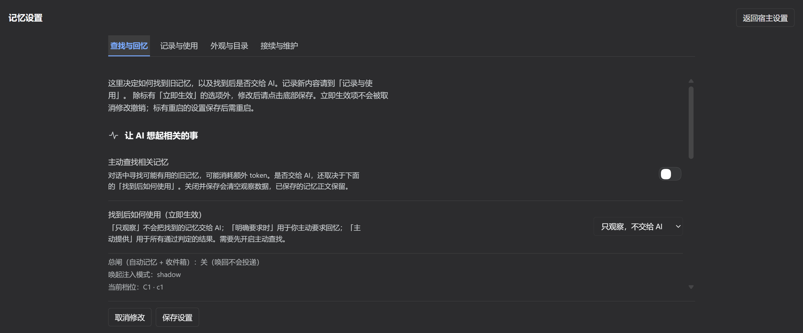
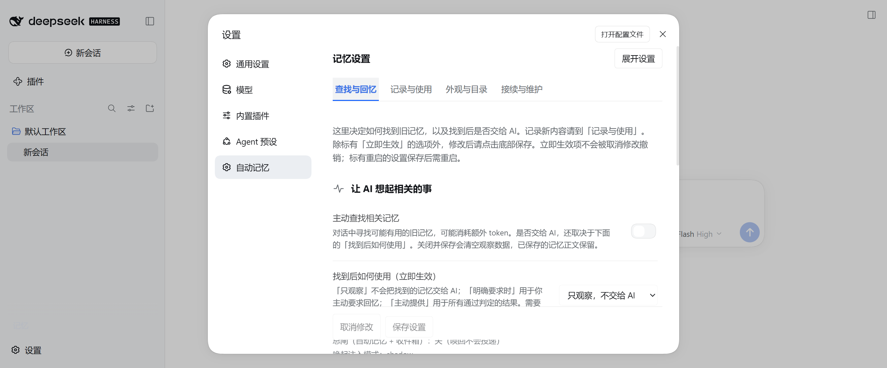
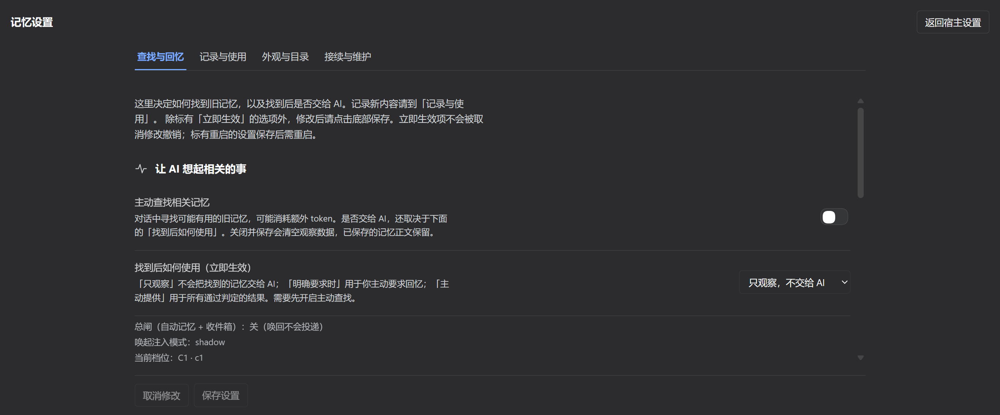
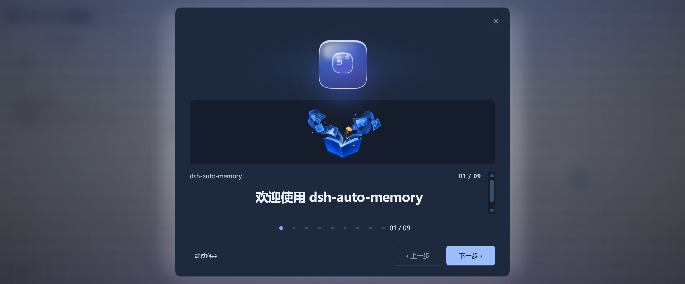

# 3.2.10「展开设置」透明叠层排查

基线：上游 `v3.2.10` / `828050056cf053c53fb2c237706f6e89c7baef09`。
真实宿主：Windows、DSH `0.2.0-rc.2`、Chrome 152；插件通过独立 `DSH_HOME` 加载发布版本源码。
未连接模型，未读取或修改个人记忆库，未测试 DeepCode APK / Android 真机。

## 复现与定位

在普通桌面端打开「设置 → 自动记忆」，点击右上角「展开设置」，即可复现宿主侧栏、宿主设置菜单和插件表单互相透出的现象。没有 Android Bridge，也没有窄屏条件。

展开层移到 `body` 后仍存在，定位为 `fixed`、层级为 `2147482800`。实际背景却是 `rgba(0, 0, 0, 0)`。点击展开／返回再展开，重复得到相同结果。

决定性的规则来自 `damLegacyOverlayGlass()`：其 `:not([data-dam-theme="page"])` 同时命中 `settings`，以 `background: transparent !important` 清空设置根与主区域。嵌入时背后有宿主对话框的底板，展开后底板不再覆盖整页，问题暴露。

另一个条件是旧款与变体的样式来源不同：旧款共享表没有 `native-settings.css` 的宿主设置适配。`3.2.10` 保留 PR #237 的合并历史，但发布树的设置源与该 PR 不同；应以发布树和实际运行结果为准。

## 修复

- 将旧玻璃规则提取到 `skins/legacy/overlay-glass.css`，所有选择器只允许 `data-dam-theme="panel"`。保留经典记忆小窗的玻璃外观；设置、向导、确认框、抽屉与通知不再被半透明令牌或清空背景规则误伤，新增入口也不会默认继承这组覆盖。
- 新增 `skins/iter5/host-settings.css`，由生成器写入客户端，并在旧款、变体的共享样式安装路径中统一加载；设置根、主区域、页签和保存条使用宿主的不透明颜色与文字颜色。
- 两份主题边界中，设置入口跟随宿主；工作台和其他浮层保留自己的主题偏好。
- 展开后由内容区滚动，保存条保留在可见区域；嵌入时由宿主滚动。修复「检测／安装向导」挤出水平滚动条。
- 窄屏只在首次有效测量时自动展开，点击「返回宿主设置」后不再被 ResizeObserver 重新展开。
- 两份实际共享样式安装器监听同页换肤与跨页 storage 变化，同步全局表和共享表，卸载时清理监听与引用计数。选择经典或主题层也发送刷新事件；从经典选择变体时同时退出经典模式，避免选择框与实际样式不一致。
- 更换全局皮肤表时始终把它放在共享宿主设置表之前，避免后插入的变体规则把嵌入保存栏覆盖成 `position: static` 并挤到视口外。
- 冻结旧皮肤的对话框层级从 `11000` 改为 `2147483200`，与变体一致，高于展开设置的 `2147482800`。
- 修改 canonical source 后重建客户端，`--check` 验证源码与产物同步。
- 冻结皮肤通过 `.gitattributes` 保持 LF，避免 Windows 的自动换行转换破坏主题回归约定。

## 验证

原始点击复现：修复前 `alpha=0 / FAIL`，修复后 `alpha=1 / PASS`。

首轮 96 组检查没有核对活跃样式表与所选皮肤是否一致；本轮追加复核发现换肤残留，不能用首轮结果作为每种皮肤均已验收的依据。

最终真实宿主设置矩阵：`2` 个宿主主题 × `5` 种皮肤（classic、legacy、instrument、editorial、water）× `3` 种布局 × `4` 个页签，`120 PASS / 0 FAIL`。布局包括 1505×625 的桌面嵌入、桌面展开，以及 320×720 的窄屏展开；工作台主题在每个宿主主题下均设为相反值。检查实际背景、主题、正文对比度至少 4.5、横向溢出、保存条可见与点击位置、内容滚动，以及全局／共享表的实际皮肤标记和先后顺序。

向导首屏另有 `2` 个宿主主题 × `5` 种皮肤，`10 PASS / 0 FAIL`。旧玻璃修复前暗色向导实际背景为 `rgba(26,26,28,0.46)`，修复后为不透明的 `rgb(29,41,61)`。实际 CSSOM 规则与 14 种非 panel 标本（7 种入口 × 2 个主题）的匹配检查未发现玻璃规则越界。

最终短复现捕获保留了 25 个操作，无丢弃的请求、操作或控制台条目；网站来源控制台没有 error，另有 1 条来源为 `chrome-extension://invalid/` 的扩展资源错误。完整矩阵记录独立保存 130 个逐组结果；长浏览器捕获曾丢弃操作，不作为完整操作轨迹。中途重建与宿主重启产生的 HMR 记录也不作为静态控制台验收。

`smoke-test-settings-expand.mjs` 执行两份实际客户端组件，覆盖主题隔离、共享表安装与卸载、延迟首次测量、窄屏展开及返回后的稳定性；修复前主题断言失败，修复后通过。原主题同步的 14 个检查和变异负路径继续通过。

`smoke-test-legacy-surface-isolation.mjs` 执行两份实际安装器、两份对话框、选肤函数及全局表替换函数，覆盖同页／跨页换肤、无关 storage 事件、只读同步、监听清理、引用计数、层级与样式表顺序。玻璃选择器有越界变异负对照。旧对话框层级已通过实际函数执行验证，没有单独强制触发“旧对话框和展开设置同时打开”的真人流程。

全量 smoke 使用工作流原有排除项和临时 HOME / USERPROFILE / DSH_HOME。首次结果中的两项中文路径错误在未修改的发布树同样复现，已将测试脚本的 URL pathname 改为 `fileURLToPath`，不改产品路径逻辑。

最终 Linux 全量：`292 PASS / 0 FAIL / 0 TIMEOUT`；Windows 全量：`290 PASS / 2 FAIL / 0 TIMEOUT`。

Windows 仍有两个完整套件受本机文件符号链接权限限制：`config-transactions`、`v21-path-boundary`，均为 `EPERM`；未修改的发布树同样失败。没有跳过或弱化这些断言，也没有更改系统权限。Linux 可执行对应的符号链接验证。自动化检查与真机验收分别记录。

## 真实截图

修复前展开：

修复后浅色宿主、深色工作台偏好：

修复后深色宿主、浅色工作台偏好：

追加复核后的真实截图：

