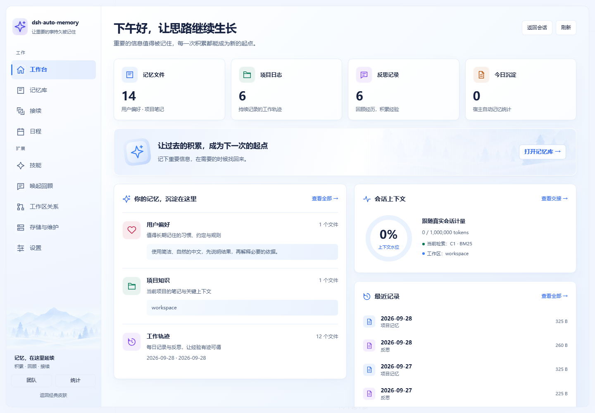
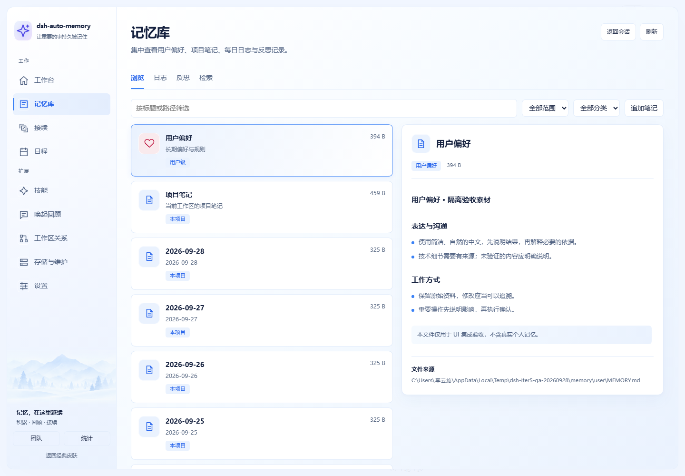
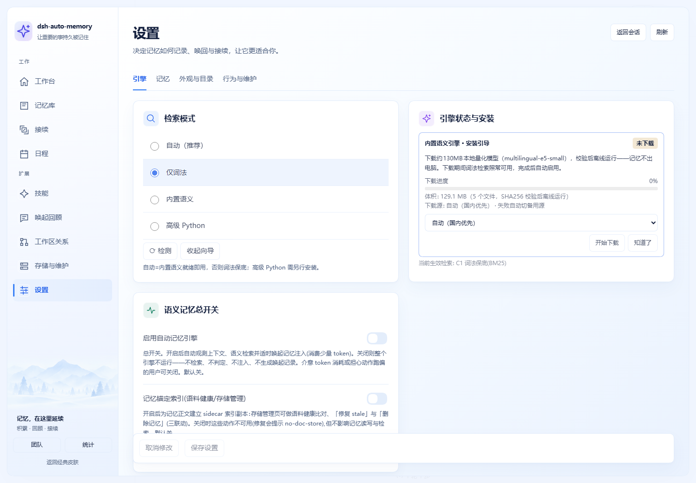
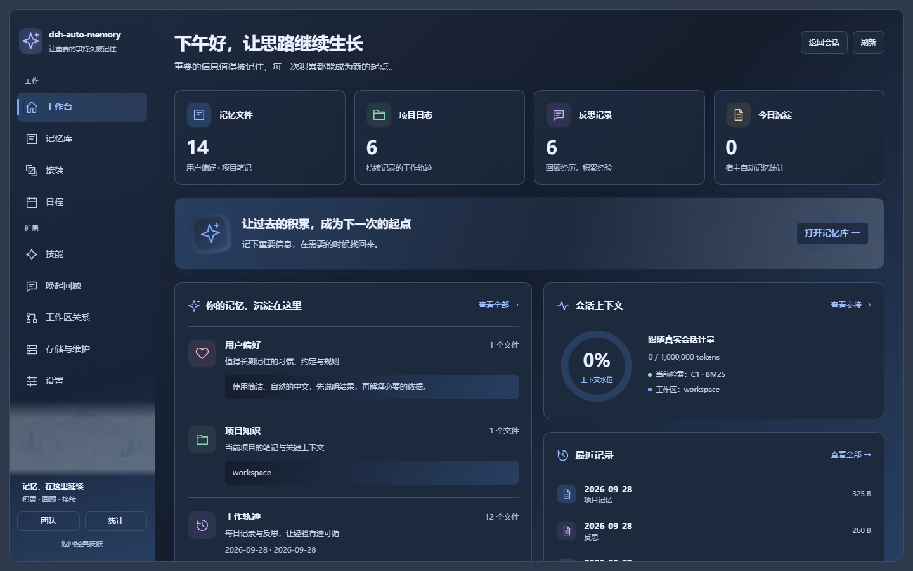
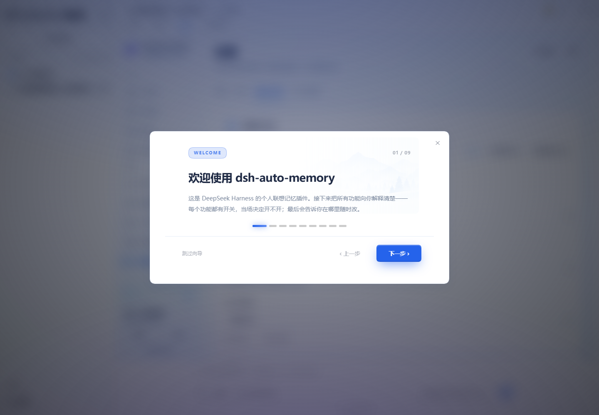
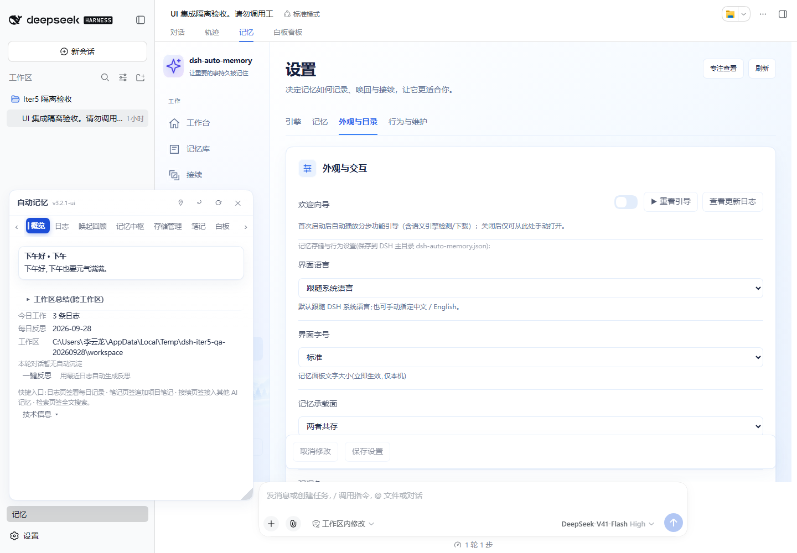

# dsh-auto-memory 皮肤开发白皮书（SKIN-GUIDE）

> **本地集成分支补充（2026-09-28）**：项目所有者后续明确允许突破本文的旧视觉约束，按新提供的参考图重构。当前「开发版」入口已接到 `Iter5Page`，实现与生成方式见 [skins/iter5/README.md](../skins/iter5/README.md)，验收见 [集成记录](ui-redesign-2026-09-25/INTEGRATION-RESULT.md)。下文 10 屏、v4 token 和旧开发版渲染函数描述保留为上游旧皮肤契约，不代表本分支的新视觉。经典版、宿主路由和既有错误回退仍保留。
> 唯一共享向导修复：将 `DialogHost` 中欢迎页条件分支的 `useDeepTheme()` 上移为无条件 Hook，修复真实重看操作触发的 React #310；其余经典代码保留。

> 面向：想给本插件做皮肤的用户与开发者。
> 承诺：**照本指南做皮肤，不碰一行逻辑代码**；经典档（classic）始终保持字节级零改动。
> 本文所有接口、键名、守卫均与 lib/client.js / lib/index.js / lib/wb-sidecar.js 实际代码逐字对拍（2026-09-28 真机验证轮）。

> ## ★ 权威参考实现（2026-09-28 起）
>
> **`skins/iter5/`（社区作者 Minervaowl7，PR #146）是当前唯一达到「可替换」标准的皮肤**，
> 本文的机制章节（§0–§2、§8、§10）**以其实现方式为准**——此前版本描述的「运行时挂载外部皮肤目录」
> 从未真正接通，是**未实装的契约**（详见 §1.1）。
>
> 权威文件：
> - `skins/iter5/README.md` —— 皮肤作者视角的完整说明（入口、源码分工、数据纪律、限制）
> - `tools/build-iter5-skin.mjs` —— **生成器**（机制核心，见 §1）
> - `docs/ui-redesign-2026-09-25/INTEGRATION-RESULT.md` —— 验收记录与已知限制
>
> 沿用其经验的一句话总结：**皮肤不是「换个 CSS」，而是「用生成器从经典组件派生一份新实现」**——
> 上游改了，重跑生成器即同步；结构漂移会明确报错而不是悄悄生成错界面。

---

## ★ 目标效果一览（iter5 真机截图）

> 全部为**真实 DSH 宿主渲染**（隔离验收环境，非 demo 假数据）。完整 24 张见
> [验收图库](https://github.com/Minervaowl7/dsh-auto-memory/blob/codex/iter5-ui-integration/artifacts/iter5-integration/gallery.html)。

| 工作台（九页导航之一） | 记忆库 |
|---|---|
|  |  |

| 设置（四组分区 · 未保存标记） | 深色适配 |
|---|---|
|  |  |

| 欢迎向导（首屏主视觉） | 窄屏（390px） | 宿主轻面板 |
|---|---|---|
|  |  |  |

**做皮肤时可对照的要点**（都在这几张图里）：

1. **九页主导航 + 独立入口**：团队与统计不塞进主航；每页有图标与语义色（`data-hue`）。
2. **列表/详情分栏 + 专注查看**：右上角「专注查看」展开全屏工作台，Escape 返回内嵌。
3. **四组设置分区**：引擎 / 记忆 / 外观与目录 / 行为与维护；**脏标记**（有未保存改动的分区打点）、
   「取消修改」、只提交实际改动键——不是"改一下写一下"。
4. **深色适配**跟随宿主主题（`data-deep`），窄屏 390px 有独立布局。
5. 引导向导首屏用 `hero.welcome` 素材槽——**皮肤不新造素材来源**。

---

## 0. 三层 Key 哲学（先读这个）

插件的"可换皮"建立在三层解耦上，**每层各管一件事**：

| 层 | 形态 | 管什么 | 改它会影响逻辑吗 |
|---|---|---|---|
| ① Token | CSS 变量 `--skin-*` / `--dam-*` / `--i5-*` | 颜色/圆角/间距/时长/阴影 | 否——纯外观 |
| ② Anchor | DOM 属性 `data-dam-*` / `data-dam-skin-v4-*` / `data-i5-*` | 结构挂载点（测试与皮肤定位用） | 否——只要锚点在 |
| ③ Asset | 素材槽 `assetOf(key, deep)` | 图片/插画/背景（明暗双份） | 否——换图=改一行 |

纪律红线：**任何皮肤工作不得改动逻辑分支、不得删除锚点、不得在样式里写裸色值**（见 §10 守卫）。
`iter5` 额外自加一条：**颜色必须用命名 token**（`--i5-*`），其 smoke 会逐行扫描 `skin.css`，
发现 `#hex`/`rgba()` 即失败（见 §10）。

---

## 1. 两代皮肤机制（★ 以 iter5 为准）

### 1.1 旧契约（未实装，仅作历史）

早期白皮书描述的是「皮肤包 = 一个目录，运行时挂载 `skin.js` 到 7 个插槽，并从 `ctx` 读数据」。
**这一层从未实现**：`lib/client.js` 里没有插槽挂载器，`skin.js` 也没有加载点。
`skins/classic/`、`skins/v4/`（含 `theme.json`）作为**第①层 token 基线**仍然有效、仍被读取，
但**不要**指望往里放 `skin.js` 就能生效。

### 1.2 现行机制（iter5，可替换标准）

```
skins/iter5/{ui.js, views.js, skin.css}     ← 手写源（唯一编辑面）
        ↓  node tools/build-iter5-skin.mjs
lib/client.js（ITER5-GENERATED:BEGIN … END 区间）  ← 生成产物，禁止手改
        ↓  宿主加载（沿用既有单 bundle + 宿主 React）
记忆页的「开发版」入口 → Iter5Page
```

生成器做四件事，**每件都要求唯一匹配**（`replaceOnce`：命中数 ≠ 1 即抛错）：

1. **嵌入手写源**：`ui.js` + `views.js` → `ITER5_CSS` 常量与组件定义，落入受控区间。
2. **从经典组件派生新皮肤版本**：`SettingsPage`→`Iter5Settings`、`StorageTab`→`Iter5Storage`、
   `MemoryHubTab`→`Iter5Skills`。派生时**逐点改造**（草稿态、脏标记、即时保存、确认弹窗、
   错误处理），而不是复制粘贴——上游改经典组件，重跑生成器即继承。
3. **接线入口**：把开发版渲染点从 `DamSkinV4Page` 换成 `Iter5Page`，并让样式表在 v4 档生效。
4. **一处共享修复**：`DialogHost` 的欢迎页分支原本在条件里调 `useDeepTheme()`（重看向导触发
   React #310），生成器把它提为无条件 Hook——**这是全 PR 唯一触碰经典向导的地方**，其余经典代码
   经归一化源码摘要核对保持一致。

**为什么用生成器而不是手改 client.js**：`lib/client.js` 有 1 万+ 行，手改会与上游冲突；
生成器把「皮肤」与「宿主」的边界变成**可断言的一处**（`replaceOnce` 的失败即「上游结构变了，
请更新生成器」），并让 `--check` 能在 CI 里发现「源码改了但没重跑生成器」。

```powershell
node tools/build-iter5-skin.mjs           # 重新生成（改完 skins/iter5/ 必跑）
node tools/build-iter5-skin.mjs --check   # 验产物是否与源同步（CI 用）
node --check lib/client.js                # 语法
node tests/smoke/smoke-test-iter5-skin.mjs # 皮肤自检（含经典档摘要守恒）
```

---

## 2. 皮肤注册与切换

- 当前皮肤存于 `localStorage['dam-skin']`（`'classic'` | `'v4'`），fail-closed：读不到/非法值一律回落经典。
- **`'v4'` 是「开发版」这一档位的内部标识，不随皮肤换代而变**——iter5 接的就是它，
  所以用户已有的偏好自动延续，无需迁移。
- 用户入口：记忆面板头部按钮（经典档显示「开发版」，开发版显示「经典」）；侧栏底部同样可切。
- 切换即热生效（`setNonce` 重渲染，不 reload）；切回经典时移除注入的 `<style id="dam-skin-v4-style">`。
- 开发版渲染抛错时走 **ES5 错误边界**（`DamSkinV4Boundary`），屏上显示错误条并**整页回落经典**——
  皮肤永远不能弄死面板。
- `iter5` 的附加入口：「专注查看」展开为全屏工作台，「返回会话」或 Escape 回到内嵌视图。


---

## 3. Token 契约（① 层详解）

### 3.1 开发版（v4）token——定义在 `[data-dam-skin-v4-root]` 一行内

| token | 出厂值 | 语义 |
|---|---|---|
| `--skin-brand` | `#4F7CFF` | 主色（DeepSeek 蓝） |
| `--skin-brand-weak` | `#EAF0FF` | 主色弱底 |
| `--skin-team` | `#7C5CFF` | 团队色 |
| `--skin-ok / warn / err / info` | `#22C55E / #F59E0B / #EF4444 / #3B82F6` | 语义色 |
| `--skin-bg / surface / border` | `#F6F8FC / #FFFFFF / #E8ECF3` | 底/面/线 |
| `--skin-text / text-2 / text-3` | `#1F2937 / #6B7280 / #9CA3AF` | 文字三级 |
| `--skin-radius-card / btn / pill` | `14px / 8px / 999px` | 圆角三档 |
| `--skin-shadow-card / pop` | 两段阴影 | 阴影两档 |
| `--skin-sidebar-w` | `224px` | 侧栏宽 |
| `--skin-dur-quick / fast / slow` | `120 / 200 / 320ms` | 动效时长 |
| `--skin-space-3 / 4 / 5` | `12 / 16 / 24px` | 间距三档（2026-09-28 补定义——此前被 10+ 规则引用但从未定义，静默失效） |

### 3.2 经典档（--dam-*）与"消费未定义白名单"

经典档 token 由经典皮肤定义。**扫描器 r15 允许"消费了但未定义"的 `--dam-*` 变量仅存在于白名单**（`EXPECT_TOKENS`）：`user-scale / radius / team-actor-hue / skin-backdrop-opacity / bg-deep`，且每条必须带兜底值。你新增消费时若不在这个名单里，要么自己定义、要么进白名单（须写明理由——这是守卫演进纪律，不是后门）。

### 3.3 零字面色纪律（按段生效）

- **团队屏段**（fe02 §8.3，`屏①–④` 标记到 `L3-team:end`）：hex / `rgba(`/`hsla(` **一个都不许出现**。动态色走变量：JS 行内只写**色相数字** `'--dam-team-actor-hue': String(hue)`，CSS 消费 `hsl(var(--dam-team-actor-hue, 0) 62% 46%)`。
- **团队 CSS 段**（`dam-team:begin..end`）：同上，且 var() 兜底里**嵌套 rgba 也会被抓**（§9.2 只豁免匹配串内直接含 `var(` 的色函数）——兜底请用裸 `var(--token)` 不带字面值。
- **皮肤 CSS（v4 注入块）**：无裸 hex/rgba；写 `var(--skin-*)` 或 `color-mix()`。

---

## 4. Anchor 契约（② 层）

- 命名：经典档 `data-dam-<域>-<名>`（如 `data-dam-team-presence`）；开发版 `data-dam-skin-v4-<名>`。
- 用途：a) 测试锁（r15/r18/r26 全靠锚点断言）；b) 皮肤定位挂载点。
- 查法：`grep -o "data-dam-[a-z0-9-]*" lib/client.js | sort -u`（当前 1800+ 个）。
- 加新锚点：**只增不改**——改值/改名会炸既有测试锁。团队屏锚点契约见 fe02 §2–§5（statusbar/members/filterbar/skills/conflicts 八屏）。

---

## 5. 素材槽（③ 层）

- 定义：`lib/skin-assets.js` → `assetOf(key, deep)`；清单 `lib/assets/skin/_manifest.json`（暗色 `_manifest-dark.json`）。
- 槽位：`hero`（各屏头图）等，`deep=true` 取暗色文件（`fileDark`），`useDeepTheme()` 自动跟随宿主明暗。
- **换图 SOP = 改 `skin-assets.js` 对应槽位的 `file` 一行**，结构与所有消费代码零改动；未就绪槽位显示确定性占位（不塌、不留白）。

---

## 6. ★读数 ↔ 接口对照表（数据从哪来、往哪写）

> 前端两条铁律：**读**必经 `configOf()` 解包（GET /config 恒回外壳 `{config, path}`，直读外壳=经典 bug 温床）；
> **写**必经 `saveConfigPatch(patch)` 唯一出口（自带错误处理与向导闸联动）。
>
> **数据纪律（取自 iter5，应照做）**：统计只来自宿主数据；文件数明确标「文件」，不冒充记忆条目数；
> 水位环不冒充健康评分；缺字段显示「—」或「暂不可用」，**不编造**。概率/原因码/锚点按接口原样展示，
> 启发式关联要**明确标注**为启发式，不把锚点前缀伪装成可打开的链接。

### 6.1 皮肤最常用（iter5 实际用到的 18 个）

| 屏/读数 | 接口常量 | 方法 | 关键字段 |
|---|---|---|---|
| 宿主状态快照 | `API.state` | GET `?ws=` | `todayEntries`、`autoStats.count/lastAt`、`greeting` |
| 记忆文件列表 | `API.list` | GET `?ws=` | 文件数组（先取 state 校验工作区一致，再取 list） |
| 单文件正文 | `API.file` | GET `?ws=&path=` | `text`；**读取必须绑定绝对来源路径** |
| 配置读写 | `API.config` | GET / POST | GET 外壳 `{config}`；POST patch 即写盘 |
| 工作区 | `API.workspaces` | POST `{force:false}` | `workspaces[].name/path` |
| 日程 | `API.calendar` | GET / POST | 新增/完成/删除（地点与提醒写备注，不伪造系统日历） |
| 检索 | `API.recall` | GET `?q=` | 条目数组 |
| 智能唤回 | `API.smartRecall` | GET | 唤回候选与理由 |
| 笔记写入 | `API.note` | POST | 追加/覆盖项目笔记 |
| 自动反思 | `API.reflectAuto` | POST | `result` |
| 反馈 | `API.reviewFeedback` | POST | 唤回审查反馈 |
| 语义状态 | `API.semanticStatus` | GET | `resolvedTier`、`ready`、`pythonInt8Present`、下载相位 |
| 影子近况 | `API.shadowRecent` | GET | shadow 档近期判定 |
| 交接状态 | `API.handoffState` | GET `?sessionId=` | `planPath/planMtime`、`refresh{sessionId,prompt}`、`ledgers[]` |
| 外部记忆 | `API.external` / `externalView` / `externalImport` / `externalRemove` | GET / POST | 来源列表与增删 |

### 6.2 全量端点（55 个，供自定义皮肤取用）

> 「用户看不到的读数」大多在下面这些里——做皮肤时优先考虑把它们暴露出来。

| 分组 | 端点常量 | 说明 |
|---|---|---|
| 面板 | `state`、`list`、`file`、`debug`、`scanDirty` | 状态/文件/诊断/脏扫描 |
| 记忆 | `recall`、`smartRecall`、`recallStats`、`memoryHub`、`storageManage` | 检索与工作台维护 |
| 规则 | `rulesList`、`rulesApply` | 用户级硬约束条目级读写 |
| 配置 | `config`、`semanticEmit`、`semanticDownload`、`semanticDeepDetect`、`semanticStatus` | 配置与语义引擎 |
| Python | `pyDetect`、`pyVenv`、`pyDeps`、`pyModel`、`pyCancel`、`pyStatus` | 环境向导六步 |
| 交接 | `handoffState`、`handoffContinue`、`handoffPermission`、`autoContState`、`autoContDecide` | 白板/接续/自动接续 |
| 看板 | `kanbanBoard`、`kanbanCard` | 看板载荷与卡片全文（按需取） |
| 团队 | `team*` 系列（见 §6.3） | 见下 |
| 记忆源 | `external`、`externalView`、`externalImport`、`externalRemove` | 外部记忆接入 |
| 日历/问候 | `calendar`、`greet`、`summarize` | 日程与问候卡 |
| 迁移 | `migrateExport`、`migrateInspect`、`migrateImport` | 导出/检查/导入 |
| 皮肤 | `skinAsset`、`skinLibraryFetch` | 素材槽与皮肤库 |
| 更新 | `updateCheck`、`update`、`notices`、`models` | 版本与通知 |
| 目录 | `browseDir`、`pickDir` | 目录浏览/选择 |
| 工作台 | `workbench` | 记忆工作台诊断/修复 |

### 6.3 团队读数

| 屏/读数 | 接口 | 关键字段 |
|---|---|---|
| 团队成员 | `…/team-members` | `{enabled, self, members, project}` |
| 团队在场 | `…/team-presence` | `{enabled, self, others, note}` |
| **谁改动** | `…/team-attribution` | `{enabled, actor, calendar, calendarInfo, attribution:{size,writes,items:[{key,memberId,memberName,at,op}]}}` |
| 团队冲突 | `…/team-conflicts` | `{enabled, policy, counts, conflicts}` |
| 团队技能 | `…/team-skills` | `{enabled, count, candidates}` |

**注意**：设置里的开关要"活"，键必须在服务端 `DEFAULT_CONFIG` 白名单（lib/index.js）——否则写了被 /config
静默丢弃（死开关；`teamShowMemberBadges` 于 2026-09-28 补入，默认 `true`）。


---

## 7. 白板看板读数细则（2026-09-28 修）

- 数据源 = `handoff/PLAN.md`（**白板**，kind='plan'）+ `handoff/handoff-*.md`（**交接账本**，kind='ledger'）+ 可选 archive。看板是两者的合并投影——卡上「白板/账本/归档」**来源徽章**即为此而设。
- 卡片标题：`##` 小节标题；若标题是**纯时间戳**（去日期/分隔符后与文档标题同核），自动取本节正文首个非标记行作**语义标题**（主键 id/归并口径不变，只改显示）。
- 卡片预览：**已剔除 `type:goal/state/dead-end/progress/archive` 标记行**（标记仍供落泳道消费——路由口径零改动，只是不再裸显机器键）。
- 落泳道：标题或正文写 `type:*` 标签 → 四泳道；不写则按标题猜，常落空（这是给写手的约定，见 index.js 提示词 §⑤）。

---

## 8. 屏分发与挂载（做全屏皮肤看这里）

### 8.1 iter5 现行结构（★ 以它为准）

主导航九页（`ITER5_PAGES`）：工作台 / 记忆库 / 接续 / 日程 / 技能 / 唤起回顾 / 工作区关系 /
存储与维护 / 设置。团队与统计保留**独立入口**，不塞进主导航。

源码分工（改皮肤只动这三个）：
- `skins/iter5/ui.js` —— 外壳、导航、原文浏览、页签、**请求生命周期**（`useIter5Data`）。
- `skins/iter5/views.js` —— 各页视图（工作台/日程/唤起详情/交接材料/外部来源/笔记/检索/关系图）。
- `skins/iter5/skin.css` —— 局部作用域样式（浅色+深色+响应式）。
  **颜色必须走 `--i5-*` 命名 token**，smoke 逐行扫描拦裸色值。

**请求生命周期是 iter5 的关键设计**（自定义皮肤务必照做）：
`useIter5Data(loader, deps)` 在发起请求前记录 `会话 id | 工作区` 身份指纹，回调时再比对一次——
**身份变了或组件已卸载，就丢弃这次响应**。避免"切了工作区/会话，旧响应回来把新界面覆盖"。

### 8.2 经典十屏（旧 v4 结构，历史）

`DAM_SKIN_V4_PAGES` 十屏 + `DAM_SKIN_V4_HOSTED` 七屏复用经典组件套壳。
iter5 已取代其视觉，但**这套结构仍在代码里**、token 仍生效；新皮肤建议参考 iter5 的组织方式。

挂载协议（两代共用）：`MemoryPageView` 按 `damSkinActive()` 分支；经典节点作为**错误边界 fallback**
传入（懒工厂 `damSkinBoundaryOf()`，smoke 环境无完整 React 时返回 null 自动走经典）。

---

## 9. 组件协议（皮肤可复用的既有件）

| 组件 | 用途 | 归属 |
|---|---|---|
| `SkinSlot` | 通用挂载点（区别于设置页预览卡） | 经典 |
| `SkinHero` / `SkinImg` | 头图/插图（走 assetOf；未就绪出占位） | 经典 |
| `SkinBackdrop` / `useDeepTheme` | 背景层 / 明暗自动跟随宿主（MutationObserver） | 经典 |
| `SkinCenterPanel` / `SkinSlotRows` / `SkinSection` | 设置页皮肤分区的预览/换图行 | 经典 |
| `Iter5Card` / `Iter5Stat` / `Iter5Tabs` / `Iter5Icon` / `Iter5Empty` | 卡片 / 统计块 / 页签（带键盘导航）/ 图标 / 空态 | iter5 |
| `useIter5Data` | 带身份守卫与重试的数据加载 | iter5 |
| `L(zh, en)` | 皮肤内文案双语（**必须走它**，勿硬编码中文） | 两代共用 |

---

## 10. 验收纪律（交皮肤前必须全绿）

> 「以 iter5 为准」的验收清单（其 PR 就是这么做的，含 CI 基线核对）。

1. `node tools/build-iter5-skin.mjs --check` → 产物与源码同步（**改了 `skins/iter5/` 必跑**）。
2. `node --check lib/client.js` → 语法。
3. `node tests/smoke/smoke-test-iter5-skin.mjs` → 皮肤自检（token 化颜色、无 demo 数据、
   经典档归一化摘要守恒、Hook 稳定性）。
4. `node tools/lib/appearance-scan.mjs` → exit 0（无裸色值）。
5. `node tools/run-smoke.mjs` → 全绿（当前 **226** 项）。
6. **经典档零改动红线**：切回经典后逐屏对拍，字节级行为不变。
   iter5 的做法是把经典部分归一化后算 **sha256 摘要**锁进测试——比"人工对拍"硬。
7. 真机：隔离 `DSH_HOME` + 独立工作区跑一遍，截图留档（iter5 留了 24 张 + JSON 检查记录）。

**CI 基线核对是加分项而非可选项**：iter5 在 PR 里逐项比较了「本 PR 的失败套件集合」与
「上游 main 的失败套件集合」，证明**未新增失败套件**——这比一句"测试都过了"可信得多。
（注：上游那批红已在 2026-09-28 修复。）

## 11. 已知边界（如实标示）

- **真实模型生成、完整跨会话接续、模型下载（130MB/563MB）、Desktop/Mica** 未验收——
  这些沿用上游实现，iter5 未改。
- **上游多窗口全局工作区写入边界**仍存在（非皮肤问题）。
- `skins/classic/`、`skins/v4/` 的 `theme.json` 只覆盖第①层 token；**第③层插槽式 `skin.js` 未实装**（见 §1.1）。
- 旧 v4 自建屏（welcome/settings）已由 iter5 的设置分组取代；暗色适配 iter5 已做
  （`data-deep` + 宿主主题侦测），旧 v4 token 仍只有日间档。
- 发布注意事项：打包前核对包清单，**避免把本地未跟踪的设计材料带进 npm**。
- 欢迎向导四页真机全过；`window['dsh-auto-memory.TOUR_STEPS']` 为向导内容**单一来源**
  （定义在 DialogHost 早退之前——顺序不能倒，否则开发版第 2/3 页空白）。

---
*维护约定：本文与代码同迁——改接口/键名/守卫，同提交更新本表；对不上的行以代码为准并回改本文。
机制章节（§0–§2、§8、§10）以 `skins/iter5/` + `tools/build-iter5-skin.mjs` 的实现为准。*
