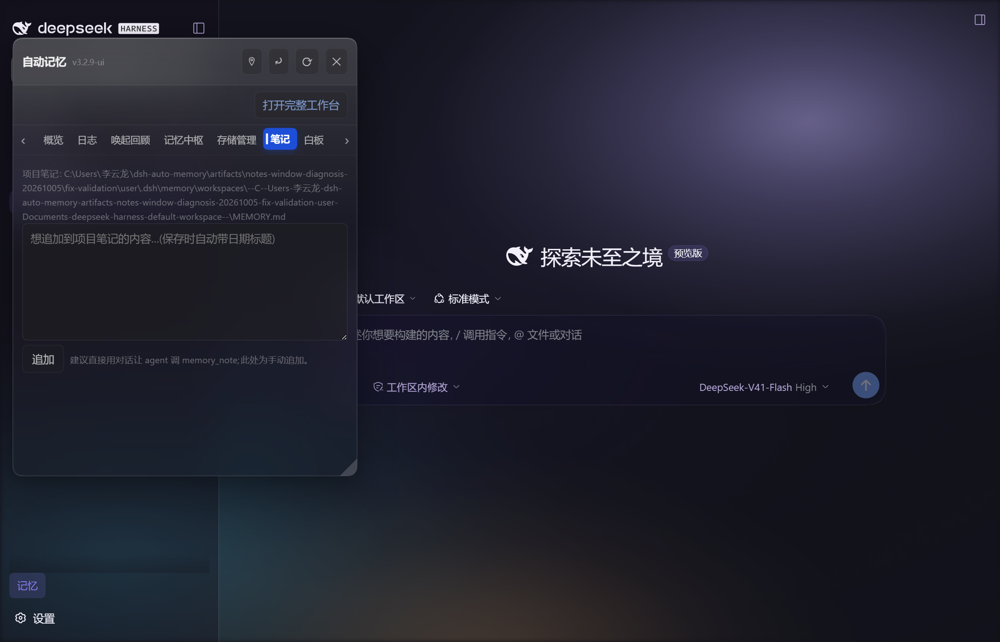

# #238 笔记浮窗消失回归

点击「笔记」加载 textarea 后，梦幻皮肤原先会把整个浮窗当成聊天输入框祖先，
后注入的 `[data-dsh-dream-skin-composer] { position: relative; }` 将浮窗移入文档流。
关闭重开保留笔记页签，因而再次触发。

浮窗现在声明为带可访问名称的非模态 `dialog`，梦幻皮肤已有的 dialog 排除逻辑会跳过其编辑器。
`MemoryPanel` 的行内几何样式也持有 `position: fixed`，已有或其他插件添加的 composer 标记
无法通过普通样式表覆盖它。会话页继续走原有承载面；没有修改或依赖梦幻皮肤包。

## 自动回归

```sh
node tests/smoke/smoke-test-notes-floating-window.mjs
```

测试执行发布 bundle 中真实的 `MemoryPanel`、`NotesTab` 与拖动处理函数，以合成状态代替 API。
覆盖笔记编辑器挂载、关闭卸载、重开保留页签、dialog 语义与固定几何、拖动后坐标及监听器清理。
在上游 `e260677` 上失败（浮窗没有行内 fixed）；修复后通过。
此 Node 测试不计算浏览器布局，布局验收使用下一项。

## 隔离真实宿主验收（2026-10-05）

DSH 桌面安装随附的 web CLI、记忆 3.2.9 加本 PR、梦幻皮肤 9.29.0，
Chrome 152，1279×821 CSS px，记忆默认 legacy 外观。
`DSH_HOME`、`USERPROFILE`、`HOME` 和 AppData 均指向独立验证目录；
没有提交笔记、运行模型或读写个人记忆。

先按 browser-skill 的会话流程绑定浏览器，在隔离宿主中打开记忆浮窗。
用观察得到的真实按钮点击「概览」「笔记」「关闭」及「记忆」入口；以下脚本每次重新观察按钮，
并检查实际 `getBoundingClientRect()`，故节点存在但移出屏幕会失败。

```powershell
pwsh -NoProfile -File tools/qa/verify-notes-floating-window.ps1 -Session <active-session>
```

| 验证 | 实测结果 |
| --- | --- |
| 点击笔记 ×3 | fixed，top≈48.00，bottom≈609.14，全部位于 821px 视口内 |
| 关闭再打开 ×3 | 保留笔记编辑器，边界同上 |
| 正常 composer 识别 | 笔记浮窗无 composer 标记；宿主聊天 composer 仍有标记 |
| 强制旧 composer 标记并新增 DOM | 浮窗仍 fixed 且可见；试验标记与节点清理 |



源码语法、核心 smoke、API 路径、水位窗口、面板承载面、皮肤分派及 Iter5 回归通过。
Iter5 手写区哈希随本次四行浮窗改动更新；生成块与生成器检查保持一致。

上游全量运行器当前引用缺失的 `tools/smoke-impact.mjs`，无法启动；
本次未将其报告为全量通过。截图来自隔离 web 宿主；未把候选包部署到用户日常桌面实例。
